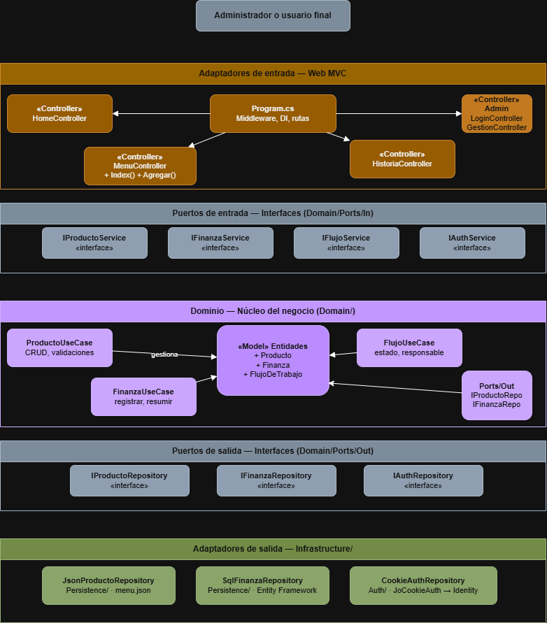
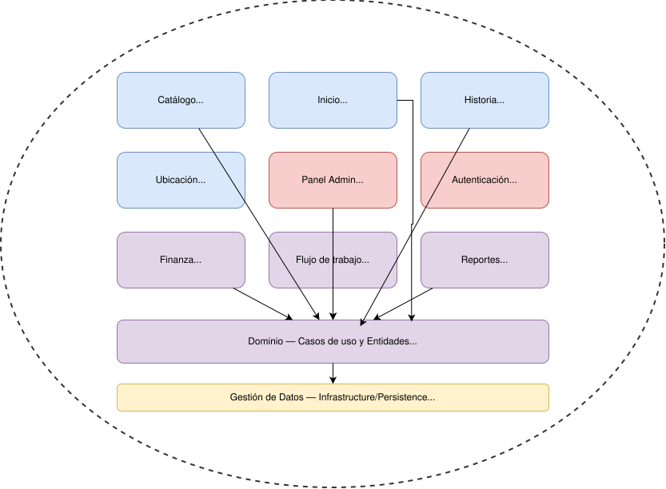
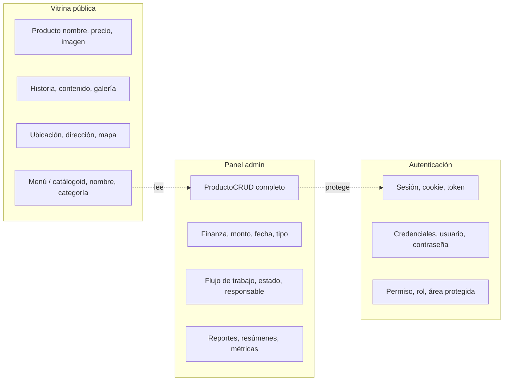

# ADR-03: Migración hacia Arquitectura Hexagonal
| Campo  | Valor |
|--------|-------|
| Autor  | Joaquin Uriona |
| Fecha  | 12/06/2026 |
| Estado | `Aceptado` · `Reemplaza ADR-02` |

## Contexto

El sistema actualmente implementa el patrón MVC documentado en ADR-02 para una
aplicación web de gestión financiera y administrativa orientada a dueños de pequeños
y medianos negocios, y a medida que el sistema crece para incluir módulos de finanzas,
flujo de trabajo y reportes, los controladores comienzan a absorber reglas de negocio
que deberían ser independientes del framework web.

Las condiciones que influyeron en esta decisión son las siguientes:

- **Restricción de equipo:** el desarrollador único debe asumir Frontend, Backend,
  DevOps y mantenimiento de forma simultánea, por lo que la arquitectura debe permitir
  trabajar en módulos de forma aislada sin romper lo que ya funciona
- **Deuda técnica materializada:** las tres limitaciones anticipadas en ADR-02 se
  volvieron concretas, pues los controladores mezclan lógica de negocio con presentación,
  `menu.json` no escala hacia los nuevos módulos y las credenciales hardcodeadas de
  `JoCookieAuth` representan un riesgo crítico antes de manejar datos financieros reales
- **Crecimiento del sistema:** agregar finanzas, flujo de trabajo y reportes sin una
  capa de dominio limpia genera un acoplamiento difícil de revertir

---

## Decisión

Se decide migrar progresivamente hacia **Arquitectura Hexagonal**, manteniendo ASP.NET Core MVC
como adaptador de entrada pero reorganizando el código en capas con
responsabilidades claras y fronteras explícitas.

### ¿Por qué?


La Arquitectura Hexagonal resuelve exactamente las tres deudas documentadas en ADR-02
sin abandonar ASP.NET Core ni el despliegue en EC2, pues el dominio financiero queda
aislado y se puede probar sin levantar el servidor web, cambiar de `menu.json` a SQL
solo requiere modificar el adaptador de persistencia sin tocar el dominio, y las
credenciales hardcodeadas se resuelven en `Infrastructure/Auth` de forma aislada,
además de que los controladores vuelven a ser coordinadores delgados y no contenedores
de lógica de negocio, lo que permite que cada módulo nuevo crezca de forma independiente
dentro del mismo monolito.


### Alternativas consideradas:


- Mantener MVC puro (ADR-02)
- Clean Architecture
- Microservicios


### Alternativa	Por qué la descarté


| Alternativa | Por qué la descarté |
|-------------|---------------------|
| Mantener MVC puro (ADR-02) | Los controladores se saturan al agregar finanzas y flujo de trabajo, materializando la deuda técnica crítica ya documentada en ADR-02 |
| Clean Architecture | Introduce más capas de abstracción de las necesarias para un equipo unipersonal en esta etapa, aumentando la complejidad sin beneficio proporcional |
| Microservicios | Descartado en ADR-02 y sigue siendo inviable para un desarrollador único, pues requiere orquestación de contenedores y gestión DevOps avanzada |

---
## Consecuencias
✅ Lo que gano:


- **Consecuencia técnica:** el dominio financiero se desarrolla en `Domain/UseCases`
  de forma aislada sin tocar los controladores, reemplazar `menu.json` por SQL solo
  requiere cambiar `Infrastructure/Persistence` y las credenciales hardcodeadas se
  resuelven en `Infrastructure/Auth` sin afectar el resto del sistema, lo que hace
  que cada módulo sea testeable de forma independiente sin levantar el servidor web

- **Consecuencia sobre el proceso:** al tener fronteras claras entre dominio,
  infraestructura y presentación, el desarrollador puede alternar entre diseñar
  pantallas y programar lógica financiera sin riesgo de romper módulos adyacentes,
  reduciendo la carga cognitiva del rol unipersonal durante el crecimiento del sistema

⚠️ Lo que sacrifico o asumo:


- **Limitación técnica:** durante la migración progresiva coexistirán el MVC puro y
  la nueva estructura hexagonal en el mismo repositorio, lo que genera una inconsistencia
  temporal que puede dificultar la lectura del código hasta completar la transición

- **Deuda o riesgo:** la curva de aprendizaje de la Arquitectura Hexagonal es mayor
  que la del MVC simple, por lo que el tiempo de desarrollo inicial se incrementa
  por la reorganización del código existente, y si la migración se interrumpe a mitad,
  el sistema quedará en un estado híbrido más difícil de mantener que cualquiera de
  los dos estilos por separado

## Diagrama





---

## Vistas Arquitectonicas


### Vista logica



### Vista de desarrollo

```text
Projecto Jo'
├── Domain/               # Núcleo del negocio — sin dependencias externas
│   ├── Entities/         # Producto, Finanza, FlujoDeTrabajo
│   ├── Ports/
│   │   ├── In/           # Casos de uso: IProductoService, IFinanzaService
│   │   └── Out/          # Repositorios: IProductoRepository, IFinanzaRepository
│   └── UseCases/         # Implementación de la lógica de negocio pura
├── Infrastructure/       # Adaptadores de salida
│   ├── Persistence/      # Implementación JSON o SQL
│   └── Auth/             # Implementación de autenticación
├── Web/                  # Adaptador de entrada — ASP.NET MVC
│   ├── Controllers/
│   ├── Views/
│   └── Areas/
└── Program.cs            # Composición de dependencias
```
### Vista de procesos

```text
[Cliente/Navegador]       [Web / Adaptador In]       [Domain / Port In]       [Domain / UseCase]       [Domain / Port Out]    [Infrastructure / Adaptador Out]
       │                           │                          │                        │                        │                        │
       │ 1. POST /Finanzas/Create  │                          │                        │                        │                        │
       ───────────────────────────>│                          │                        │                        │                        │
       │                           │ 2. Ejecuta caso de uso   │                        │                        │                        │
       │                           │    (IFinanzaService)     │                        │                        │                        │
       │                           ──────────────────────────>│                        │                        │                        │
       │                           │                          │ 3. Invoca              │                        │                        │
       │                           │                          ────────────────────────>│                        │                        │
       │                           │                          │                        │ 4. Valida reglas       │                        │
       │                           │                          │                        │    de negocio (Finanza)│                        │
       │                           │                          │                        │──┐                     │                        │
       │                           │                          │                        │  │                     │                        │
       │                           │                          │                        │  <┘                     │                        │
       │                           │                          │                        │                        │                        │
       │                           │                          │                        │ 5. Persiste datos      │                        │
       │                           │                          │                        │    (IFinanzaRepository)│                        │
       │                           │                          │                        ────────────────────────>│                        │
       │                           │                          │                        │                        │ 6. Guarda en DB / JSON │
       │                           │                          │                        │                        │ (FinanzaRepositoryImpl)│
       │                           │                          │                        │                        ────────────────────────>│
       │                           │                          │                        │                        │                        │
       │                           │                          │                        │                        │ 7. Retorna Confirmación│
       │                           │                          │                        │                        │<───────────────────────
       │                           │                          │                        │ 8. Retorna Resultado   │                        │
       │                           │                          │                        │<───────────────────────│                        │
       │                           │                          │ 9. Retorna DTO/Estado  │                        │                        │
       │                           │                          │<───────────────────────│                        │                        │
       │                           │ 10. Renderiza Vista      │                        │                        │                        │
       │                           │<─────────────────────────│                        │                        │                        │
       │ 11. Redirección / HTML    │                          │                        │                        │                        │
       │<──────────────────────────│                          │                        │                        │                        │

```


### Vista de despligue


---

## Trade-offs

| Decisión | Ganas | Sacrificas |
|---|---|---|
| Hexagonal sobre MVC puro | Dominio testeable y controladores delgados sin afectar el stack tecnológico actual | Más archivos, más abstracciones y mayor tiempo inicial de reorganización |
| Migración progresiva sobre reescritura total | El sistema sigue funcionando durante la transición sin detener el desarrollo | Coexistencia temporal de dos estilos en el mismo repositorio hasta completar la migración |
| Monolito hexagonal sobre microservicios | Sin overhead de infraestructura, un solo despliegue en EC2 y sin orquestación de contenedores | Escalado granular sigue sin ser posible por componente si la demanda crece por módulo |
| `Infrastructure/Auth` sobre credenciales hardcodeadas | Las credenciales salen del código fuente y se pueden cambiar sin recompilar | Requiere implementar ASP.NET Identity o un mecanismo equivalente, aumentando el tiempo de desarrollo |
| `Infrastructure/Persistence` sobre `menu.json` | Control de concurrencia, transacciones y escalabilidad real hacia SQL | Requiere configurar Entity Framework y una base de datos, eliminando la simplicidad del archivo plano |

---

## Atributos de calidad

### Estaticos

| Atributo | Pregunta que responde | En Proyecto Jo'  |
| :--- | :--- | :--- |
| **Mantenibilidad** | ¿Puedo cambiar el adaptador de persistencia sin tocar la lógica financiera? | `Infrastructure/Persistence` es independiente de `Domain/UseCases` |
| **Modularidad** | ¿Puedo agregar el módulo de reportes sin romper el de finanzas? | Cada caso de uso en `Domain/UseCases` crece de forma aislada |
| **Testeabilidad** | ¿Puedo probar el cálculo financiero sin levantar el servidor web? | Sí, el dominio no tiene dependencias de ASP.NET |


### Dinamicos

| Atributo | Pregunta que responde | En Proyecto Jo'  |
| :--- | :--- | :--- |
| **Disponibilidad** | Si el EC2 cae, ¿el admin puede seguir gestionando finanzas? | Sigue siendo un solo EC2 sin redundancia, caída total si el servidor falla |
| **Seguridad** | ¿Un visitante puede ver o modificar los datos financieros del admin? | Mejora al resolver `JoCookieAuth` en `Infrastructure/Auth` de forma aislada |
| **Escalabilidad** | Si el módulo financiero crece, ¿se puede escalar solo ese componente? | Monolito hexagonal, escalar sigue implicando escalar todo el servidor EC2 |

---

## Bounded Contexts 




---

## ¿Por qué se reemplaza ADR-02?

La decisión de MVC puro documentada en ADR-02 fue correcta para el MVP inicial,
sin embargo las limitaciones técnicas anticipadas en su sección de consecuencias
se materializaron al incorporar los módulos de finanzas, flujo de trabajo y reportes,
por lo que la Arquitectura Hexagonal reemplaza esa decisión resolviendo exactamente
las tres deudas documentadas sin cambiar el stack tecnológico ni la infraestructura
de despliegue.

---

## Uso de IA

Se utilizó IA únicamente para:

- Corregir redacción y ortografía del documento
- Generar la sintaxis Mermaid del diagrama de Bounded Contexts

No se utilizó para tomar decisiones arquitectónicas ni para diseñar la solución.
