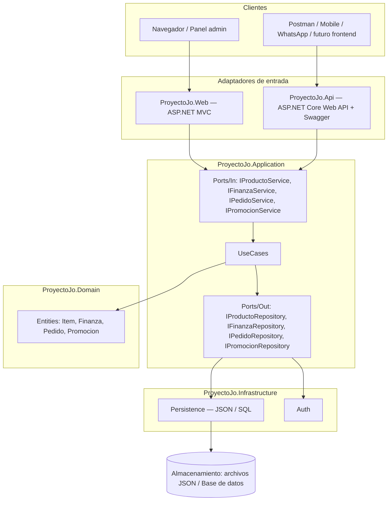
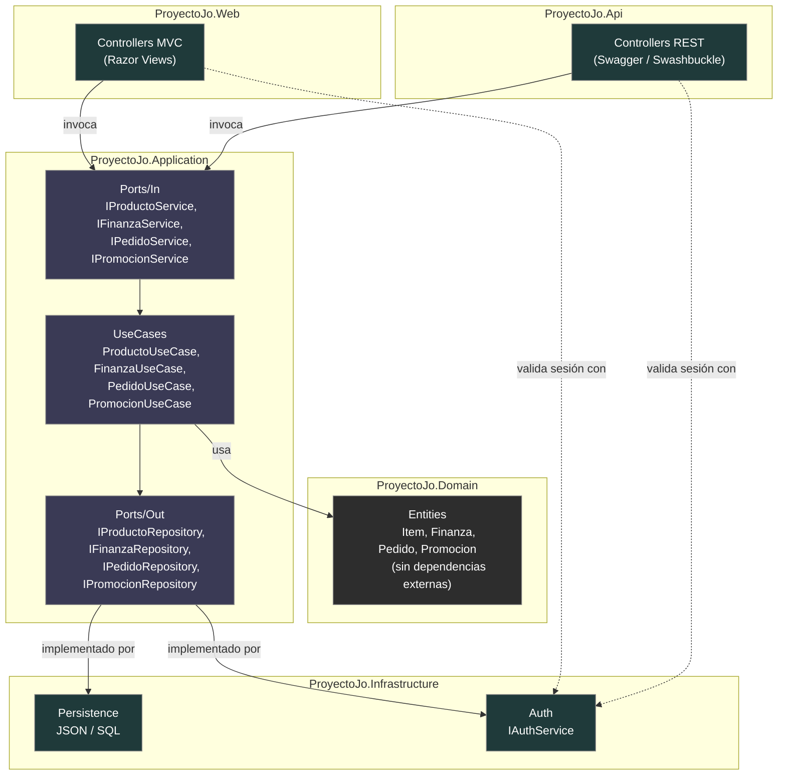
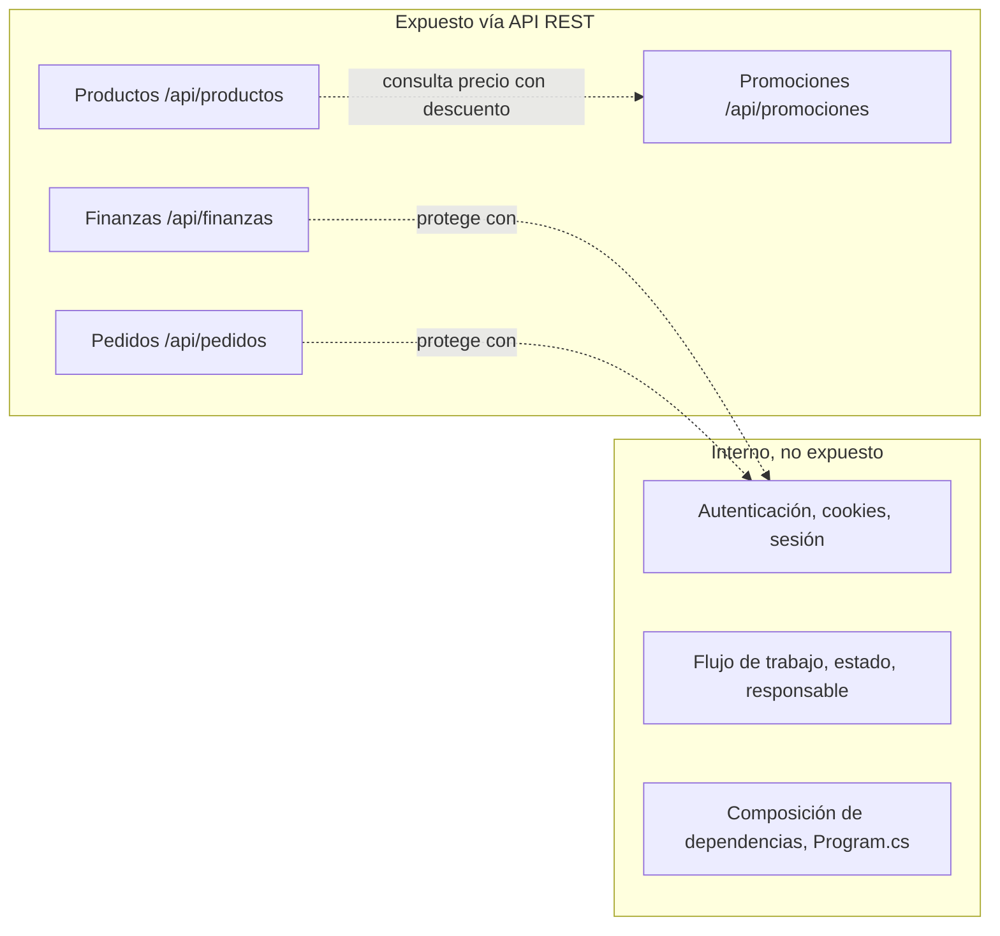

# ADR-04: Incorporación de una API REST 

| Campo  | Valor |
|--------|-------|
| Autor  | Joaquin Uriona |
| Fecha  | 19/06/2026 |
| Estado | `Aceptado` |

---

## Contexto

Hasta ahora, `Proyecto Jo'` exponía toda su funcionalidad únicamente a través del
adaptador `ProyectoJo.Web`, pensado para un único cliente, el navegador, ya que ADR-03
solo contemplaba migrar hacia Arquitectura Hexagonal manteniendo ASP.NET Core MVC como
único adaptador de entrada, sin mencionar todavía una API. Sin embargo, esa misma
migración hexagonal deja el dominio y los casos de uso completamente desacoplados de
ASP.NET, por lo que agregar un adaptador de entrada adicional se vuelve una extensión
natural y de bajo riesgo en vez de una reescritura, justo en el momento en que surge la
necesidad real de que el sistema sea consumido por clientes distintos al navegador, ya
sea una aplicación móvil, una integración con WhatsApp, herramientas de prueba como
Postman o un futuro frontend desacoplado.

Las condiciones que influyeron en esta decisión son las siguientes:

- **Restricción de equipo:** sigue siendo un desarrollador único, por lo que cualquier
  forma de exponer datos hacia afuera debe reutilizar la lógica de negocio ya existente
  en `ProyectoJo.Application`, sin duplicar reglas financieras ni de inventario y sin
  multiplicar el trabajo de mantenimiento
- **Arquitectura ya preparada:** gracias a ADR-03, el dominio y los casos de uso
  (`IProductoService`, `IFinanzaService`, `IPedidoService`, `IPromocionService`) no
  conocen ASP.NET ni la capa web, por lo que agregar un segundo adaptador de entrada
  no debería tocar `Domain` ni `Application`, sino únicamente traducir HTTP hacia los
  puertos ya existentes

---

## Decisión

Se decide implementar una **API REST con ASP.NET Core Web API** dentro del proyecto
`ProyectoJo.Api`, documentada con **Swagger / OpenAPI (Swashbuckle)**, de modo que los
controladores de la API actúen como adaptadores de entrada delgados, igual que los
controladores MVC de `ProyectoJo.Web`: reciben la petición HTTP, invocan el puerto
correspondiente en `ProyectoJo.Application` (los mismos `UseCases` que ya usa la vista
web) y devuelven el resultado serializado a JSON.

### ¿Por qué?

REST resuelve el problema de exponer el dominio hacia clientes distintos al navegador
sin introducir una segunda implementación de la lógica de negocio, ya que al estar
`Domain` y `Application` aislados, `ProyectoJo.Api` simplemente
se conecta a los mismos casos de uso (`ProductoUseCase`, `FinanzaUseCase`,
`PedidoUseCase`, `PromocionUseCase`) que ya existían, lo que valida en la práctica que
la arquitectura hexagonal cumple su promesa de añadir adaptadores sin modificar el
núcleo u además, REST mapea de forma natural sobre operaciones que los puertos ya
exponían como CRUD (`ObtenerTodos`, `ObtenerPorId`, `Agregar`, `Editar`, `Eliminar`),
por lo que no fue necesario diseñar un nuevo modelo de comunicación desde cero, y
Swagger genera documentación interactiva automáticamente a partir de los mismos
controladores, sin mantener un archivo de esquema aparte, lo cual es clave para un
desarrollador único que no tiene tiempo de escribir documentación por separado.

### Alternativas consideradas

| Alternativa | Por qué la descarté |
|-------------|---------------------|
| GraphQL | Obliga a definir un esquema y resolvers adicionales, y como la mayoría de las operaciones del dominio (Productos, Finanzas, Pedidos, Promociones) son CRUD simples, la flexibilidad de consulta de GraphQL no compensa la complejidad añadida para un equipo unipersonal |
| gRPC | Requiere definir contratos `.proto` y no tiene soporte nativo en el navegador ni en herramientas simples de prueba como Postman o WhatsApp, lo que dificulta la validación rápida de endpoints durante el desarrollo |
| SOAP | Es un protocolo más pesado, basado en sobres XML, sin beneficio real frente a JSON sobre HTTP en este contexto, además de que no es el estándar que se pide documentar con Swagger |
| Servir JSON directamente desde los controladores de `ProyectoJo.Web` | Mezclaría la responsabilidad de presentación (vistas Razor) con la de servir datos a clientes externos, rompiendo el principio de adaptadores separados ya establecido en ADR-03 y violando SRP |

---

## Consecuencias

**✅ Lo que gano:**

- **Consecuencia técnica:** `ProyectoJo.Api` se convierte en un segundo adaptador de
  entrada que reutiliza por completo `ProyectoJo.Application`, sin duplicar lógica
  financiera ni de inventario, lo que confirma en código real que la frontera entre
  Domain/Application e Infraestructura/Presentación definida en ADR-03 funciona, ya
  que agregar la API no requirió modificar ni `Domain` ni `Application`
- **Consecuencia sobre el proceso:** Swagger expone una interfaz interactiva para
  probar cada endpoint sin escribir un cliente HTTP manual, lo que reduce el tiempo
  que el desarrollador único dedica a verificar manualmente cada ruta y además sirve
  como documentación viva para quien revise el repositorio

**⚠️ Lo que sacrifico o asumo:**

- **Limitación técnica:** por ahora la API no tiene un mecanismo de autenticación o
  autorización propio más allá de lo que ofrezca `IAuthService` reutilizado de forma
  básica, por lo que los endpoints quedan abiertos, lo cual es aceptable para fines
  académicos pero es un riesgo que debe resolverse antes de exponer datos financieros
  reales en producción
- **Deuda o riesgo:** ahora existen dos adaptadores de entrada, `ProyectoJo.Web` y
  `ProyectoJo.Api`, que dependen de los mismos puertos en `ProyectoJo.Application`,
  por lo que si un puerto cambia su firma, ambos adaptadores deben actualizarse, lo
  que aumenta la superficie de mantenimiento a medida que crecen los módulos de
  Finanzas, Flujo de Trabajo y Reportes

---

## Diagrama



---

## Vistas Arquitectonicas

### Vista logica



### Vista de desarrollo

```text
Projecto Jo'
├── Domain/               # Núcleo del negocio — sin cambios respecto a ADR-03
│   ├── Entities/         # Item, Finanza, Pedido, Promocion
│   ├── Ports/
│   │   ├── In/           # IProductoService, IFinanzaService, IPedidoService, IPromocionService
│   │   └── Out/          # IProductoRepository, IFinanzaRepository, IPedidoRepository, IPromocionRepository
│   └── UseCases/         # Implementación de la lógica de negocio pura — sin cambios
├── Infrastructure/       # Adaptadores de salida — sin cambios
│   ├── Persistence/
│   └── Auth/
├── Web/                  # Adaptador de entrada — ASP.NET MVC (navegador)
│   ├── Controllers/
│   ├── Views/
│   └── Areas/
├── Api/                  # Adaptador de entrada — ASP.NET Core Web API (NUEVO)
│   ├── Controllers/      # ProductosController, FinanzasController, PedidosController, PromocionesController
│   └── Program.cs        # Configuración de Swagger / Swashbuckle
└── Program.cs            # Composición de dependencias compartida por ambos adaptadores
```

### Vista de procesos

```text
[Cliente externo]      [Api / Adaptador In]      [Domain / Port In]      [Domain / UseCase]      [Domain / Port Out]    [Infrastructure / Adaptador Out]
       │                        │                         │                       │                        │                        │
       │ 1. GET /api/finanzas   │                         │                       │                        │                        │
       ────────────────────────>│                         │                       │                        │                        │
       │                        │ 2. Ejecuta caso de uso  │                       │                        │                        │
       │                        │    (IFinanzaService)    │                       │                        │                        │
       │                        ─────────────────────────>│                       │                        │                        │
       │                        │                         │ 3. Invoca             │                        │                        │
       │                        │                         ───────────────────────>│                        │                        │
       │                        │                         │                       │ 4. Consulta repositorio│                        │
       │                        │                         │                       │   (IFinanzaRepository) │                        │
       │                        │                         │                       │───────────────────────>│                        │
       │                        │                         │                       │                        │ 5. Lee de DB / JSON    │
       │                        │                         │                       │                        ────────────────────────>│
       │                        │                         │                       │                        │ 6. Retorna datos       │
       │                        │                         │                       │                        │<───────────────────────│
       │                        │                         │                       │ 7. Retorna lista        │                        │
       │                        │                         │                       │<───────────────────────│                        │
       │                        │                         │ 8. Retorna DTO/Estado │                         │                        │
       │                        │                         │<───────────────────────│                        │                        │
       │                        │ 9. Serializa a JSON     │                       │                        │                        │
       │                        │<─────────────────────────│                       │                        │                        │
       │ 10. Respuesta 200 OK   │                         │                       │                        │                        │
       │<───────────────────────│                         │                       │                        │                        │

```

### Vista de despligue


La API se despliega dentro del mismo proceso Kestrel en la instancia AWS EC2 ya
utilizada por `ProyectoJo.Web`, por lo que no se agrega infraestructura nueva, solo
nuevas rutas (`/api/...`) que conviven con las rutas MVC existentes.

---

## Trade-offs

| Decisión | Ganas | Sacrificas |
|---|---|---|
| API REST sobre GraphQL o gRPC | Curva de aprendizaje mínima, compatible con cualquier cliente HTTP y con Swagger out-of-the-box | Sin flexibilidad de consultas como GraphQL ni contratos binarios eficientes como gRPC si el sistema lo necesitara más adelante |
| `ProyectoJo.Api` como adaptador independiente | `ProyectoJo.Web` no se contamina con responsabilidades de servir JSON a terceros | Dos adaptadores de entrada que deben mantenerse sincronizados contra los mismos puertos |
| Swagger/Swashbuckle sobre documentación manual | Documentación interactiva generada automáticamente desde el código, siempre actualizada | Depende de que los controladores y DTOs estén bien anotados, o la documentación pierde calidad |
| Reutilizar `ProyectoJo.Application` sobre duplicar lógica en la API | Cero duplicación de reglas de negocio entre Web y Api | Cualquier cambio de contrato en un puerto impacta a ambos adaptadores simultáneamente |

---

## Atributos de calidad

### Estaticos

| Atributo | Pregunta que responde | En Proyecto Jo' |
| :--- | :--- | :--- |
| **Mantenibilidad** | ¿Puedo agregar un endpoint nuevo sin tocar la lógica financiera? | `Api/Controllers` solo invoca los puertos existentes en `Application`, sin reglas propias |
| **Modularidad** | ¿Puedo agregar la API sin romper el adaptador Web? | `ProyectoJo.Web` y `ProyectoJo.Api` son proyectos independientes que comparten `Application` |
| **Testeabilidad** | ¿Puedo verificar un endpoint sin levantar vistas Razor? | Sí, Swagger permite probar cada ruta de forma aislada, sin pasar por el navegador ni por las vistas |

### Dinamicos

| Atributo | Pregunta que responde | En Proyecto Jo' |
| :--- | :--- | :--- |
| **Disponibilidad** | Si el EC2 cae, ¿la API también deja de responder? | Sí, al compartir el mismo proceso Kestrel y la misma instancia, ambos adaptadores caen juntos |
| **Seguridad** | ¿Cualquiera puede consumir los endpoints sin autenticarse? | Actualmente sí, ya que la API aún no implementa autenticación propia, lo cual queda como riesgo abierto |
| **Escalabilidad** | Si crece el consumo desde clientes externos, ¿se puede escalar solo la API? | No todavía, pues al ser un monolito hexagonal, escalar implica escalar todo el servidor EC2, incluyendo Web y Api juntos |

---

## Bounded Contexts expuestos por la API



---

## Documentacion de la api


Se determino que el punto de entrada principal para consultar los endpoints será el archivo `README.md` del repositorio y
en lugar de detallar las rutas dentro de los documentos de arquitectura, el `README.md` de Proyecto Jo'
contendrá el enlace directo y las instrucciones necesarias para ejecutar y acceder a la interfaz interactiva de Swagger de forma local o en el entorno de despliegue. 

**Porque:** Esto centraliza la información de inicio rápido para los desarrolladores en el lugar más intuitivo al explorar el repositorio,
evitando que la documentación de acceso quede desactualizada u oculta en los registros de decisiones.


---

## Uso de IA

Se utilizó IA únicamente para:

- Corregir redacción y ortografía del documento
- Generar la sintaxis Mermaid del diagrama de Bounded Contexts y el boceto en texto
  de la vista de procesos y la vista de desarrollo

No se utilizó para tomar decisiones arquitectónicas ni para diseñar la solución.