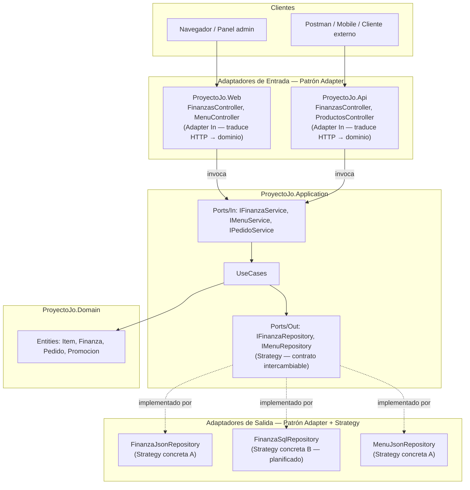
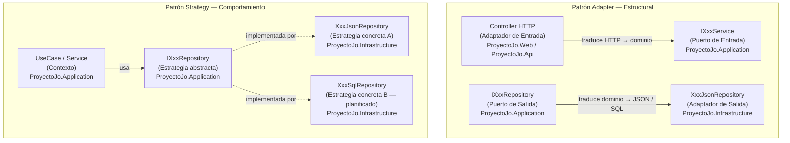
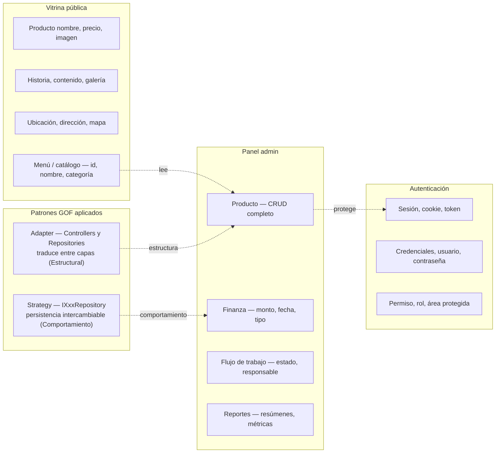

# ADR-05: Integración de Patrones de Diseño GOF

| Campo  | Valor |
|--------|-------|
| Autor  | Joaquin Uriona |
| Fecha  | 26/06/2026 |
| Estado | `Aceptado` |


---

## Contexto

Hasta ahora `Proyecto Jo'` ha definido en ADR-03 las capas de la Arquitectura
Hexagonal y en ADR-04 la incorporación de `ProyectoJo.Api` como segundo adaptador
de entrada, sin embargo ninguno de los dos documentos nombra explícitamente los
patrones de diseño estructurales y de comportamiento que sostienen esas decisiones
en el código, y a medida que el sistema crece con seis módulos implementados y cinco
más planificados, la ausencia de una decisión formal sobre patrones GOF genera el
riesgo de que los módulos futuros como Recetario Digital, Alerta de Stock o Cierre
de Caja se construyan de formas inconsistentes entre sí.

Las condiciones que influyeron en esta decisión son las siguientes:

- **Incompatibilidad de interfaces entre capas:** los controladores de
  `ProyectoJo.Web` y `ProyectoJo.Api` necesitan comunicarse con los puertos de
  `ProyectoJo.Application` y los repositorios de `ProyectoJo.Infrastructure`
  necesitan implementar esos mismos puertos, pero cada capa habla un lenguaje
  distinto, HTTP, casos de uso y persistencia, lo que requiere una forma
  estructurada de traducir entre ellos sin romper el aislamiento del dominio.
- **Intercambiabilidad de la persistencia:** la solución comenzó con repositorios
  JSON y tiene planificada la migración a SQL mediante Entity Framework, por lo que
  se necesita una forma de encapsular esas implementaciones concretas detrás de un
  contrato común que permita cambiarlas sin modificar ningún caso de uso.
- **Consistencia entre módulos:** con módulos ya implementados como Finanzas, Menú,
  Inventario, Promociones, Mapa de Calor y el flujo Cocina/Recepción, documentar
  los patrones que los sostienen garantiza que los módulos futuros sigan el mismo
  modelo estructural sin que el desarrollador tenga que decidirlo de nuevo
  cada vez.

---

## Decisión

Se decide documentar e integrar formalmente dos patrones de diseño GOF en la
solución, uno estructural y uno de comportamiento, el patrón **Adapter** para
traducir entre las interfaces incompatibles de las capas y el patrón **Strategy**
para encapsular las implementaciones de persistencia como algoritmos intercambiables.

### ¿Por qué?

El patrón Adapter resuelve directamente el problema de incompatibilidad de interfaces
entre capas sin violar el principio de inversión de dependencias, pues los
controllers de `ProyectoJo.Web` y `ProyectoJo.Api` actúan como adaptadores de
entrada que traducen peticiones HTTP a llamadas sobre `IFinanzaService`,
`IMenuService` o `IPedidoService`, y las implementaciones en
`ProyectoJo.Infrastructure` actúan como adaptadores de salida que traducen las
llamadas del dominio a operaciones sobre archivos JSON o en el futuro sobre
Entity Framework, garantizando que ninguna de las dos capas extremas conozca los
detalles de la otra.

El patrón Strategy resuelve el problema de intercambiabilidad de la persistencia,
pues los puertos de salida como `IFinanzaRepository` o `IMenuRepository` definen
el contrato y cada implementación concreta como `FinanzaJsonRepository` encapsula
el algoritmo específico de acceso a datos, lo que permite al `Program.cs`
seleccionar en tiempo de composición qué estrategia inyectar sin que los casos de
uso en `ProyectoJo.Application` cambien ni una línea.

### Alternativas consideradas

- Facade en lugar de Adapter
- Template Method en lugar de Strategy
- Repository sin abstracción de interfaz

| Alternativa | Por qué la descarté |
|-------------|---------------------|
| Facade en lugar de Adapter | Facade simplifica una interfaz compleja pero el problema real no es simplificación sino traducción entre el lenguaje HTTP y el lenguaje del dominio, y esa responsabilidad de conversión entre interfaces incompatibles corresponde al Adapter |
| Template Method en lugar de Strategy | Template Method requiere herencia para definir el esqueleto del algoritmo y que las subclases rellenen los pasos, pero la solución ya usa composición mediante interfaces por DIP y Strategy es la variante de comportamiento que encaja con inyección de dependencias sin introducir jerarquías de herencia |
| Repository sin abstracción de interfaz | Implementar los repositorios como clases concretas directamente referenciadas desde los casos de uso acoplaría `ProyectoJo.Application` a `ProyectoJo.Infrastructure`, violando la regla de dependencias de la Arquitectura Hexagonal y el principio de inversión de dependencias |

---

## Consecuencias

✅ Lo que gano:

- **Consecuencia técnica:** los controllers permanecen delgados porque el Adapter
  encapsula toda la traducción entre HTTP y los puertos, la migración de JSON a SQL
  solo requiere crear una nueva clase que implemente `IFinanzaRepository` y cambiar
  el registro en `Program.cs` sin tocar ningún caso de uso, y cualquier módulo nuevo
  como Recetario Digital o Alerta de Stock puede seguir el mismo modelo de Adapter
  en entrada y Strategy en persistencia de forma consistente en ambos adaptadores,
  `ProyectoJo.Web` y `ProyectoJo.Api`.

- **Consecuencia sobre el proceso:** al tener los patrones documentados como decisión
  explícita el desarrollador tiene una guía clara al agregar módulos nuevos sin
  necesidad de decidir caso por caso cómo estructurar la traducción entre capas,
  reduciendo la carga cognitiva del rol unipersonal a medida que el sistema crece
  hacia los módulos planificados.

⚠️ Lo que sacrifico o asumo:

- **Limitación técnica:** cada módulo nuevo requiere al menos una interfaz de entrada,
  una interfaz de salida y dos implementaciones concretas antes de poder ejecutar el
  primer flujo, lo que incrementa el número de archivos por módulo respecto a un
  enfoque MVC directo sin abstracciones.

- **Deuda o riesgo:** si la interfaz de un puerto de salida se diseña mal desde el
  inicio todas las implementaciones concretas que actúen como Strategy heredan esa
  decisión y requieren cambios coordinados en todos los módulos que dependan de ese
  puerto, y la calidad del contrato inicial es crítica porque su costo de corrección
  crece con cada módulo que se agregue.

---

## Diagrama



---

## Vistas Arquitectónicas

### Vista lógica



### Vista de desarrollo

```text
ProyectoJo'
├── ProyectoJo.Application/
│   └── Ports/
│       ├── In/
│       │   ├── IFinanzaService.cs        # Puerto de entrada — contrato del Adapter In
│       │   ├── IMenuService.cs
│       │   └── IPedidoService.cs
│       └── Out/
│           ├── IFinanzaRepository.cs     # Estrategia abstracta (Strategy)
│           └── IMenuRepository.cs
│
├── ProyectoJo.Infrastructure/
│   └── Persistence/
│       ├── FinanzaJsonRepository.cs      # Adaptador de salida (Adapter) + Strategy concreta A
│       └── MenuJsonRepository.cs
│
├── ProyectoJo.Web/
│   └── Areas/Admin/Controllers/
│       ├── FinanzasController.cs         # Adaptador de entrada (Adapter In)
│       ├── MenuController.cs
│       └── OperacionesController.cs
│
└── ProyectoJo.Api/
    └── Controllers/
        ├── FinanzasController.cs         # Segundo adaptador de entrada (Adapter In)
        └── ProductosController.cs
```

### Vista de procesos

```text
[Cliente]           [Controller / Adapter In]     [IXxxService / Port In]    [UseCase]         [IXxxRepository / Strategy]   [JsonRepository / Adapter Out]
      │                         │                           │                      │                        │                            │
      │  POST /Finanzas/Create  │                           │                      │                        │                            │
      ────────────────────────> │                           │                      │                        │                            │
      │                         │  2. Adapter traduce HTTP  │                      │                        │                            │
      │                         │     → RegistrarMovimiento │                      │                        │                            │
      │                         ──────────────────────────> │                      │                        │                            │
      │                         │                           │  3. Invoca UseCase   │                        │                            │
      │                         │                           ─────────────────────> │                        │                            │
      │                         │                           │                      │  4. Valida dominio     │                            │
      │                         │                           │                      │ ──┐                    │                            │
      │                         │                           │                      │   │                    │                            │
      │                         │                           │                      │ <─┘                    │                            │
      │                         │                           │                      │  5. Strategy.Guardar() │                            │
      │                         │                           │                      ───────────────────────> │                            │
      │                         │                           │                      │                        │  6. Adapter traduce        │
      │                         │                           │                      │                        │     dominio → JSON         │
      │                         │                           │                      │                        ──────────────────────────> │
      │                         │                           │                      │                        │  7. Confirmación           │
      │                         │                           │                      │                        │ <──────────────────────── │
      │                         │                           │                      │  8. Resultado          │                            │
      │                         │                           │                      │ <───────────────────── │                            │
      │                         │                           │  9. DTO / estado     │                        │                            │
      │                         │                           │ <──────────────────  │                        │                            │
      │                         │  10. Renderiza / JSON     │                      │                        │                            │
      │                         │ <─────────────────────────│                      │                        │                            │
      │  11. HTML / 200 OK      │                           │                      │                        │                            │
      │ <──────────────────── ─ │                           │                      │                        │                            │
```

### Vista de despliegue

Los patrones Adapter y Strategy no alteran la vista de despliegue documentada en
ADR-03 y ADR-04, y el sistema sigue siendo un monolito desplegado en una única
instancia AWS EC2 con Kestrel como servidor web integrado, pues los patrones operan
en tiempo de compilación e inyección de dependencias y no en tiempo de despliegue,
por lo que no se agrega infraestructura nueva.

---

## Trade-offs

| Decisión | Ganas | Sacrificas |
|---|---|---|
| Adapter sobre acceso directo entre capas | Las capas permanecen desacopladas y cambiar el framework web o la capa de persistencia no rompe el dominio | Más clases e interfaces por módulo y la navegación del código requiere seguir más niveles de indirección |
| Strategy sobre implementación concreta directa | La migración de JSON a SQL es un cambio de una línea en `Program.cs` y los casos de uso no se tocan | Requiere disciplina para no filtrar detalles de implementación hacia arriba en la interfaz del puerto |
| Composición vía Strategy sobre herencia vía Template Method | Sin jerarquías de herencia y la estrategia concreta se inyecta en tiempo de ejecución | Se pierde la posibilidad de reutilizar pasos comunes en una clase base aunque esto no aplica al caso de persistencia simple |
| Dos patrones de categorías distintas sobre un solo patrón | Cubre tanto la traducción estructural entre capas como el comportamiento intercambiable de la persistencia | Mayor superficie de conceptos a dominar para un equipo unipersonal en fase de migración |

---

## Atributos de calidad

### Estáticos

| Atributo | Pregunta que responde | En Proyecto Jo' |
| :--- | :--- | :--- |
| **Mantenibilidad** | ¿Puedo cambiar la persistencia de JSON a SQL sin tocar los casos de uso? | Sí, Strategy garantiza que `FinanzaJsonRepository` sea reemplazable por `FinanzaSqlRepository` sin modificar `FinanzaService` |
| **Modularidad** | ¿Puedo agregar el módulo Recetario Digital siguiendo el mismo modelo? | Sí, el par Adapter + Strategy define el modelo repetible para cualquier módulo nuevo en Web y en Api |
| **Testeabilidad** | ¿Puedo probar `FinanzaService` sin repositorio real ni servidor web? | Sí, Strategy permite inyectar un repositorio en memoria o un mock durante las pruebas unitarias |

### Dinámicos

| Atributo | Pregunta que responde | En Proyecto Jo' |
| :--- | :--- | :--- |
| **Disponibilidad** | ¿Los patrones agregan puntos de falla en tiempo de ejecución? | No, Adapter y Strategy operan en compilación e inyección de dependencias sin overhead en ejecución |
| **Seguridad** | ¿El Adapter de entrada expone detalles internos del dominio al cliente? | No, el controller solo retorna DTOs o `IActionResult` y nunca entidades del dominio directamente |
| **Escalabilidad** | ¿Los patrones limitan el escalado del monolito? | No, la estrategia de persistencia es independiente del número de instancias del proceso |

---

## Bounded Contexts



---

## Uso de IA

Se utilizó IA únicamente para:

- Corregir redacción y ortografía del documento.
- Generar la sintaxis Mermaid de los diagramas.

No se utilizó para tomar decisiones sobre qué patrones integrar ni para diseñar
su aplicación dentro del sistema.