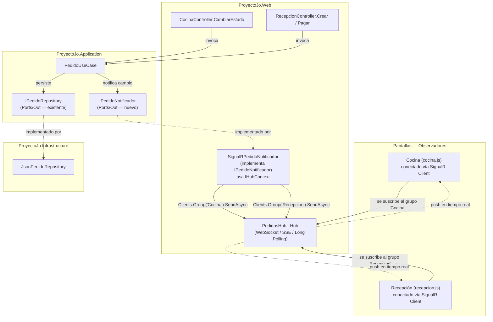
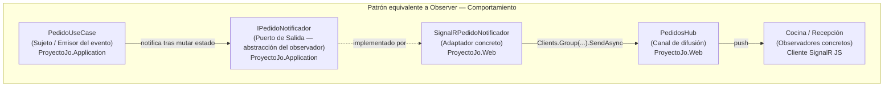
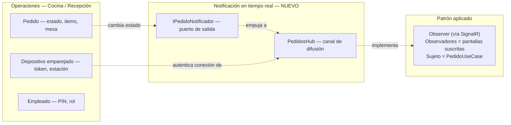

# ADR-06: Reemplazo de Polling por SignalR en Cocina/Recepción

| Campo  | Valor |
|--------|-------|
| Autor  | Joaquin Uriona |
| Fecha  | 27/06/2026 |
| Estado | `Aceptado` |

---

## Contexto

Las pantallas de `Cocina` y `Recepción` dentro del Area `Operaciones` necesitan
reflejar el estado de los pedidos casi en tiempo real, ya que un pedido creado en
Recepción debe aparecer en Cocina en cuestión de segundos, y un pedido marcado como
`Preparado` en Cocina debe reflejarse de vuelta en Recepción para que se pueda cobrar.
Actualmente esa sincronización se resuelve con **polling**: tanto `cocina.js` como
`recepcion.js` ejecutan `setInterval(cargarPedidos, 3000)` y golpean los endpoints
`GET /Operaciones/Cocina/ObtenerPedidos` y `GET /Operaciones/Recepcion/ObtenerPedidos`
cada 3 segundos, sin importar si hubo o no un cambio real.

Cada uno de esos ticks termina invocando `IPedidoService.ObtenerParaCocinaAsync()` o
`ObtenerParaRecepcionAsync()`, que a su vez llaman a
`JsonPedidoRepository.ObtenerTodosAsync()`, el cual abre `pedidos.json`, lee el
archivo completo y lo deserializa entero, todo protegido por un único
`SemaphoreSlim` estático compartido por **todas** las operaciones sobre pedidos
(lecturas y escrituras por igual). Las condiciones que influyeron en esta decisión
son las siguientes:

- **Costo de I/O que no depende del cambio real:** un pedido normalmente cambia de
  estado un par de veces en varios minutos (`Pendiente` → `Preparado` → `Pagado`),
  pero el servidor relee y reparsea el archivo completo cada 3 segundos por cada
  pantalla conectada, durante todo el turno de servicio, generando cientos de
  lecturas de disco por hora que casi nunca traen información nueva.
- **Contención de un único candado compartido:** como el `SemaphoreSlim` de
  `JsonPedidoRepository` es estático y se usa tanto para leer (`ObtenerTodosAsync`)
  como para escribir (`GuardarAsync`, `ActualizarAsync`), cada poll de lectura
  compite por el mismo candado que usan las acciones reales de Cocina
  (`CambiarEstado`) y Recepción (`Crear`, `Pagar`), lo cual no escala bien si se
  agregan más estaciones o dispositivos emparejados mediante `IDispositivoService`.
- **`pedidos.json` crece sin archivado:** al ser un archivo de solo anexar sin
  purga (ver ADR previos sobre persistencia JSON), el costo de cada lectura
  completa aumenta con el tiempo de vida del negocio, mientras que el polling
  sigue ejecutándose a la misma frecuencia fija sin importar ese crecimiento.
- **Latencia percibida innecesaria:** con un intervalo de 3 segundos, un cambio de
  estado puede tardar hasta 3 segundos en reflejarse del lado contrario, lo cual es
  perceptible en un flujo operativo donde Cocina y Recepción dependen una de la
  otra para no entregar ni cobrar de más.

---

## Decisión

Se decide reemplazar el polling por intervalo en `cocina.js` y `recepcion.js` por
**SignalR** (`Microsoft.AspNetCore.SignalR`), de modo que el servidor empuje los
cambios de pedidos a los clientes conectados únicamente cuando ocurre una mutación
real (`CrearAsync`, `CambiarEstadoAsync`), en vez de que los clientes pregunten por
el estado completo cada 3 segundos.

Para no romper la regla de aislamiento de `ProyectoJo.Application` definida desde
ADR-03 (no puede conocer ASP.NET Core), se introduce un nuevo puerto de salida
**`IPedidoNotificador`** en `Application/Ports/Out`, que `PedidoUseCase` invoca
después de cada mutación exitosa. La implementación concreta,
**`SignalRPedidoNotificador`**, vive en `ProyectoJo.Web` (no en
`ProyectoJo.Infrastructure`) porque depende de `IHubContext<PedidosHub>`, una
construcción específica de ASP.NET Core SignalR que solo existe en el proyecto web.

### ¿Por qué?

SignalR resuelve el problema de fondo sin agregar infraestructura nueva: corre
dentro del mismo proceso Kestrel ya desplegado en la instancia EC2 (ADR-03/ADR-04),
usa WebSockets cuando están disponibles y cae automáticamente a Server-Sent Events
o long polling si el cliente o la red no los soportan, sin que haya que programar
ese fallback a mano. Conceptualmente, el patrón aquí es el primo de comportamiento
de Adapter y Strategy que ya documentó ADR-05: los clientes de Cocina y Recepción
se comportan como **observadores** que se suscriben a un grupo, y `PedidoUseCase`
notifica a través de `IPedidoNotificador` cada vez que cambia el estado, sin que el
caso de uso conozca cuántos observadores hay ni cómo están conectados — es el mismo
espíritu del patrón **Observer** del catálogo GoF, aplicado sobre el puerto de
salida en vez de sobre una clase concreta.

Al introducir `IPedidoNotificador` como puerto de salida en `Application` y dejar su
implementación SignalR en `Web`, `PedidoUseCase.CambiarEstadoAsync` y `CrearAsync`
siguen sin saber nada de WebSockets, Hubs ni HTTP; solo llaman a una interfaz, igual
que ya hacen con `IFinanzaService` o `IPedidoRepository`. Además, como Cocina y
Recepción ya autentican cada dispositivo emparejado vía `OperacionesCookieAuth`
(ver `AuthController`), el Hub puede reusar exactamente la misma cookie y los mismos
roles (`Cocina`, `Recepcion`) sin inventar un mecanismo de autenticación aparte.

### Alternativas consideradas

| Alternativa | Por qué la descarté |
|-------------|---------------------|
| Reducir el intervalo de polling o hacerlo adaptativo (backoff) | No resuelve el problema de fondo, solo lo retrasa: sigue siendo el cliente preguntando a ciegas en vez de que el servidor avise cuando realmente hay un cambio |
| Server-Sent Events (SSE) implementado a mano | SignalR ya incluye SSE como uno de sus transportes de fallback automático; implementarlo manualmente duplicaría algo que SignalR ya resuelve, sin ganar nada a cambio |
| Long polling manual (mantener la conexión HTTP abierta hasta que haya un cambio) | Es más complejo de programar correctamente (timeouts, reconexión, múltiples requests colgados) que SignalR, sin ningún beneficio sobre usarlo directamente |
| Mensajería externa (Redis Pub/Sub, RabbitMQ, Azure SignalR Service) | Agrega infraestructura nueva fuera del monolito de una sola instancia EC2, lo cual contradice el trade-off de "Monolito sobre Microservicios" ya aceptado; es sobre-ingeniería para el volumen de un solo restaurante con un desarrollador único |

---

## Consecuencias

✅ Lo que gano:

- **Consecuencia técnica:** el servidor deja de leer `pedidos.json` cada 3 segundos
  por pantalla conectada sin razón; ahora solo se lee/escribe cuando alguien crea
  un pedido o cambia su estado, y ese resultado ya en memoria es lo que se empuja a
  los clientes, eliminando la enorme mayoría de los accesos a disco que hoy no
  traen información nueva.
- **Consecuencia técnica:** la latencia percibida baja de "hasta 3 segundos" a
  prácticamente instantánea, porque el cambio se envía en el mismo momento en que
  `PedidoUseCase` lo persiste, en vez de esperar al siguiente tick del cliente.
- **Consecuencia sobre el proceso:** el nuevo puerto `IPedidoNotificador` mantiene
  intacto el aislamiento de `ProyectoJo.Application` definido en ADR-03; cualquier
  prueba unitaria de `PedidoUseCase` puede seguir corriendo con un mock de ese
  puerto, sin levantar SignalR ni un servidor real.
- **Consecuencia sobre el negocio:** menos margen de error humano en el flujo
  Cocina ↔ Recepción (entregar tarde porque Cocina no vio el pedido a tiempo, o
  cobrar de más porque Recepción no vio que ya estaba pagado en otra estación).

⚠️ Lo que sacrifico o asumo:

- **Limitación técnica:** se introduce una excepción documentada a la regla
  "los adaptadores de salida viven en `Infrastructure`": `SignalRPedidoNotificador`
  vive en `ProyectoJo.Web` porque `IHubContext<PedidosHub>` solo existe ahí. Queda
  registrado aquí para que no se interprete como un descuido en una futura revisión.
- **Limitación técnica:** hay que reescribir `cocina.js` y `recepcion.js` para usar
  el cliente de SignalR (`@microsoft/signalr`) en vez de `fetch` + `setInterval`,
  además de mantener el manejo de eventos de reconexión, que no existía antes.
- **Deuda o riesgo:** si la conexión WebSocket se cae por una red inestable en el
  local y el cliente no reconecta correctamente, la pantalla de Cocina podría
  quedarse "congelada" sin que el cocinero lo note de inmediato; se debe extender
  el indicador `estado-conexion` que ya existe en `cocina.js` para reflejar también
  el estado de la conexión SignalR (`Conectado` / `Reconectando` / `Desconectado`),
  y conservar un botón de refresco manual como red de seguridad.
- **Deuda o riesgo:** mientras el sistema siga siendo el monolito de una sola
  instancia EC2 ya aceptado en ADR-03/ADR-04, SignalR en memoria funciona sin nada
  adicional; pero si en el futuro se escala a más de una instancia, SignalR
  necesita un *backplane* (por ejemplo Redis) para que los mensajes lleguen a
  clientes conectados a una instancia distinta de la que generó el cambio. Esto no
  aplica hoy, pero debe quedar anotado para no sorprenderse el día que se escale
  horizontalmente.

---

## Diagrama



---

## Vistas Arquitectónicas

### Vista lógica



### Vista de desarrollo

```text
ProyectoJo'
├── ProyectoJo.Application/
│   └── Ports/
│       └── Out/
│           ├── IPedidoRepository.cs        # Existente — sin cambios
│           └── IPedidoNotificador.cs       # NUEVO — puerto de salida para push en tiempo real
│   └── UseCases/
│       └── PedidoUseCase.cs                # Modificado — invoca IPedidoNotificador tras Crear/CambiarEstado
│
├── ProyectoJo.Web/
│   ├── Hubs/
│   │   └── PedidosHub.cs                   # NUEVO — Hub de SignalR, [Authorize(AuthenticationSchemes="OperacionesCookieAuth")]
│   ├── Realtime/
│   │   └── SignalRPedidoNotificador.cs     # NUEVO — implementa IPedidoNotificador usando IHubContext<PedidosHub>
│   ├── Areas/Operaciones/Controllers/
│   │   ├── CocinaController.cs             # Sin cambios en su contrato, ObtenerPedidos puede conservarse como carga inicial
│   │   └── RecepcionController.cs          # Igual — Crear/Pagar siguen invocando el mismo IPedidoService
│   ├── wwwroot/js/operaciones/
│   │   ├── cocina.js                       # Modificado — reemplaza setInterval por cliente SignalR
│   │   └── recepcion.js                    # Modificado — reemplaza setInterval por cliente SignalR
│   └── Program.cs                          # Modificado — AddSignalR(), MapHub<PedidosHub>("/hubs/pedidos"), registro de IPedidoNotificador
```

### Vista de procesos

```text
[Recepción crea pedido]   [RecepcionController]   [PedidoUseCase]   [IPedidoRepository]   [IPedidoNotificador]   [PedidosHub]        [Pantalla Cocina]
        │                          │                     │                  │                     │                   │                     │
        │ POST /Recepcion/Crear    │                     │                  │                     │                   │                     │
        ─────────────────────────> │                     │                  │                     │                   │                     │
        │                          │ CrearAsync(pedido)  │                  │                     │                   │                     │
        │                          ───────────────────── >│                  │                     │                   │                     │
        │                          │                     │ GuardarAsync     │                     │                   │                     │
        │                          │                     ──────────────────>│                     │                   │                     │
        │                          │                     │ Pedido guardado  │                     │                   │                     │
        │                          │                     │<──────────────────│                     │                   │                     │
        │                          │                     │ NotificarCreado(pedido)                │                   │                     │
        │                          │                     ───────────────────────────────────────── >│                   │                     │
        │                          │                     │                  │                     │ Group("Cocina")   │                     │
        │                          │                     │                  │                     │  .SendAsync(...)  │                     │
        │                          │                     │                  │                     ───────────────────>│                     │
        │                          │                     │                  │                     │                   │  evento "PedidoNuevo"│
        │                          │                     │                  │                     │                   │ ────────────────────>│
        │                          │  201 Created        │                  │                     │                   │                     │  Cocina renderiza
        │ <─────────────────────── │                     │                  │                     │                   │                     │  la tarjeta sin pedir nada
```

### Vista de despliegue

SignalR no agrega infraestructura nueva: corre dentro del mismo proceso Kestrel ya
desplegado en la instancia AWS EC2 definida en ADR-03/ADR-04, por lo que sigue
siendo un monolito en una sola instancia. La única consideración de despliegue es
que, si en el futuro se coloca un balanceador o proxy inverso frente a Kestrel, este
debe permitir explícitamente el *upgrade* de conexión a WebSocket (encabezados
`Connection: Upgrade` / `Upgrade: websocket`); hoy, al no existir ese balanceador
frente a la instancia única, no se requiere ninguna configuración adicional. Si en
algún momento se decide escalar a más de una instancia, se deberá incorporar un
*backplane* (por ejemplo Redis) para que SignalR distribuya los mensajes entre
instancias, lo cual queda fuera del alcance de este ADR.

---

## Trade-offs

| Decisión | Ganas | Sacrificas |
|---|---|---|
| SignalR sobre mantener el polling | El servidor deja de leer disco cada 3 segundos sin necesidad, y la latencia de actualización baja de segundos a casi instantánea | Hay que mantener conexiones persistentes, reconexión automática y un nuevo Hub, en vez de un endpoint REST simple y sin estado |
| Nuevo puerto `IPedidoNotificador` sobre llamar a SignalR directo desde `PedidoUseCase` | `ProyectoJo.Application` sigue sin conocer ASP.NET Core ni SignalR, y `PedidoUseCase` se puede probar con un mock del puerto | Una capa de indirección más para un caso que, en el corto plazo, solo tiene una implementación concreta |
| Implementación del puerto en `ProyectoJo.Web` en vez de `ProyectoJo.Infrastructure` | Se puede usar `IHubContext<PedidosHub>` directamente sin inventar una forma de exponerlo fuera del proyecto web | Se rompe, de forma documentada y consciente, la convención de que todos los adaptadores de salida viven en `Infrastructure` |
| SignalR sobre un broker externo (Redis/RabbitMQ) | Cero infraestructura nueva, consistente con el monolito de una sola instancia EC2 ya aceptado | Si algún día se escala a múltiples instancias, habrá que agregar un backplane que hoy no existe |

---

## Atributos de calidad

### Estáticos

| Atributo | Pregunta que responde | En Proyecto Jo' |
| :--- | :--- | :--- |
| **Mantenibilidad** | ¿Puedo cambiar el mecanismo de tiempo real sin tocar `PedidoUseCase`? | Sí, `IPedidoNotificador` aísla a `Application` de SignalR; cambiar a otro transporte solo implica una nueva implementación del puerto |
| **Modularidad** | ¿Esta decisión afecta a otros módulos como Finanzas o Inventario? | No, el cambio queda contenido en Pedidos/Operaciones; el resto de los módulos sigue usando REST normal |
| **Testeabilidad** | ¿Puedo probar `PedidoUseCase.CambiarEstadoAsync` sin levantar SignalR? | Sí, basta con un mock de `IPedidoNotificador`, igual que ya se hace con `IPedidoRepository` |

### Dinámicos

| Atributo | Pregunta que responde | En Proyecto Jo' |
| :--- | :--- | :--- |
| **Disponibilidad** | Si se cae la conexión SignalR de una pantalla, ¿deja de funcionar por completo? | No debería: se mantiene un botón de refresco manual y un indicador de estado de conexión como red de seguridad, en vez de depender 100% del push |
| **Seguridad** | ¿Cualquiera puede conectarse al Hub y ver pedidos? | No, `PedidosHub` reutiliza `OperacionesCookieAuth` y los roles `Cocina`/`Recepcion` ya existentes vía `AuthController`, sin un mecanismo de autenticación nuevo |
| **Escalabilidad** | ¿El push en tiempo real funciona igual si se agregan más dispositivos emparejados? | Sí dentro de una sola instancia EC2; si se escala a varias instancias se necesita un backplane (Redis), lo cual queda fuera del alcance de este ADR |

---

## Bounded Contexts



---

## Uso de IA

Se utilizó IA únicamente para:

- Corregir redacción y ortografía del documento.
- Generar la sintaxis Mermaid de los diagramas y el boceto en texto de la vista de
  procesos, a partir del código ya existente en `cocina.js`, `recepcion.js`,
  `PedidoUseCase.cs` y los controladores de `Operaciones`.

No se utilizó para tomar la decisión de adoptar SignalR ni para diseñar la forma en
que `IPedidoNotificador` se integra con la Arquitectura Hexagonal.
