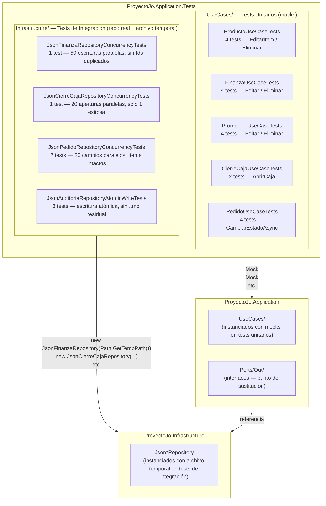
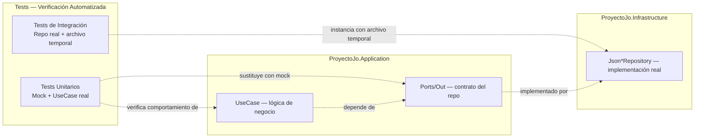

# ADR-07: Introducción de Tests y Estrategia de Cobertura

| Campo  | Valor |
|--------|-------|
| Autor  | Joaquin Uriona |
| Fecha  | 29/06/2026 |
| Estado | `Aceptado` |

---

## Contexto

Hasta este punto `ProyectoJo` no contaba con ningún proyecto de tests en la solución y toda la validación del comportamiento del sistema se hacía de forma manual: correr la aplicación, navegar las pantallas y observar el resultado, lo que funcionó durante la etapa inicial de construcción pero a medida que el sistema creció en módulos (Finanzas, Operaciones, Promociones, Auditoría, CierreCaja) y se introdujeron mecanismos de concurrencia reales (SignalR, locks sobre archivos JSON, operaciones atómicas), el costo de validar manualmente cada cambio aumentó y la probabilidad de introducir regresiones sin detectarlas también.

Las condiciones que motivaron esta decisión son las siguientes:

- **La Arquitectura Hexagonal ya garantizaba testeabilidad pero no se aprovechaba:** desde ADR-03, `ProyectoJo.Application` no tiene ninguna referencia a ASP.NET Core, Entity Framework ni ningún detalle de infraestructura y sus `UseCase` solo dependen de interfaces (`IPedidoRepository`, `IFinanzaService`, `IAuditoriaService`, etc.), lo que permite instanciarlos en un test con mocks sin levantar ningún servidor ni archivo real, un potencial que estaba presente desde el primer día pero nunca había sido utilizado

- **Los puertos de salida (`Ports/Out`) permiten tests de integración selectivos:** las implementaciones concretas en `ProyectoJo.Infrastructure` (los siete `Json*Repository`) reciben su ruta de archivo como parámetro de constructor, lo que permite instanciarlos en un test apuntando a un archivo temporal del sistema operativo sin ninguna configuración adicional ni base de datos levantada, haciendo posible testear comportamiento real de I/O y concurrencia sin acoplarse al entorno de producción

- **El sistema opera con concurrencia real:** Cocina y Recepción están conectadas simultáneamente vía SignalR y pueden disparar mutaciones sobre los mismos pedidos en el mismo instante, por lo que sin tests automatizados que reproduzcan esa concurrencia el único momento en que una condición de carrera se detecta es en producción

- **Cero CI/CD:** la ausencia de tests hacía imposible automatizar la validación de cambios en cualquier pipeline futuro, bloqueando el factor de paridad entre entornos de los 12-Factor App documentados en el diseño del sistema

---

## Decisión

Se decide introducir `ProyectoJo.Application.Tests` como nuevo proyecto de la solución, usando **xUnit 2.9.2** como framework de tests y **Moq 4.20.72** como biblioteca de mocking, organizado en dos niveles de cobertura que se complementan entre sí pero nunca se mezclan dentro de la misma clase de test.

El primer nivel son los **tests unitarios** (carpeta `UseCases/`), donde cada `UseCase` se instancia con mocks de todos sus puertos de salida, permitiendo verificar la lógica de negocio de forma completamente aislada, sin tocar disco, sin levantar servidor y en milisegundos, cubriendo tanto el camino feliz (la entidad existe, la operación se completa y la auditoría se registra) como el camino de error (la entidad no existe, la operación aborta y la auditoría no se registra).

El segundo nivel son los **tests de integración** (carpeta `Infrastructure/`), donde los repositorios JSON concretos se instancian apuntando a archivos temporales generados con `Path.GetTempPath() + Guid.NewGuid()` y eliminados en `IDisposable.Dispose()`, permitiendo disparar escrituras reales con `Task.WhenAll` sobre múltiples hilos para verificar comportamiento bajo concurrencia real, algo que un mock no puede reproducir porque un `Mock<IFinanzaRepository>` no tiene lock ni I/O de archivo de verdad.

### ¿Por qué xUnit y Moq?

xUnit es el framework de tests estándar del ecosistema .NET moderno, usado por el propio ASP.NET Core y por la mayoría de los proyectos open source de Microsoft, con soporte nativo en `dotnet test` sin configuración adicional, mientras que Moq es la biblioteca de mocking más adoptada para C# con una API fluida (`Setup`, `Returns`, `Verify`, `Times`) que encaja directamente con el estilo de interfaces pequeñas y específicas que ya define `ProyectoJo.Application` en sus `Ports/In` y `Ports/Out`, siguiendo el principio de Interface Segregation (ISP) documentado en el diseño del sistema.

### Alternativas consideradas

| Alternativa | Por qué la descarté |
|-------------|---------------------|
| NUnit | Funcionalidad equivalente a xUnit para este caso de uso, sin ninguna ventaja concreta sobre él en el ecosistema .NET moderno, por lo que la elección de xUnit sobre NUnit es principalmente de consistencia con el ecosistema ASP.NET Core |
| NSubstitute en lugar de Moq | API más simple que Moq para casos básicos pero con menos control sobre verificaciones de llamadas (`Verify`/`Times`), que son exactamente las aserciones más importantes en los tests de auditoría ("este método fue llamado exactamente una vez" o "este método nunca fue llamado") |
| Tests directamente en `ProyectoJo.Web` o `ProyectoJo.Infrastructure` | Contradice el Atributo de Calidad de Testeabilidad documentado en el diseño: la lógica de negocio debe ser testeable sin levantar el servidor web ni depender de la infraestructura, por lo que los tests unitarios deben poder correr referenciando solo `Application` y `Domain` |
| Un único nivel de tests (solo unitarios o solo integración) | Los tests unitarios con mocks no pueden reproducir condiciones de carrera reales entre hilos compitiendo por el mismo lock, y los tests de integración contra archivos reales son más lentos y frágiles ante el entorno, por lo que los dos niveles se complementan en vez de reemplazarse |

---

## Consecuencias

✅ Lo que gano:

- **Consecuencia técnica:** cualquier `UseCase` de `ProyectoJo.Application` puede probarse con un mock de sus dependencias sin levantar ningún servidor ni archivo real, en milisegundos, consistente con el Atributo de Calidad de Testeabilidad documentado en el diseño del sistema
- **Consecuencia técnica:** el comportamiento bajo concurrencia real (múltiples hilos compitiendo sobre el mismo archivo JSON) puede verificarse automáticamente con `Task.WhenAll` en los tests de integración de `Infrastructure/`, sin depender de reproducción manual ni de observación en producción
- **Consecuencia sobre el proceso:** `dotnet test ProyectoJo.Application.Tests` puede integrarse en cualquier pipeline de CI/CD (GitHub Actions, Azure Pipelines) como gate de calidad automático antes de un deploy, desbloqueando el factor de paridad de los 12-Factor App y cerrando la deuda de "Cero CI/CD" identificada en la revisión técnica
- **Consecuencia sobre el proceso:** el contrato de cada puerto de salida (`IFinanzaRepository`, `IPedidoRepository`, etc.) queda implícitamente documentado en los tests: un futuro desarrollador puede leer `FinanzaUseCaseTests` y entender exactamente qué espera `FinanzaUseCase` de su repositorio, incluyendo los casos de error, sin leer el código de producción
- **Consecuencia sobre la migración a EF:** cuando se implemente `SqlFinanzaRepository` como parte del Objetivo futuro del sistema (migración a Entity Framework), los tests unitarios de `FinanzaUseCase` seguirán corriendo sin modificación porque mockean `IFinanzaRepository`, no la implementación JSON concreta, confirmando que el contrato del puerto se respeta independientemente del motor de persistencia

⚠️ Lo que sacrifico o asumo:

- **Limitación técnica:** los tests de integración en `Infrastructure/` usan los repositorios JSON reales, por lo que no cubren el comportamiento futuro de los repositorios SQL, esos tests de integración deberán reescribirse o complementarse cuando se migre a Entity Framework
- **Deuda o riesgo:** `ProyectoJo.Web` (controllers, middleware, vistas) y `ProyectoJo.Infrastructure/Auth` no tienen cobertura de tests en esta decisión, los controllers son deliberadamente delgados (solo mapean HTTP e invocan puertos, sin lógica propia) por lo que su cobertura tiene menor prioridad, pero el `JsonExceptionMiddleware` introducido en la misma sesión y los mecanismos de autenticación (`EnvAuthService`, `EmpleadoAuthUseCase`) quedan sin tests automatizados
- **Deuda o riesgo:** no existe todavía ningún pipeline de CI/CD que ejecute `dotnet test` automáticamente en cada push, por lo que la ejecución de los tests sigue siendo un paso manual que depende de la disciplina del desarrollador hasta que se configure `.github/workflows`

---

## Diagrama



---

## Vistas Arquitectónicas

### Vista de desarrollo

```text
ProyectoJo/
├── ProyectoJo.Application/
│   ├── Ports/Out/                  # Interfaces — punto de sustitución entre UseCase y repo
│   └── UseCases/                   # Lógica de negocio — testeable con mocks de los puertos
│
├── ProyectoJo.Infrastructure/
│   └── Persistence/
│       └── Json*Repository.cs      # Implementaciones reales — testeables con archivo temporal
│
└── ProyectoJo.Application.Tests/   # NUEVO — proyecto de tests
    ├── ProyectoJo.Application.Tests.csproj
    │   # Dependencias: xUnit 2.9.2, Moq 4.20.72, Microsoft.NET.Test.Sdk 17.12.0
    │   # Referencias: Application, Domain, Infrastructure
    ├── UseCases/                   # Tests unitarios — mocks, sin I/O real
    │   ├── ProductoUseCaseTests.cs
    │   ├── FinanzaUseCaseTests.cs
    │   ├── PromocionUseCaseTests.cs
    │   ├── CierreCajaUseCaseTests.cs
    │   └── PedidoUseCaseTests.cs
    └── Infrastructure/             # Tests de integración — repo real, archivo temporal
        ├── JsonFinanzaRepositoryConcurrencyTests.cs
        ├── JsonCierreCajaRepositoryConcurrencyTests.cs
        ├── JsonPedidoRepositoryConcurrencyTests.cs
        └── JsonAuditoriaRepositoryAtomicWriteTests.cs
```

### Vista de procesos

```text
[dotnet test]   [xUnit Runner]   [Test Unitario]   [Mock<IRepo>]   [UseCase]   [Test Integración]   [Json*Repository]   [Archivo .tmp]   [Archivo real]
      │                │                │                │               │                │                    │                  │                │
      │ descubre tests │                │                │               │                │                    │                  │                │
      ──────────────── >│                │                │               │                │                    │                  │                │
      │                │ instancia      │                │               │                │                    │                  │                │
      │                ─────────────── >│                │               │                │                    │                  │                │
      │                │                │ Setup/Returns  │               │                │                    │                  │                │
      │                │                ────────────────>│               │                │                    │                  │                │
      │                │                │                │  invoca       │                │                    │                  │                │
      │                │                │                ───────────── > │                │                    │                  │                │
      │                │                │ Verify(Times)  │               │                │                    │                  │                │
      │                │                │<───────────────│               │                │                    │                  │                │
      │                │ instancia      │                │               │                │                    │                  │                │
      │                ──────────────────────────────────────────────── >│                │                    │                  │                │
      │                │                │                │               │  Task.WhenAll  │                    │                  │                │
      │                │                │                │               │ ───────────────>│                   │                  │                │
      │                │                │                │               │                │ WriteAllText       │                  │                │
      │                │                │                │               │                │ ───────────────────>│                 │                │
      │                │                │                │               │                │                    │  File.Move      │                │
      │                │                │                │               │                │                    │ ──────────────────────────────── >│
      │                │ Assert         │                │               │                │                    │                  │                │
      │ resultado      │<───────────────────────────────────────────────────────────────────────────────────────────────────────────────────────── │
      │<───────────────│                │                │               │                │                    │                  │                │
```

---

## Trade-offs

| Decisión | Ganas | Sacrificas |
|---|---|---|
| Dos niveles (unitarios + integración) sobre un único nivel | Cada nivel verifica lo que el otro no puede: los mocks no tienen lock real, los archivos temporales no tienen lógica de negocio aislada | Dos patrones distintos de setup que un desarrollador nuevo debe aprender para contribuir tests al proyecto |
| xUnit sobre NUnit | Consistencia con el ecosistema ASP.NET Core y soporte nativo en `dotnet test` sin configuración | Ninguna desventaja técnica concreta para este volumen de tests |
| Moq sobre NSubstitute | Control preciso de verificaciones con `Verify`/`Times`, crítico para confirmar que auditoría no se llama cuando no debe | API levemente más verbosa que NSubstitute para casos simples de `Setup`/`Returns` |
| Archivo temporal con `Guid` sobre archivo fijo | Cada instancia de test tiene su propio archivo aislado, los tests pueden correr en paralelo sin pisarse | `IDisposable.Dispose()` debe implementarse correctamente en cada clase de integración o los `.tmp` y archivos de test quedan en el sistema |
| Referenciar `Infrastructure` desde el proyecto de tests | Los tests de integración pueden instanciar los repositorios reales sin configuración adicional | El proyecto de tests tiene una referencia directa a `Infrastructure`, acoplándolo a la implementación concreta además de a la interfaz |

---

## Atributos de calidad

### Estáticos

| Atributo | Pregunta que responde | En Proyecto Jo' |
| :--- | :--- | :--- |
| **Testeabilidad** | ¿Puedo verificar la lógica de un `UseCase` sin levantar el servidor ni una base de datos? | Sí, `ProyectoJo.Application` no tiene dependencias de infraestructura y cualquier `UseCase` se puede instanciar con mocks de sus puertos en un test xUnit |
| **Mantenibilidad** | ¿Cómo sé que un cambio en `FinanzaUseCase` no rompió el comportamiento esperado? | `dotnet test ProyectoJo.Application.Tests` corre los 26 tests en segundos y señala exactamente qué método y qué aserción falló |
| **Modularidad** | ¿Los tests de un módulo afectan a los de otro? | No, cada clase de test es completamente independiente: instancia sus propios mocks o sus propios archivos temporales y los limpia en `Dispose()` |

### Dinámicos

| Atributo | Pregunta que responde | En Proyecto Jo' |
| :--- | :--- | :--- |
| **Disponibilidad** | ¿Cómo verifico que el sistema sigue funcionando después de un cambio de concurrencia? | Los tests de integración en `Infrastructure/` disparan escrituras reales con `Task.WhenAll` y verifican que el archivo final sea consistente, sin necesidad de reproducir la condición manualmente |
| **Escalabilidad** | ¿Los tests siguen siendo válidos si se agregan más módulos (Reportes, Inventario)? | Sí, cada nuevo `UseCase` puede tener su propia clase de test unitario en `UseCases/` siguiendo el mismo patrón, sin modificar los tests existentes |

---

## Bounded Contexts



---

## Uso de IA

Se utilizó IA para:

- Generar la estructura inicial de los archivos de test (`ProductoUseCaseTests`,
  `FinanzaUseCaseTests`, `PromocionUseCaseTests`, `CierreCajaUseCaseTests`,
  `PedidoUseCaseTests`, y los tests de integración de concurrencia y escritura
  atómica) a partir del código existente en `ProyectoJo.Application` y
  `ProyectoJo.Infrastructure`
- Corregir redacción y ortografía de este documento
- Generar la sintaxis Mermaid de los diagramas y el boceto en texto de la
  vista de procesos

No se utilizó para decidir la estrategia de dos niveles (unitarios + integración),
la elección de xUnit y Moq, ni el criterio de usar archivos temporales con
`Guid` para aislar los tests de integración