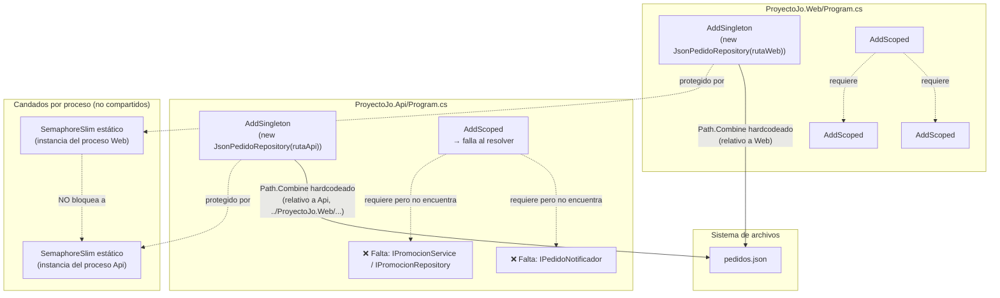
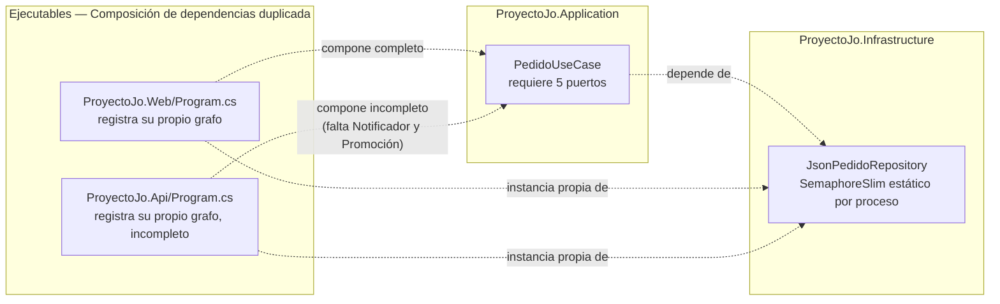

# ADR-08: Deuda Técnica de `ProyectoJo.Api`

| Campo  | Valor |
|--------|-------|
| Autor  | Joaquin Uriona |
| Fecha  | 15/07/2026 |
| Estado | `Aceptado` |

---

## Nota de actualización (25/08/2026)

El contenido original de este ADR (15/07/2026) describe `ProyectoJo.Api` en su
estado previo a la migración de persistencia a PostgreSQL (ver
[ADR-10](./ADR-10-Joaquin-Uriona.md)): `JsonPedidoRepository` con
`SemaphoreSlim` estático, rutas de `pedidos.json` armadas a mano, y una Api
parcialmente rota (solo `PedidosController` fallaba por DI incompleta,
`ProductosController` seguía funcionando). Ese código ya no existe — la
migración a Postgres eliminó por completo la capa de repositorios JSON — y la
causa raíz que este ADR identificó (`ProyectoJo.Web` y `ProyectoJo.Api`
componen su propio grafo de dependencias por separado, sin un punto de
configuración compartido) sigue exactamente igual de sin resolver, pero el
síntoma empeoró: `ProyectoJo.Api/Program.cs` hoy no registra **ningún**
repositorio (ni `IProductoRepository`, ni `IPedidoRepository`, ni los demás),
así que el 100% de sus endpoints fallan en runtime al resolver su `UseCase`
correspondiente, no solo los de `PedidosController` como describía la versión
original de este documento. El detalle actualizado vive en la sección "Known
technical debt" de `CLAUDE.md`.

La propuesta de solución original (centralizar el registro de dependencias en
un método de extensión compartido, del tipo `AddProyectoJoServices`) sigue
siendo la resolución correcta y sigue sin implementarse; este ADR permanece
`Aceptado` como decisión de "documentar y no resolver todavía", no porque el
contenido técnico de la sección Contexto siga describiendo el código actual.

---

## Contexto

`ProyectoJo.Api` nació como un proyecto vacío, reservado explícitamente para
desarrollo futuro (móvil, WhatsApp, Postman) y sin lógica propia, en algún punto
de la evolución del sistema se le agregaron `PedidosController` y
`ProductosController` para exponer los mismos casos de uso que ya usa
`ProyectoJo.Web`, reutilizando `ProyectoJo.Application` y
`ProyectoJo.Infrastructure`, por lo cual el
problema es que, mientras `PedidoUseCase` seguía creciendo dentro de `Application`
(se le agregaron `IPedidoNotificador` y una dependencia de
`IPromocionService` para calcular precios finales en `CrearAsync`), a lo cual no volvi
a revisar si `ProyectoJo.Api/Program.cs` que registra sus propias dependencias
de forma independiente a `ProyectoJo.Web/Program.cs` seguía siendo capaz de
construir ese grafo de dependencias.

Al inspeccionar el código actual se confirmaron tres deudas concretas, ninguna de
las dos documentada hasta ahora:

- **`ProyectoJo.Api/Program.cs` arma las rutas a los archivos de persistencia a
  mano:**
```csharp
  var pedidosPath = Path.Combine(
      builder.Environment.ContentRootPath, "..", "ProyectoJo.Web", "Persistencia", "pedidos.json");
```
  en vez de leerlas de configuración o variables de entorno, y con ese path
  construye su propia instancia de `JsonPedidoRepository` y `JsonFinanzaRepository`
  vía `AddSingleton<IPedidoRepository>(new JsonPedidoRepository(...))`.

- **`JsonPedidoRepository` usa un candado estático por proceso:**
```csharp
  private static readonly SemaphoreSlim _lock = new(1, 1);
```
  Como Api y Web son dos procesos distintos (dos `dotnet run` separados, cada
  uno con su propio `AppDomain`), cada uno tiene su **propia** instancia de ese
  `SemaphoreSlim` estático, si ambos procesos escriben `pedidos.json` casi al
  mismo tiempo, el candado de uno no bloquea al otro: el patrón de
  escritura a temporal y `File.Move` sigue siendo atómico a nivel de archivo, pero dos
  `File.Move` casi simultáneos desde procesos distintos pueden pisarse entre sí,
  y la garantía de "solo un escritor a la vez" que sí existe dentro de un mismo
  proceso deja de cumplirse entre procesos.

- **`ProyectoJo.Api/Program.cs` no registra el grafo completo de dependencias
  de `PedidoUseCase`:**
```csharp
  builder.Services.AddScoped<IPedidoService, PedidoUseCase>();
```
  pero `PedidoUseCase` requiere en su constructor `IPedidoRepository`,
  `IFinanzaService`, `IPedidoNotificador`, `IProductoService` y
  `IPromocionService`, a lo cual la Api registra los primeros tres tipos de repositorio y
  los tres `*Service` correspondientes a Pedido/Producto/Finanza, pero nunca
  registra `IPedidoNotificador` ni `IPromocionService` (ni su repositorio,
  `IPromocionRepository`), el contenedor de DI de Api no puede construir
  `PedidoUseCase`.

Estas dos deudas comparten un origen común: `ProyectoJo.Api` y `ProyectoJo.Web`
son dos ejecutables independientes que componen su propio grafo de
dependencias por separado, en vez de compartir un único punto de
configuración, por lo que cualquier cambio en `Application`/`Infrastructure`
que no se replique manualmente en ambos `Program.cs` deja a uno de los dos
procesos desincronizado sin ningún aviso en tiempo de compilación.

---

## Decisión

Se documentan ambas deudas y se decide **no resolverlas
todavía**, dejándolas explícitamente registradas para una iteración futura, en
vez de parchearlas de forma apresurada dentro de esta revisión y la razón es que
las dos comparten una causa raíz — `ProyectoJo.Api` compone su propio grafo de
dependencias de forma manual y desincronizada de `ProyectoJo.Web` — y conviene
resolverlas juntas con una sola decisión de diseño (por ejemplo, centralizar el
registro de servicios de `Application`/`Infrastructure` en un método de
extensión compartido, del tipo `AddProyectoJoServices(config)`, invocado por
igual desde `Web` y `Api`) en vez de dos parches puntuales que dejen la próxima
dependencia nueva de `PedidoUseCase` en la misma situación.

### ¿Por qué se clasifican así?

- La deuda de la ruta hardcodeada y el candado no compartido es **deuda de
  infraestructura**: nace de que la configuración de persistencia
  no se centralizó como un `Backing Service` según el principio de
  12-Factor App ya adoptado en el diseño del sistema, sino que cada proyecto
  ejecutable la reconstruye por su cuenta.
- La deuda del registro de DI incompleto es **deuda accidental**: no decidi
  conscientemente dejar `ProyectoJo.Api` sin `IPedidoNotificador` ni
  `IPromocionService`; simplemente `PedidoUseCase` creció después de que Api
  copió su composición inicial de servicios, y no existía ningún mecanismo
   que lo hiciera evidente antes de un intento real de request a `PedidosController`.

### Alternativas consideradas

| Alternativa | Por qué la descarté |
|-------------|---------------------|
| Corregir ambas deudas ahora mismo dentro de este ADR | Resolvería el síntoma puntual pero no la causa raíz (registro de servicios duplicado entre Web y Api); la próxima dependencia nueva de cualquier `UseCase` volvería a dejar a Api desincronizado |
| Ignorar la deuda del candado por ser "poco probable" | El propio ADR-06 ya identificó que Cocina y Recepción generan escrituras concurrentes reales sobre `pedidos.json`; agregar un segundo proceso (Api) que escribe el mismo archivo sin candado compartido aumenta, no reduce, la probabilidad de colisión |
| Eliminar `ProyectoJo.Api` hasta que se necesite de verdad | Contradice el trabajo ya invertido en `PedidosController`/`ProductosController` y Swagger; la regla de diseño original de dejarlo vacío ya fue superada por la implementación actual, por lo que documentar la deuda es más honesto que revertir trabajo funcional |

---

## Consecuencias

✅ Lo que gano:

- **Consecuencia sobre el proceso:** ambas deudas quedan documentadas con
  evidencia de código concreta, en vez de vivir solo como una sospecha; un
  futuro desarrollador no tiene que
  redescubrirlas leyendo `Program.cs` línea por línea.
- **Consecuencia técnica:** al identificar que la causa raíz es compartida
  (registro de dependencias duplicado), la solución futura puede resolver las
  dos deudas con un solo cambio de diseño en vez de dos parches independientes.

⚠️ Lo que sacrifico o asumo:

- **Deuda o riesgo (infraestructura):** mientras no se centralice la
  configuración de rutas y el candado de concurrencia entre procesos, cualquier
  escritura simultánea a `pedidos.json` desde Api y Web corre riesgo de
  corromper una escritura o perder un cambio, aunque cada escritura individual
  siga siendo atómica a nivel de archivo.
- **Deuda o riesgo (accidental):** mientras `ProyectoJo.Api/Program.cs` no
  registre `IPedidoNotificador` e `IPromocionService`, cualquier request real a
  `PedidosController` (`GetRecepcion`, `GetCocina`, `Create`, `Pagar`,
  `CambiarEstado`) falla en tiempo de ejecución con una excepción de resolución
  de DI antes de llegar a `PedidoUseCase`, hoy esto no afecta a los usuarios
  reales de Cocina/Recepción porque siguen usando `ProyectoJo.Web`, pero
  bloquea cualquier intento de probar o consumir la Api tal como está.
- **Costo de no pagarla:** si se conecta un cliente real a la Api (móvil,
  WhatsApp, Postman) antes de resolver la deuda de DI, el primer request
  fallará de inmediato; y si ese cliente además escribe pedidos al mismo tiempo
  que Cocina/Recepción vía Web, la deuda de infraestructura deja de ser teórica.

---

## Diagrama



---

## Vistas Arquitectónicas

### Vista de desarrollo

```text
ProyectoJo/
├── ProyectoJo.Web/
│   ├── Program.cs                  # Registra su propio grafo de dependencias
│   └── Persistencia/
│       └── pedidos.json            # Archivo real, ruta relativa a Web
│
├── ProyectoJo.Api/
│   ├── Program.cs                  # Registra su propio grafo, incompleto y desincronizado
│   │   # Path.Combine(ContentRootPath, "..", "ProyectoJo.Web", "Persistencia", "pedidos.json")
│   │   # AddSingleton<IPedidoRepository>(new JsonPedidoRepository(...)) — instancia propia
│   │   # AddScoped<IPedidoService, PedidoUseCase>() — sin IPedidoNotificador ni IPromocionService
│   ├── Controllers/
│   │   ├── PedidosController.cs    # Falla en runtime por DI incompleta
│   │   └── ProductosController.cs  # Funciona — ProductoUseCase no depende de los servicios faltantes
│   └── (sin AddProyectoJoServices compartido con Web) — PENDIENTE
│
├── ProyectoJo.Application/
│   └── UseCases/PedidoUseCase.cs   # Requiere: IPedidoRepository, IFinanzaService,
│                                    # IPedidoNotificador, IProductoService, IPromocionService
│
└── ProyectoJo.Infrastructure/
    └── Persistence/
        └── JsonPedidoRepository.cs # private static readonly SemaphoreSlim _lock — por proceso
```

### Vista de procesos

```text
[Proceso Web]      [SemaphoreSlim Web]   [pedidos.json]   [SemaphoreSlim Api]      [Proceso Api]
      │                     │                    │                  │                    │
      │  CambiarEstado      │                    │                  │                    │
      │────────────────────>│                    │                  │                    │
      │                     │  WriteAllText+Move │                  │                    │
      │                     │───────────────────>│                  │                    │
      │<────────────────────│                    │                  │  Create (pedido)   │
      │                     │                    │                  │<───────────────────│
      │                     │                    │  WriteAllText+Move                    │
      │                     │                    │<─────────────────│                    │
      │                     │                    │                  │───────────────────>│
      │                     │                    │                  │                    │
      │        ⚠️ Ninguno de los dos SemaphoreSlim conoce al otro: si ambos                │
      │           procesos escriben casi al mismo tiempo, el orden final del              │
      │           File.Move depende del sistema operativo, no de un candado común         │
```

---

## Trade-offs

| Decisión | Ganas | Sacrificas |
|---|---|---|
| Documentar ahora, resolver después | Evitaria resolver el síntoma dos veces cuando aparezca la próxima dependencia nueva en `PedidoUseCase` | La Api queda inutilizable para `PedidosController` mientras tanto, aunque hoy no la use ningún cliente real |
| Tratar ambas deudas como una sola causa raíz  | Una única solución futura (`AddProyectoJoServices`) resuelve las dos en vez de necesitar dos cambios independientes | Retrasa la solución porque exige diseñar el método de extensión compartido en vez de aplicar un fix rápido a cada síntoma |
| Mantener `ProyectoJo.Api` en vez de eliminarlo | Se conserva el trabajo ya invertido en `PedidosController`, `ProductosController` y Swagger | El proyecto queda documentado como "no funcional para Pedidos" hasta que se resuelva, lo cual puede confundir a quien lo vea por primera vez |
| No compartir el candado entre procesos todavía | No agrega la complejidad de un mecanismo de lock distribuido (archivo `.lock`, mutex con nombre, etc.) antes de que exista un cliente real que lo necesite | Si alguien conecta la Api a producción antes de resolver esto, la ventana de colisión entre `File.Move` de dos procesos queda abierta |

---

## Atributos de calidad

### Estáticos

| Atributo | Pregunta que responde | En Proyecto Jo' |
| :--- | :--- | :--- |
| **Mantenibilidad** | ¿Agregar una dependencia nueva a `PedidoUseCase` se refleja automáticamente en todos los proyectos que lo consumen? | `Web` y `Api` registran sus dependencias por separado, así que la respuesta actual es "solo si alguien se acuerda de actualizar los dos `Program.cs`" |
| **Modularidad** | ¿Esta deuda afecta a otros módulos como Finanzas o Inventario? | No, está acotada al proyecto `ProyectoJo.Api` y a cómo compone sus dependencias; `ProyectoJo.Web` no se ve afectado |
| **Configurabilidad** | ¿Las rutas de persistencia se pueden cambiar sin recompilar? | No todavía: están armadas con `Path.Combine` relativo a `ContentRootPath` dentro del propio `Program.cs` de Api, en vez de leerse de `appsettings`/variables de entorno |

### Dinámicos

| Atributo | Pregunta que responde | En Proyecto Jo' |
| :--- | :--- | :--- |
| **Disponibilidad** | ¿Qué pasa si un cliente real intenta usar `ProyectoJo.Api` hoy? | Cualquier endpoint de `PedidosController` falla al resolver `PedidoUseCase` por DI incompleta; `ProductosController` sí funciona porque `ProductoUseCase` no depende de los servicios faltantes |
| **Escalabilidad** | ¿El sistema soporta agregar un tercer proceso que también escriba `pedidos.json`? | No de forma segura todavía: el `SemaphoreSlim` estático de `JsonPedidoRepository` protege solo dentro de un mismo proceso, no entre procesos distintos |
| **Consistencia** | ¿Dos procesos escribiendo el mismo archivo casi al mismo tiempo pueden perder una escritura? | Sí, potencialmente: cada `File.Move` sigue siendo atómico a nivel de archivo, pero no hay coordinación entre el `SemaphoreSlim` de Web y el de Api |

---

## Propuesta de solución

| Deuda | Propuesta |
|-------|-----------|
| Rutas hardcodeadas y candado no compartido entre procesos | Extraer un método de extensión `AddProyectoJoPersistence(configuration)` en `Infrastructure`, que lea las rutas desde `appsettings`/variables de entorno (no desde `Path.Combine` relativo a `ContentRootPath`), e invocarlo igual desde `Web` y `Api`, resuelve el hardcodeo, pero **no** resuelve por sí solo el candado entre procesos, mientras Api y Web sigan siendo procesos separados escribiendo el mismo archivo, ese candado seguirá sin compartirse; queda anotado como límite conocido de la solución propuesta |
| Registro de DI incompleto en Api | Mover el bloque completo de registro de `Ports/Out` y `Ports/In` (repositorios + casos de uso) a un método de extensión compartido en `Infrastructure` o `Application`, del mismo modo que se centralizaron las rutas, para que agregar una dependencia nueva a un `UseCase` no dependa de recordar actualizar dos `Program.cs` por separado |


---

## Bounded Contexts



---

## Uso de IA

Se utilizó IA para:

- Corregir redacción y ortografía de este documento.
- Generar la sintaxis Mermaid de los diagramas y el boceto en texto de la
  vista de procesos.

No se utilizó para decidir si estas deudas se resuelven ahora o después, ni
para diseñar la propuesta de solución de centralizar el registro de
dependencias, esa decisión de diseño fue tomada por el autor.