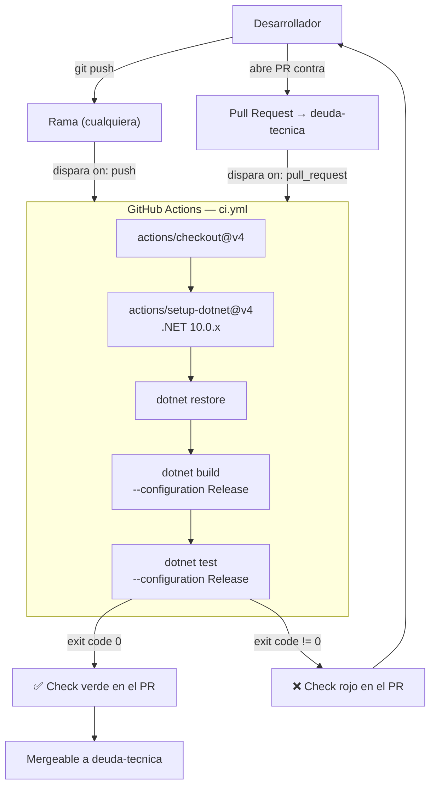

# ADR-09: Pipeline de Integración Continua con GitHub Actions

| Campo  | Valor |
|--------|-------|
| Autor  | Joaquin Uriona |
| Fecha  | 22/07/2026 |
| Estado | `Aceptado` |

---

## Nota de actualización (25/08/2026)

Varios detalles factuales de este ADR (22/07/2026) quedaron desactualizados
por cambios posteriores, documentados en las secciones correspondientes de
`CLAUDE.md`:

- **Versiones de acciones:** `actions/checkout@v4`/`actions/setup-dotnet@v4`
  citadas en la Decisión y el diagrama ya no son las que corre el workflow —
  se actualizaron a `@v7`/`@v6` (commit `97d6403`).
- **Composición de la suite:** los "24 tests (17 unitarios + 7 de integración
  con concurrencia real sobre `Json*Repository`)" ya no existen así — esos
  tests de concurrencia se eliminaron junto con la capa de persistencia JSON
  al migrar a PostgreSQL (ver [ADR-10](./ADR-10-Joaquin-Uriona.md)); la suite
  actual (`ProyectoJo.Application.Tests`) creció a más de 160 tests, todos
  mockeados sobre `Ports/Out`, sin tests de integración contra una base real
  todavía (ver "Test coverage" en `CLAUDE.md`).
- **Trigger de Pull Request:** ya no apunta solo a `deuda-tecnica` — el riesgo
  que la propia sección "Alternativas consideradas" de este ADR anticipó
  ("abrir el trigger a cualquier rama base") terminó pasando en la dirección
  inversa: `deuda-tecnica` quedó stale mientras el trabajo real convergía en
  `main`, así que `main` se agregó como target adicional sin reemplazar a
  `deuda-tecnica`.
- **Pasos del job:** el workflow ganó pasos que este ADR no describe —
  chequeo de migraciones de EF Core pendientes (`dotnet ef migrations
  has-pending-model-changes`) y auditoría de paquetes NuGet vulnerables
  (`dotnet list package --vulnerable`) — y, más recientemente, un bloque
  `permissions: contents: read` y un `concurrency` group para cancelar runs
  viejos de la misma rama.

La decisión de fondo (GitHub Actions, un solo job, `Release` únicamente) sigue
vigente y no cambió; lo que quedó desactualizado es la descripción puntual del
workflow en un momento específico de su evolución.

---

## Contexto

Desde ADR-07, `ProyectoJo.Application.Tests` existe como proyecto de tests dentro de la solución, con 17 tests unitarios (mocks sobre `UseCases/`) y 7 tests de integración con concurrencia real (`Infrastructure/`), pero la ejecución de `dotnet test` seguía siendo un paso manual: dependía de que el propio desarrollador se acordara de correrlo antes de cada push. El mismo ADR-07 ya había dejado esto anotado explícitamente como deuda ("no existe todavía ningún pipeline de CI/CD que ejecute `dotnet test` automáticamente en cada push"), y la revisión de arquitectura marcaba "Sin CI/CD visible" como debilidad de nivel industrial, señalando además que el objetivo de 12-Factor App de separar Build/Release/Run no estaba resuelto sin automatización documentada.

Las condiciones que motivaron esta decisión son las siguientes:

- **Los tests ya existían pero no se ejecutaban solos:** tener 24 tests en el repo sin que nada los dispare automáticamente da una falsa sensación de cobertura — el valor real de una suite de tests aparece cuando corre sin intervención humana en cada cambio, no cuando existe en el disco.
- **El repositorio ya tenía condiciones de carrera reales documentadas (ADR-06):** cualquier regresión futura sobre `CambiarEstadoAsync` o los repositorios `Json*` con lock debía quedar atrapada por los tests de integración de concurrencia antes de llegar a producción, no descubierta manualmente.
- **El proyecto es .NET 10 con `dotnet test` nativo:** no había necesidad de herramientas de build externas ni de un runner autoalojado; cualquier proveedor de CI que soporte `actions/setup-dotnet` alcanza para compilar y correr la suite completa.

---

## Decisión

Se decide agregar un workflow de **GitHub Actions** (`.github/workflows/ci.yml`) que compila la solución y corre `ProyectoJo.Application.Tests` en cada `push` a cualquier rama y en cada Pull Request contra `deuda-tecnica`, usando `ubuntu-latest` como runner y `dotnet-version: '10.0.x'` vía `actions/setup-dotnet@v4`. El trabajo se desarrolló sobre una rama dedicada, `pipeline-ci`, con commits incrementales (agregar el workflow, ajustar el trigger de PR, corregir el proyecto de tests si el build fallaba) en vez de un único commit que mezclara todo, para que el historial de la rama refleje el proceso real de configurarlo y no solo el resultado final.

El workflow tiene un único job (`build-and-test`) con cuatro pasos secuenciales:

1. `actions/checkout@v4` — clona el repositorio.
2. `actions/setup-dotnet@v4` — instala el SDK de .NET 10.
3. `dotnet restore` — resuelve dependencias (xUnit 2.9.2, Moq 4.20.72, Microsoft.NET.Test.Sdk 17.12.0, ya declaradas en `ProyectoJo.Application.Tests.csproj`).
4. `dotnet build --no-restore --configuration Release` seguido de `dotnet test --no-build --configuration Release --verbosity normal` — compila y corre toda la suite; si un solo test falla, el job termina con código de salida distinto de cero y el check del PR queda en rojo.

### ¿Por qué GitHub Actions?

El repositorio ya vive en GitHub, así que GitHub Actions no agrega una cuenta ni una integración externa nueva: el pipeline queda definido como código versionado (`ci.yml`) dentro del propio repositorio, visible en la pestaña "Actions" y como check directamente sobre cada Pull Request.

### Alternativas consideradas

| Alternativa | Por qué la descarté |
|-------------|---------------------|
| Azure Pipelines | Requiere una organización de Azure DevOps separada del repositorio de GitHub; agrega una cuenta y una configuración externa sin ningún beneficio concreto sobre Actions para un proyecto que ya vive 100% en GitHub |
| Correr los tests solo con un pre-commit hook local (`husky`/`dotnet test` en `git commit`) | No resuelve el problema real: un hook local depende de que cada desarrollador lo tenga instalado y no lo salte con `--no-verify`; no genera un check visible en el Pull Request ni evidencia compartida del estado de los tests |
| Un solo job que compile Debug y Release | La solución no tiene necesidad real de validar ambas configuraciones, el objetivo del pipeline es detectar regresiones de tests, no probar configuraciones de build; `Release` alcanza y es más representativo de cómo se compilaría para un deploy real |
| Trigger de `pull_request` contra todas las ramas en vez de solo `deuda-tecnica` | En este momento del proyecto el trabajo activo converge sobre `deuda-tecnica`; abrir el trigger a cualquier rama base generaría checks duplicados en Pull Requests intermedios que todavía no apuntan a esa rama |

---

## Consecuencias

✅ Lo que gano:

- **Consecuencia técnica:** los 24 tests de `ProyectoJo.Application.Tests` (17 unitarios + 7 de integración con concurrencia real) corren automáticamente en cada push, sin depender de que el desarrollador se acuerde de ejecutar `dotnet test` a mano.
- **Consecuencia sobre el proceso:** cada Pull Request contra `deuda-tecnica` muestra un check de CI (verde o rojo) directamente en la interfaz de GitHub, dando evidencia objetiva y compartida del estado de la suite antes de mergear, en vez de depender de la palabra del autor del PR.
- **Consecuencia sobre el proceso:** cierra formalmente la deuda "Sin CI/CD visible" y la deuda anotada en ADR-07 ("la ejecución de los tests sigue siendo un paso manual"), avanzando el factor de paridad Build/Release/Run de 12-Factor App ya adoptado en el diseño del sistema.
- **Consecuencia sobre el diseño:** al no requerir ninguna base de datos ni servidor externo levantado (los tests de integración usan archivos temporales del propio runner), el job de CI no necesita ningún servicio adicional (`services:` en el workflow) más allá del SDK de .NET, manteniéndolo simple y rápido.

⚠️ Lo que sacrifico o asumo:

- **Limitación técnica:** el pipeline solo compila y testea `ProyectoJo.Application.Tests`; no incluye `ProyectoJo.Web`, `ProyectoJo.Api` ni `ProyectoJo.Infrastructure/Auth` fuera de lo que ya cubren los tests de integración.
- **Deuda o riesgo:** el trigger de `pull_request` apunta únicamente a `deuda-tecnica`; un Pull Request contra otra rama base no dispara el check, por lo que si el flujo de trabajo cambia de rama principal el workflow debe actualizarse a mano.
- **Deuda o riesgo:** no hay todavía ningún paso de despliegue (`Release`/`Run` de 12-Factor) ni de publicación de artefactos, el pipeline actual es solo el gate de calidad de Build, no un pipeline de CI/CD completo hasta el deploy.
- **Costo de no pagarla:** si en el futuro se agrega un test lento (por ejemplo, de integración contra un archivo grande) el job seguiría siendo secuencial y sin caché de paquetes NuGet entre ejecuciones, lo que alargaría el tiempo de cada push; hoy el volumen de tests (24) no lo justifica, pero queda como límite conocido del workflow actual.

---

## Diagrama

---

## Trade-offs

| Decisión | Ganas | Sacrificas |
|---|---|---|
| GitHub Actions sobre Azure Pipelines | Cero configuración externa: el pipeline vive como código en el propio repositorio y el check aparece directo en el Pull Request | Menor flexibilidad de agentes/self-hosted runners que sí ofrece Azure DevOps, irrelevante para el volumen actual del proyecto |
| Un solo job (`build-and-test`) sobre jobs separados de build y test | Pipeline simple de leer y mantener, tiempo total de ejecución más corto al no tener overhead de arrancar un job nuevo | Si el build falla, no hay un resultado separado de "test", ambos quedan reportados como el mismo check |
| Solo `Release` sobre compilar `Debug` y `Release` | Pipeline más rápido y representativo de cómo se compilaría para un deploy real | No detecta eventuales diferencias de comportamiento exclusivas de compilación `Debug` (hoy no hay ninguna conocida en el proyecto) |

---

## Atributos de calidad

### Estáticos

| Atributo | Pregunta que responde | En Proyecto Jo' |
| :--- | :--- | :--- |
| **Mantenibilidad** | ¿Cómo se detecta que un cambio rompió un test antes de mergear? | El check de CI en el Pull Request queda en rojo automáticamente si `dotnet test` falla, sin que nadie tenga que correrlo a mano |
| **Automatización** | ¿La validación de calidad depende de la disciplina de un desarrollador? | Ya no: se dispara sola en cada `push` y en cada Pull Request contra `deuda-tecnica`, cerrando la deuda de "paso manual" dejada abierta en ADR-07 |

### Dinámicos

| Atributo | Pregunta que responde | En Proyecto Jo' |
| :--- | :--- | :--- |
| **Disponibilidad** | ¿Qué pasa si `JsonPedidoRepositoryConcurrencyTests` detecta una regresión de concurrencia real? | El job de CI falla, el check queda rojo y el Pull Request no debería mergearse hasta corregirlo, evitando que una regresión de concurrencia llegue a producción sin ser vista |
| **Velocidad de feedback** | ¿Cuánto tarda un desarrollador en saber si su cambio rompió algo? | El tiempo de un run del workflow (restore + build + test de 24 tests), visible directamente en la pestaña Actions o como check del PR, en vez de esperar a una prueba manual o a un reporte en producción |

---

## Uso de IA

Se utilizó IA para:

- Generar la sintaxis Mermaid del diagrama de flujo del pipeline.
- Corregir redacción y ortografía de este documento.
