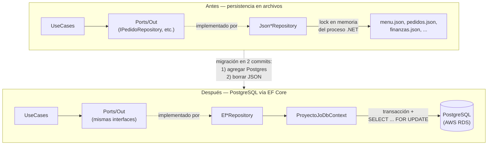

# ADR-10: Migración de persistencia de JSON a PostgreSQL con EF Core

| Campo  | Valor |
|--------|-------|
| Autor  | Joaquin Uriona |
| Fecha  | 30/07/2026 |
| Estado | `Aceptado` |

---

## Contexto

Desde ADR-01, la persistencia de Proyecto Jo' vivía en archivos `.json` planos (`ProyectoJo.Web/Persistencia/*.json`: menú, finanzas, pedidos, promociones, empleados, dispositivos, cierres de caja, auditoría), leídos y escritos por una familia de `Json*Repository` en `ProyectoJo.Infrastructure`. Esta decisión tenía sentido al principio del proyecto — cero infraestructura externa, cualquiera podía clonar el repo y correrlo sin instalar nada — pero para julio ya mostraba límites reales, no hipotéticos:

- **La concurrencia se resolvía con locks en memoria del propio proceso .NET**, no con nada a nivel de almacenamiento. ADR-06 y ADR-07 ya habían documentado y testeado condiciones de carrera reales sobre `CambiarEstadoAsync` y los repositorios `Json*` — el lock funcionaba, pero solo protegía contra otro hilo del **mismo proceso**; no había forma de que dos instancias del proceso Web corrieran contra el mismo dato sin pisarse.
- **Cada operación de lectura implicaba deserializar el archivo completo a memoria** y filtrar con LINQ — no había forma de pedirle al almacenamiento "dame solo lo que necesito". Los commits `perf(auditoria): filter before sorting`, `perf(finanzas): group once by year/month/type`, `perf(pedidos): avoid reloading full insumo catalog per order line`, `perf(recetario)`, `perf(opiniones)` y `perf(menu)` (todos del 27-29/07/2026) fueron intentos reales de estirar el rendimiento de ese modelo antes de decidir migrar — ayudaron, pero no resolvían el problema de fondo: seguía siendo O(n) sobre archivos que solo crecen.
- **Una escritura interrumpida a mitad de camino (crash, `OutOfMemoryException`, corte del proceso) podía dejar un archivo JSON corrupto**, sin ningún mecanismo de rollback — a diferencia de una transacción real, que se revierte entera o no se aplica.
- **El proyecto se encaminaba hacia un despliegue real** (ADR-09 ya había resuelto CI; el siguiente paso lógico era CD), y desplegar en infraestructura administrada (AWS) con archivos JSON en el disco del propio servidor significa que cualquier redeploy, reinicio de instancia, o escalado horizontal futuro pone en riesgo los datos — no hay backups automáticos de un archivo suelto como sí los hay para una base de datos gestionada.

## Decisión

Se decide migrar toda la persistencia de `ProyectoJo.Web` de archivos JSON a **PostgreSQL vía Entity Framework Core** (`Npgsql.EntityFrameworkCore.PostgreSQL` + `EFCore.NamingConventions` para nombres de tabla/columna en snake_case), manteniendo intacta la Arquitectura Hexagonal adoptada en ADR-03: el cambio queda **completamente contenido en `ProyectoJo.Infrastructure`** — una familia de `Ef*Repository` implementando los mismos `Ports/Out` que antes implementaban los `Json*Repository`. Ni `Ports/In`, ni `UseCases/`, ni `ProyectoJo.Domain` se tocaron; es la prueba de que la arquitectura hexagonal decidida en ADR-03 cumplió su propósito real: cambiar el motor de persistencia de punta a punta sin tocar una sola línea de lógica de negocio.

El rollout se hizo en dos commits deliberadamente separados, no uno solo:

1. `feat(infrastructure): add EF Core + PostgreSQL persistence layer` — se agrega la capa nueva completa (`ProyectoJoDbContext`, una `IEntityTypeConfiguration<T>` por entidad, los `Ef*Repository`, las migraciones iniciales) **conviviendo** con la capa JSON existente, sin borrar nada todavía.
2. `refactor: remove JSON persistence layer, keep Web on PostgreSQL only` — una vez confirmado que `ProyectoJo.Web` corre completo contra Postgres, se elimina toda la familia `Json*Repository` y los archivos `.json` de persistencia.

Decisiones técnicas puntuales dentro de la migración:

- **Colecciones propias en tablas hijas**: `Pedido.Items` y `Receta.Ingredientes` se mapean como *owned collections* en sus propias tablas (`pedido_items`, `receta_ingredientes`) con `ON DELETE CASCADE`, en vez de columnas JSON embebidas — permite consultarlas con SQL normal y mantiene la integridad referencial a nivel de base de datos, no de aplicación.
- **Normalización global de fechas a UTC**: el código históricamente mezcla `DateTime.Now` y `DateTime.UtcNow` (arrastrado de la era JSON, donde la diferencia no importaba). Postgres exige `Kind == Utc` para columnas `timestamp with time zone`, así que se agregó un `ValueConverter` global en `OnModelCreating` que normaliza cualquier `DateTime`/`DateTime?` al escribir, en vez de auditar y corregir cada call site individualmente.
- **Concurrencia real con `SELECT ... FOR UPDATE`**: las operaciones que antes dependían del lock en memoria (`Pedido.CambiarEstadoAtomicoAsync`, descontar/reponer stock de `Insumo`) ahora usan una transacción de base de datos con `FOR UPDATE`, bloqueando la fila específica a nivel del motor — funciona correctamente aunque haya múltiples instancias del proceso Web corriendo al mismo tiempo, algo que el lock en memoria nunca pudo garantizar.

### Alternativas consideradas

| Alternativa | Por qué la descarté |
|-------------|---------------------|
| SQLite | Cero servidor externo que administrar, fácil de empezar — pero su modelo de escritura concurrente (lock a nivel de archivo/base completa) es exactamente el problema que se buscaba resolver, no una solución. Tampoco es la opción que ofrece AWS RDS como servicio gestionado. |
| MongoDB / NoSQL orientado a documentos | El dominio ya es fuertemente relacional: un pedido afecta el stock de varios insumos y genera un registro financiero en la misma operación lógica — exactamente el tipo de transacción multi-entidad que un modelo relacional con ACID resuelve de forma nativa y un modelo de documentos obliga a simular a mano. |
| MySQL | Técnicamente viable y también soportado por AWS RDS, pero sin ninguna ventaja concreta sobre PostgreSQL para este proyecto — se optó por Postgres por ser la opción con mejor soporte de tipos avanzados (arrays nativos, usados por `Promocion.ItemIds`) y el ecosistema `Npgsql`/EF Core ya evaluado. |
| Seguir en JSON, invertir en mejor locking en memoria (colas, `SemaphoreSlim` más granular) | Es literalmente lo que se probó primero (la tanda de commits `perf(*)` de fines de julio) — mejoró tiempos de respuesta pero no resuelve que el locking en memoria solo protege un único proceso: cualquier escalado horizontal futuro (más de una instancia del Web corriendo) rompe la garantía de concurrencia por completo. |

---

## Consecuencias

✅ Lo que gano:

- **Concurrencia real entre procesos:** los locks pasan de estar en memoria de un único proceso .NET a nivel de fila en la base de datos (`SELECT ... FOR UPDATE`), lo que sigue siendo correcto aunque en el futuro corran múltiples instancias del Web en paralelo.
- **Consultas filtrables y ordenables en el servidor:** habilita directamente el trabajo de paginación/optimización SQL documentado en ADR-12 — antes era físicamente imposible pedirle a un archivo JSON "dame la página 3 ordenada por fecha" sin traer todo a memoria primero.
- **Esquema versionado y reproducible:** las migraciones de EF Core (`dotnet ef migrations`) dejan un historial explícito de cómo evolucionó la estructura de datos, en vez de que el "esquema" fuera implícito en cómo el código serializaba cada clase.
- **Compatibilidad directa con infraestructura gestionada:** habilita desplegar contra AWS RDS (ADR-13) con backups automáticos administrados por el proveedor, en vez de depender de la persistencia de disco de una única instancia EC2.

⚠️ Lo que sacrifico o asumo:

- **Se pierde el "cero instalación":** correr el proyecto en desarrollo ahora requiere una instancia de PostgreSQL disponible (local o remota) antes de poder levantar `ProyectoJo.Web` — clonar el repo y correr `dotnet run` ya no alcanza por sí solo.
- **Deuda parcialmente neutralizada, no resuelta:** el mix de `DateTime.Now`/`DateTime.UtcNow` heredado de la era JSON sigue existiendo en el código de los `UseCases`; se lo neutralizó con una conversión global en la capa de persistencia en vez de corregir cada call site, así que la inconsistencia semántica sigue latente si algún día se necesita comparar fechas fuera de esa capa.
- **Riesgo real durante la ventana de convivencia:** entre el primer commit (agregar Postgres) y el segundo (borrar JSON), el código tuvo, brevemente, dos sistemas de persistencia activos a la vez — cualquier ruta que hubiera quedado escribiendo al archivo JSON viejo sin que EF Core la reemplazara habría producido datos huérfanos, invisibles hasta el segundo commit.

---

## Diagrama

---

## Trade-offs

| Decisión | Ganas | Sacrificas |
|---|---|---|
| PostgreSQL sobre SQLite | Concurrencia real entre múltiples instancias del proceso; compatible con AWS RDS gestionado | Ya no hay "cero instalación": desarrollo requiere una instancia de Postgres disponible |
| PostgreSQL sobre MongoDB | Transacciones ACID nativas para operaciones que tocan varias entidades a la vez (pedido + stock + finanza) | Menor flexibilidad de esquema si el dominio cambiara de forma radicalmente distinta a la relacional actual |
| Migrar en dos commits (agregar y luego borrar) sobre un único cambio grande | Permite validar que Postgres funciona de punta a punta antes de eliminar el fallback | Ventana real de código con dos sistemas de persistencia coexistiendo, con riesgo de inconsistencia temporal |
| Normalizar fechas a UTC en un `ValueConverter` global sobre corregir cada call site | Cambio de una sola vez, sin tener que auditar cada uso de `DateTime.Now` en `UseCases/` | La inconsistencia semántica entre `DateTime.Now` y `DateTime.UtcNow` sigue existiendo en el código, solo queda oculta al llegar a la base |

---

## Atributos de calidad

### Estáticos

| Atributo | Pregunta que responde | En Proyecto Jo' |
| :--- | :--- | :--- |
| **Modificabilidad** | ¿Qué tan aislado queda un cambio de motor de persistencia? | Gracias a la Arquitectura Hexagonal de ADR-03, el cambio completo de JSON a PostgreSQL quedó contenido en `ProyectoJo.Infrastructure` — cero cambios en `Ports/In`, `UseCases/` o `ProyectoJo.Domain` |
| **Testability** | ¿Los tests de casos de uso necesitaron cambiar al migrar el motor de persistencia? | No — siguen mockeando los mismos `Ports/Out` de siempre; los `UseCases` nunca supieron que el repositorio de atrás dejó de ser un archivo JSON |

### Dinámicos

| Atributo | Pregunta que responde | En Proyecto Jo' |
| :--- | :--- | :--- |
| **Concurrencia** | ¿Qué pasa si dos requests intentan descontar stock del mismo insumo al mismo tiempo? | Antes: dependía de un lock en memoria válido solo dentro de un mismo proceso. Ahora: `SELECT ... FOR UPDATE` bloquea la fila a nivel del motor de base de datos, correcto incluso con múltiples instancias del Web corriendo en paralelo |
| **Consistencia ante fallas** | ¿Qué pasa si el proceso se cae a mitad de una operación que toca stock y finanzas a la vez? | Antes: el archivo JSON podía quedar parcialmente escrito y corrupto, sin forma de revertir. Ahora: la transacción de PostgreSQL se revierte entera o no se aplica — no hay estado intermedio inconsistente |

---

## Uso de IA

Se utilizó IA para:

- Generar la sintaxis Mermaid del diagrama de antes/después.
- Corregir redacción y ortografía de este documento.
