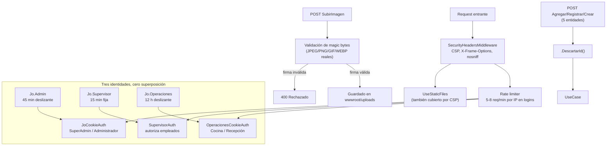

# ADR-11: Hardening de seguridad — cookies, cabeceras, autorización por área y validación de entrada

| Campo  | Valor |
|--------|-------|
| Autor  | Joaquin Uriona |
| Fecha  | 31/07/2026 |
| Estado | `Aceptado` |

---

## Contexto

Con la persistencia ya migrada a PostgreSQL (ADR-10) y el sistema encaminado a un despliegue público real (ADR-13), la superficie de ataque dejó de ser teórica: el sitio iba a quedar expuesto en internet, con tres tipos de usuarios distintos (dueño/administrador, empleados de Cocina/Recepción, y clientes anónimos) accediendo desde dispositivos y redes que el equipo no controla. Varias debilidades concretas, no hipotéticas, quedaron identificadas:

- **`Administrador.Areas` tenía un estado inexpresable de forma segura.** El modelo distinguía entre `["General"]` (acceso total) y una lista de áreas específicas, pero una lista **vacía** — que debería significar "sin acceso a ningún área" — el `LoginController` la interpretaba por defecto como acceso `General`. En la práctica: destildar "Acceso general" y no marcar ninguna área individual en el formulario de creación de administradores seguía otorgando acceso total. Era un bug de autorización real, no un caso límite improbable.
- **El PIN de supervisor (`SupervisorAuth`) era opcional al crear un administrador.** `AdministradorUseCase.CrearAsync` permitía guardar un administrador sin PIN de supervisor asignado, lo que en la práctica significaba que ese administrador nunca podría autorizar el acceso de empleados de Cocina/Recepción — una inconsistencia funcional con implicancia de seguridad (¿quién es responsable de habilitar el PIN si no es obligatorio desde el alta?).
- **Los endpoints de creación que bindean la entidad completa del dominio directo desde el `POST`** (`MenuController.Agregar`, `FinanzasController.Registrar`, `InsumosController.Crear`, `PromocionesController.Agregar`, `RecetarioController.Agregar`) confiaban en que el cliente nunca mandaría un `Id` — nada en el código lo impedía explícitamente antes de esta ronda de hardening.
- **La validación de imágenes subidas (`PromocionesController.SubirImagen`) confiaba en la extensión del archivo**, no en su contenido real — subir un archivo malicioso con extensión `.png` pero contenido arbitrario no estaba bloqueado a nivel de aplicación.
- **No había ninguna cabecera de seguridad HTTP explícita** (`X-Content-Type-Options`, `X-Frame-Options`, `Content-Security-Policy`) ni política de cookies endurecida (`Secure`, `HttpOnly`, `SameSite`) — quedaban en los valores por defecto de ASP.NET Core, que no son suficientes para un sitio que maneja tres esquemas de autenticación distintos.
- **El pipeline de CI (ADR-09) no auditaba dependencias vulnerables** — un paquete NuGet con un CVE conocido podía llegar a producción sin que nada lo señalara.

## Decisión

Se decide endurecer la seguridad en cuatro frentes simultáneos, todos aplicados sobre la base ya migrada a PostgreSQL:

**1. Separación estricta de las tres identidades de autenticación.** Se formaliza la jerarquía `SuperAdmin` / `Administrador` / `Operador` (empleados) con tres esquemas de cookie completamente independientes y sin superposición de alcance — comprometer una no otorga acceso a las otras:

| Esquema | Cookie | Expiración |
|---|---|---|
| `JoCookieAuth` | `Jo.Admin` | 45 min deslizante |
| `SupervisorAuth` | `Jo.Supervisor` | 15 min, fija |
| `OperacionesCookieAuth` | `Jo.Operaciones` | 12 h deslizante |

Las cuatro cookies del sistema (las tres de arriba más `Jo.DispositivoToken`, la de emparejamiento de dispositivos) se marcan `HttpOnly` + `Secure` + `SameSite=Strict`.

**2. `Administrador.Areas` deja de tener un estado inexpresable.** `LoginController` ya no aplica ningún fallback a `General` cuando la lista de áreas viene vacía — mapea `Areas` directo a claims `Area`, sin excepciones. `AdministradorUseCase` guarda explícitamente el literal `"General"` cuando corresponde, en vez de dejar la lista vacía como señal ambigua entre "todo" y "nada". El PIN de supervisor pasa a ser **obligatorio, no opcional**: `CrearAsync` exige usuario + contraseña + PIN juntos (los tres o ninguno se guarda), y `EditarAsync` exige reingresar contraseña y PIN nuevos en cada edición — no existe un camino de "dejar en blanco para mantener el actual".

**3. Cabeceras de seguridad y CSP centralizadas.** `SecurityHeadersMiddleware` se registra temprano en el pipeline (antes de `UseStaticFiles`, para que aplique también a archivos estáticos) y fija `X-Content-Type-Options: nosniff`, `X-Frame-Options: DENY`, y un `Content-Security-Policy` explícito con allowlist mínima (`cdn.jsdelivr.net` para Bootstrap/Chart.js, fuentes de Google, `frame-src https://www.google.com` únicamente para el embed de Maps en Ubicación) — sin `'unsafe-inline'` para scripts en ningún caso, lo que a su vez obligó a que no exista ni un solo `<script>` inline ni atributo `onclick`/`onsubmit` en toda la aplicación.

**4. Validación de contenido real, no de metadatos declarados.** `SubirImagen` valida los *magic bytes* reales del archivo (firma binaria de JPEG/PNG/GIF/WEBP), no la extensión ni el `Content-Type` declarado por el cliente. Los cinco endpoints que bindean una entidad completa desde el `POST` llaman `.DescartarId()` antes de invocar el caso de uso — un único método de extensión sobre `IEntidadConId`, reutilizado en las cinco entidades afectadas, en vez de cinco reseteos manuales de `entity.Id = 0` propensos a que alguno se olvide. El pipeline de CI se extiende con `dotnet list package --vulnerable`, bloqueando el merge si alguna dependencia trae un CVE conocido.

### Alternativas consideradas

| Alternativa | Por qué la descarté |
|-------------|---------------------|
| Un único esquema de cookie con roles/claims para distinguir Admin/Supervisor/Operador | Simplifica el código de autenticación, pero significa que robar **una sola** cookie compromete potencialmente las tres identidades; el costo de mantener tres esquemas separados es bajo comparado con el radio de explosión de una sola cookie universal comprometida |
| Validar solo la extensión del archivo subido, con una lista blanca más estricta | Más simple de implementar, pero no protege contra un archivo con extensión falseada y contenido arbitrario — la validación de magic bytes es la única que realmente verifica qué es el archivo, no lo que dice ser |
| Dejar el PIN de supervisor opcional pero validarlo recién al intentar usarlo (fail-fast tardío) | Mueve el error de "no se puede crear sin PIN" a "no se puede autorizar Cocina/Recepción" en un momento operativo mucho peor (durante el servicio, no durante el alta administrativa) — exigirlo desde la creación falla temprano, cuando es barato corregirlo |
| `Content-Security-Policy-Report-Only` en vez de aplicarla directamente | Habría permitido detectar violaciones sin romper nada primero, pero el proyecto no tenía todavía ningún endpoint de reporte de violaciones CSP armado — aplicar la política directa y corregir lo que rompiera (como pasó con el embed de Google Maps, agregado al allowlist después de que la CSP lo bloqueara) fue más rápido dado el tamaño del equipo |

---

## Consecuencias

✅ Lo que gano:

- **Compromiso de una identidad no implica compromiso de las otras:** las tres cookies de autenticación son independientes; robar `Jo.Operaciones` (la de mayor duración, 12h) no otorga ningún acceso administrativo.
- **El estado "sin acceso a ningún área" ahora es representable y se respeta:** cierra un bug de autorización real donde un administrador mal configurado terminaba con acceso total sin que nadie lo hubiera decidido explícitamente.
- **Defensa en profundidad ante XSS:** aunque existiera una inyección de HTML en algún punto no revisado, la CSP sin `'unsafe-inline'` impide que un `<script>` inyectado se ejecute.
- **El pipeline de CI ahora es también un gate de seguridad**, no solo de correctitud funcional — una dependencia vulnerable bloquea el merge igual que un test roto.

⚠️ Lo que sacrifico o asumo:

- **Costo de mantenimiento de la CSP:** cualquier nuevo CDN, iframe embebido, o script inline futuro requiere actualizar manualmente el allowlist en `SecurityHeadersMiddleware.cs` — ya pasó una vez con el embed de Google Maps rompiendo la página de Ubicación silenciosamente hasta que se detectó y corrigió.
- **El PIN de supervisor obligatorio agrega fricción al alta de administradores:** ya no existe un flujo rápido de "crear administrador, configurar el PIN después" — los tres datos (usuario, contraseña, PIN) se piden juntos siempre, lo que puede ser inconveniente si en algún momento se necesita dar de alta administradores en lote.
- **La auditoría de vulnerabilidades (`dotnet list package --vulnerable`) solo cubre paquetes NuGet conocidos por la base de datos de asesorías de GitHub** — no protege contra vulnerabilidades en el propio código de la aplicación ni en dependencias de terceros fuera del ecosistema .NET (por ejemplo, las librerías de `wwwroot/lib`).

---

## Diagrama

---

## Trade-offs

| Decisión | Ganas | Sacrificas |
|---|---|---|
| Tres esquemas de cookie separados sobre uno unificado con roles | Compromiso de una identidad no otorga acceso a las otras dos | Más código de configuración de autenticación en `Program.cs`, tres flujos de login a mantener en vez de uno |
| CSP estricta sin `'unsafe-inline'` sobre una política más permisiva | Bloquea de raíz cualquier `<script>` inyectado, incluso si hay una vulnerabilidad de XSS no detectada | Cualquier nuevo recurso externo (CDN, iframe) requiere una actualización manual del allowlist antes de funcionar |
| PIN de supervisor obligatorio desde la creación sobre configurable después | El error de "falta PIN" aparece en el alta administrativa, el momento más barato de corregirlo | Más fricción operativa: no hay alta rápida de administradores sin PIN configurado de entrada |
| Validar magic bytes sobre confiar en la extensión declarada | Bloquea archivos con extensión falseada y contenido arbitrario | Costo de implementación mayor (leer y verificar la firma binaria real de cada formato soportado) |

---

## Atributos de calidad

### Estáticos

| Atributo | Pregunta que responde | En Proyecto Jo' |
| :--- | :--- | :--- |
| **Seguridad (auditabilidad)** | ¿Se puede verificar automáticamente que no haya dependencias con vulnerabilidades conocidas? | Sí — `dotnet list package --vulnerable` corre en cada push como parte del pipeline de CI de ADR-09, bloqueando el merge si aparece un CVE |
| **Mantenibilidad de la política de seguridad** | ¿Dónde se define qué recursos externos puede cargar la aplicación? | En un único archivo (`SecurityHeadersMiddleware.cs`), no disperso entre vistas — cualquier cambio de CSP tiene un solo lugar de verdad |

### Dinámicos

| Atributo | Pregunta que responde | En Proyecto Jo' |
| :--- | :--- | :--- |
| **Confidencialidad ante robo de sesión** | ¿Qué pasa si un atacante roba la cookie de un empleado de Cocina? | Solo obtiene acceso al esquema `OperacionesCookieAuth` — no puede escalar a `Jo.Admin` ni `Jo.Supervisor`, son cookies y esquemas completamente independientes |
| **Disponibilidad ante fuerza bruta** | ¿Qué pasa si alguien intenta adivinar credenciales de login por fuerza bruta? | El rate limiter (5-8 requests/min por IP, `AddRateLimiter`) corta el intento antes de que sea viable, y redirige con `?bloqueado=true` en vez de exponer si el usuario existe o no |

---

## Uso de IA

Se utilizó IA para:

- Generar la sintaxis Mermaid del diagrama de cookies/middleware.
- Corregir redacción y ortografía de este documento.
