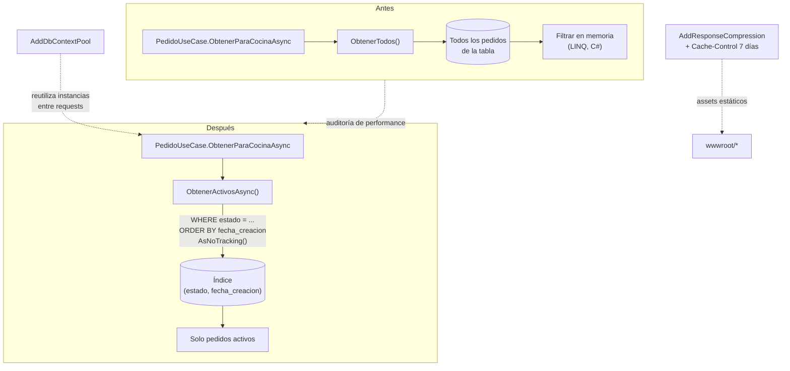

# ADR-12: Optimización de performance — consultas SQL, paginación e índices

| Campo  | Valor |
|--------|-------|
| Autor  | Joaquin Uriona |
| Fecha  | 31/07/2026 |
| Estado | `Aceptado` |

---

## Contexto

La migración a PostgreSQL (ADR-10) resolvió los problemas de concurrencia, pero por sí sola no garantiza rendimiento — un `Ef*Repository` mal escrito puede reproducir exactamente los mismos problemas que tenía la era JSON (traer todo a memoria y filtrar del lado de la aplicación), solo que ahora contra una base de datos real en vez de un archivo. Una auditoría específica de performance, hecha después de tener el sistema completo corriendo contra Postgres, encontró antipatrones concretos en las rutas más calientes del sistema:

- **`ObtenerParaCocinaAsync`/`ObtenerParaRecepcionAsync` traían **todos** los pedidos de la base** (sin filtro de estado ni fecha) en cada polling de las vistas de Cocina/Recepción — vistas que, por diseño (`PedidosHub`/SignalR reemplazó el polling en ADR-06, pero cada evento igual dispara una recarga completa vía `cargarPedidos()`), se refrescan constantemente durante el servicio activo. Era la ruta más caliente de todo el sistema y la más cara.
- **Los listados de Finanzas y Auditoría paginaban del lado del cliente**, después de traer TODO el histórico de movimientos/registros a memoria — la paginación existía visualmente en la vista, pero el costo de traer los datos ya se había pagado completo antes de mostrar solo 10-20 filas.
- **`ProyectoJo.Application.UseCases.PedidoUseCase` tenía un método `ObtenerPendientesAsync()` sin ningún caller real** — código muerto que seguía compilando y corriendo tests, pero no aportaba nada.
- **No existía ningún índice más allá de las claves primarias** sobre las columnas que efectivamente se usaban en cláusulas `WHERE`/`ORDER BY` de las rutas calientes (`Pedido.Estado` + `FechaCreacion`, `Finanza.Fecha`, `RegistroAuditoria.FechaHora`).
- **`AddDbContext` crea y destruye una instancia de `DbContext` completa por cada request**, incluyendo la inicialización interna de EF Core — bajo carga sostenida (el escenario real de Cocina/Recepción durante el servicio) ese costo de inicialización se paga una y otra vez innecesariamente.
- **No había compresión de respuesta ni cache-control en archivos estáticos** — cada CSS/JS/imagen se servía sin comprimir y sin cabeceras de cache, aunque su contenido no cambia entre requests.

## Decisión

Se decide atacar la optimización en el orden de mayor impacto real primero, empujando trabajo que hoy hace `UseCases`/la vista hacia SQL, que es quien debería hacerlo:

**1. Consultas de Cocina/Recepción filtradas en el motor, no en memoria.** Se agregan `IPedidoRepository.ObtenerActivosAsync()` y `ObtenerDelDiaAsync(DateTime desde)`, con `Where`/`OrderBy`/`Include(p => p.Items)`/`AsNoTracking()` resueltos directamente en SQL — el filtro de "solo pedidos activos" o "solo los del día" ya no se hace después de traer todo, sino que es parte de la consulta. `ObtenerParaCocinaAsync()`/`ObtenerParaRecepcionAsync()` en `PedidoUseCase` quedan reducidos a una sola línea de delegación. `ObtenerPendientesAsync()`, sin callers reales, se elimina.

**2. Paginación real en SQL para Finanzas y Auditoría.** `IFinanzaRepository.ObtenerPaginado(mes, anio, pagina, porPagina)` y el equivalente de `IAuditoriaRepository` calculan el rango de fechas con `new DateTime(anio, mes, 1)`/`.AddMonths(1)` (compatible con el índice agregado sobre la columna de fecha), ejecutan `.Count()` para el total y después `.Skip().Take()` — el costo de la consulta ahora es proporcional a la página pedida, no al histórico completo.

**3. Índices dirigidos a las columnas que las nuevas consultas realmente filtran/ordenan**, no índices genéricos especulativos:

| Tabla | Índice | Motivo |
|---|---|---|
| `pedidos` | `(estado, fecha_creacion)` | Filtro compuesto de `ObtenerActivosAsync`/`ObtenerDelDiaAsync` |
| `finanzas` | `(fecha)` | Rango de fecha de `ObtenerPaginado` |
| `registros_auditoria` | `(fecha_hora)` | Rango de fecha del historial paginado |

**4. `AddDbContextPool` sobre `AddDbContext`.** Reutiliza instancias de `ProyectoJoDbContext` entre requests en vez de crear una nueva cada vez, evitando pagar el costo de inicialización repetidamente bajo carga sostenida.

**5. Compresión de respuesta y cache-control en estáticos.** `AddResponseCompression` (con `EnableForHttps = true`) y `StaticFileOptions.OnPrepareResponse` fijando `Cache-Control: public, max-age=604800` (7 días) para todo lo servido por `UseStaticFiles`.

**Explícitamente descartado por costo/beneficio negativo:** convertir a async y empujar el filtrado a SQL en `EmpleadoAuthUseCase` (login de Cocina/Recepción). Se implementó, se revisó, y **se revirtió por completo** — la tabla de empleados es pequeña y no crece con el uso del sistema (a diferencia de pedidos/finanzas/auditoría), así que la ganancia real de mover el filtro a SQL era despreciable, mientras que el costo era concreto: 2 de los 5 tests de `EmpleadoAuthUseCaseTests` (`ConEmpleadoInactivo_DevuelveNull`, `ConRolDistintoAlDeLaEstacion_DevuelveNull`) perdían cobertura real, porque esa regla de negocio pasaría a vivir en una cláusula SQL inalcanzable por los mocks de `Ports/Out` que usan los tests unitarios.

### Alternativas consideradas

| Alternativa | Por qué la descarté |
|-------------|---------------------|
| Cachear en memoria (`IMemoryCache`) los listados de Cocina/Recepción en vez de optimizar la consulta | No resuelve el problema real: los pedidos activos cambian constantemente durante el servicio (es justamente el caso de uso), así que el caché se invalidaría casi en cada request — la complejidad de invalidación no se justifica frente a simplemente escribir la consulta correcta desde el inicio |
| Agregar índices a todas las columnas usadas en cualquier `Where` del sistema, no solo las tres rutas calientes identificadas | Cada índice adicional tiene costo de escritura (cada `INSERT`/`UPDATE` debe mantenerlo actualizado) — indexar especulativamente columnas sin evidencia real de que sean cuello de botella es pagar ese costo sin beneficio medido |
| Migrar todos los repositorios restantes (`CierreCaja`, `Insumo`, `Opinion`, `Producto`, `Promocion`, `Receta`) a async en la misma pasada | Quedó explícitamente pospuesto — son rutas de bajo tráfico comparadas con Cocina/Recepción/Finanzas/Auditoría, y el beneficio real no justificaba el volumen de cambio en ese momento; documentado como backlog, no como decisión tomada |
| Convertir `EmpleadoAuthUseCase` a filtrado por SQL | Implementado y revertido en la misma sesión de trabajo, ver Decisión arriba — caso real de una optimización que se probó, se midió el costo real (cobertura de tests perdida) contra el beneficio real (tabla pequeña, sin crecimiento), y se descartó explícitamente en vez de dejarla a medias |

---

## Consecuencias

✅ Lo que gano:

- **La ruta más caliente del sistema (Cocina/Recepción) ya no trae el histórico completo de pedidos en cada refresco** — el costo de cada consulta es proporcional a los pedidos activos/del día, no a todo lo que existe en la tabla.
- **Finanzas y Auditoría pagan solo el costo de la página pedida**, no del histórico completo — la paginación visual y el costo real de la consulta ahora coinciden.
- **Se eliminó código muerto real** (`ObtenerPendientesAsync()`) detectado durante la auditoría, no solo se optimizó lo que ya se sabía que existía.
- **Bajo carga sostenida, el pool de `DbContext` evita pagar inicialización repetida**, y la compresión de respuesta reduce el peso de cada request de assets estáticos.

⚠️ Lo que sacrifico o asumo:

- **`AddDbContextPool` es incompatible con cómo las herramientas de diseño de EF Core (`dotnet ef`, y por extensión los *migration bundles*) construyen el `DbContext` por defecto** — una limitación real y documentada de EF Core, no un bug de esta implementación, pero que exigió agregar una `IDesignTimeDbContextFactory` explícita (ver ADR-13) para que las migraciones siguieran funcionando en el pipeline de despliegue. Fue un costo oculto que no se descubrió hasta el primer deploy real.
- **La optimización de `EmpleadoAuthUseCase` se evaluó, se implementó, y se revirtió** — tiempo de desarrollo invertido en un camino que terminó explícitamente descartado; documentado acá como decisión consciente, no como trabajo perdido silenciosamente.
- **Sync→async en los repositorios restantes queda como deuda conocida, no resuelta** — `CierreCaja`, `Insumo`, `Opinion`, `Producto`, `Promocion`, `Receta` siguen con sus métodos originales; si su volumen de uso creciera, necesitarían la misma revisión que ya se le hizo a Pedido/Finanza/Auditoría.

---

## Diagrama

---

## Trade-offs

| Decisión | Ganas | Sacrificas |
|---|---|---|
| Filtrar en SQL (`WHERE`/`ORDER BY`) sobre traer todo y filtrar en memoria | Costo de consulta proporcional a lo que realmente se necesita, no al total de la tabla | Consultas más específicas por caso de uso (`ObtenerActivosAsync`, `ObtenerDelDiaAsync`) en vez de un `ObtenerTodos()` genérico reutilizable |
| Índices dirigidos solo a las 3 rutas calientes medidas sobre indexar especulativamente | Cada índice agregado tiene beneficio medido y justificado | Otras consultas menos frecuentes (`Insumo`, `Promocion`, etc.) no se benefician todavía de índices dedicados |
| `AddDbContextPool` sobre `AddDbContext` | Evita pagar inicialización de `DbContext` en cada request bajo carga sostenida | Incompatible por defecto con las herramientas de diseño de EF Core; exige una `IDesignTimeDbContextFactory` adicional |
| Revertir la optimización de `EmpleadoAuthUseCase` en vez de dejarla implementada | Se conserva el 100% de la cobertura de tests existente sobre esa regla de negocio | Se resigna una ganancia de performance real pero marginal, dado el tamaño fijo y pequeño de la tabla de empleados |

---

## Atributos de calidad

### Estáticos

| Atributo | Pregunta que responde | En Proyecto Jo' |
| :--- | :--- | :--- |
| **Testability** | ¿Optimizar una consulta puede degradar silenciosamente la cobertura de una regla de negocio? | Sí, y quedó documentado explícitamente: la reversión de la optimización de `EmpleadoAuthUseCase` fue una decisión consciente para no perder cobertura real de `EmpleadoAuthUseCaseTests` |
| **Simplicidad** | ¿Cada `UseCase` sigue teniendo una única línea de responsabilidad clara tras la optimización? | Sí — `ObtenerParaCocinaAsync()`/`ObtenerParaRecepcionAsync()` quedaron reducidos a una delegación de una línea al repositorio, que es quien ahora concentra el filtro |

### Dinámicos

| Atributo | Pregunta que responde | En Proyecto Jo' |
| :--- | :--- | :--- |
| **Rendimiento (latencia)** | ¿Cuánto tarda Cocina en refrescar la lista de pedidos activos durante el servicio? | Antes: proporcional a **todos** los pedidos históricos de la tabla. Ahora: proporcional solo a los pedidos activos, gracias al índice `(estado, fecha_creacion)` y `AsNoTracking()` |
| **Escalabilidad** | ¿Qué pasa con el tiempo de respuesta de Finanzas/Auditoría a medida que se acumula más histórico con el tiempo de uso real del sistema? | Antes: degradaba linealmente con el histórico total (paginación solo visual). Ahora: constante respecto al histórico, proporcional únicamente al tamaño de página pedido |

---

## Uso de IA

Se utilizó IA para:

- Auditar el código de las rutas identificadas y proponer un orden de prioridad basado en tráfico real esperado (Cocina/Recepción primero).
- Implementar los cambios de repositorio, `UseCase` y migración de índices.
- Evaluar el costo/beneficio de la optimización de `EmpleadoAuthUseCase` y ejecutar la reversión.
- Generar la sintaxis Mermaid del diagrama y corregir redacción de este documento.
