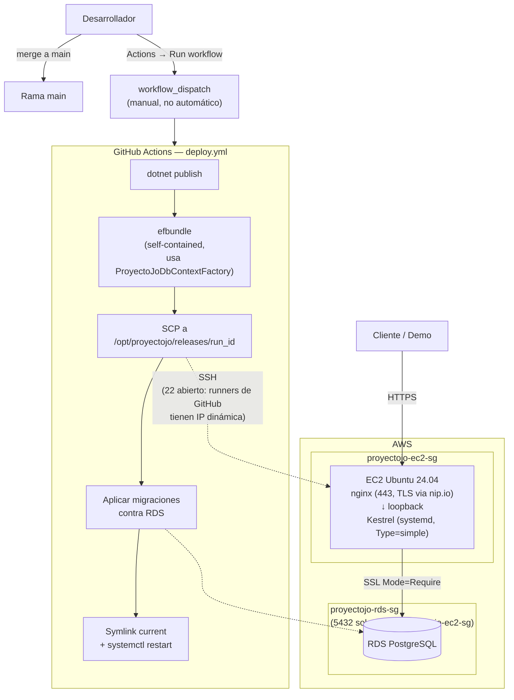

# ADR-13: Pipeline de despliegue manual a AWS (EC2 + RDS + nginx vía GitHub Actions)

| Campo  | Valor |
|--------|-------|
| Autor  | Joaquin Uriona |
| Fecha  | 01/08/2026 |
| Estado | `Aceptado` |

---

## Contexto

Con la persistencia en PostgreSQL (ADR-10), el hardening de seguridad aplicado (ADR-11), y el rendimiento de las rutas calientes resuelto (ADR-12), el sistema estaba listo en el código pero seguía sin correr en ningún lado accesible fuera de una máquina de desarrollo. ADR-09 ya había resuelto la mitad del problema de 12-Factor App (Build/Test automatizados vía CI); faltaba la otra mitad: Release/Run. Las condiciones concretas del proyecto marcaron los límites de la solución:

- **El objetivo era una demo en vivo puntual, no un sistema en producción de uso continuo** — cualquier decisión de infraestructura que agregara complejidad de operación sin un beneficio directo para ese objetivo (IaC con Terraform, orquestación con Kubernetes, múltiples entornos) no se justificaba con el tiempo y el equipo disponibles.
- **El equipo no tenía experiencia previa con AWS** — cualquier decisión de infraestructura necesitaba poder documentarse paso a paso para alguien que nunca había usado la consola, no asumir conocimiento previo.
- **El presupuesto real era la capa gratuita de AWS (Free Tier)** — 750 horas/mes durante 12 meses de EC2 y RDS, lo que descartó de entrada cualquier alternativa con costo fijo mensual.
- **La aplicación ya corría sobre PostgreSQL**, así que el motor de base de datos gestionado más directo era RDS PostgreSQL, sin necesidad de evaluar otros motores.

## Decisión

Se decide desplegar sobre una única instancia **EC2** (Ubuntu 24.04) con **nginx** como proxy reverso (terminación TLS + reenvío a Kestrel por loopback) y **RDS PostgreSQL** como base de datos gestionada, activado por un pipeline de **GitHub Actions con disparo manual** (`workflow_dispatch`, sin trigger automático en push).

**Arquitectura de red:** dos *security groups* separados, no uno solo compartido — `proyectojo-ec2-sg` (22 restringido a una IP específica salvo para el propio pipeline de CI, 80/443 abiertos) y `proyectojo-rds-sg` (5432 con **origen el security group del EC2**, no una IP ni un rango — la base de datos nunca queda alcanzable directamente desde internet, solo desde el servidor de aplicación).

**Mecánica del deploy** (`.github/workflows/deploy.yml`): publish de `ProyectoJo.Web` → generar un *migrations bundle* de EF Core autocontenido (`efbundle`, no requiere el SDK instalado en el servidor) → subir el release por SCP a `/opt/proyectojo/releases/<run_id>` → aplicar migraciones pendientes contra RDS ejecutando el bundle **antes** de activar el release nuevo → apuntar el symlink `/opt/proyectojo/current` al release nuevo y reiniciar el servicio `systemd` → conservar solo los últimos 5 releases (rollback rápido: mover el symlink al anterior y reiniciar, sin necesidad de re-desplegar).

**Sin dominio propio:** en vez de requerir que el equipo comprara y configurara un dominio (fuera del alcance de "lo más básico posible" para una demo puntual), se usa un servicio de DNS gratuito (`nip.io`) que resuelve un hostname derivado de la propia IP elástica a esa misma IP — permite que `certbot` emita un certificado TLS real de Let's Encrypt sin ningún registro DNS manual.

### Problemas reales encontrados y resueltos durante el primer despliegue de punta a punta

Ninguno de estos era previsible desde el diseño del pipeline en abstracto — todos aparecieron recién al ejecutar el primer deploy real contra infraestructura real, y cada uno es una decisión de arquitectura en sí misma:

1. **El *migration bundle* no podía construir el `DbContext`.** `AddDbContextPool` (ADR-12) rompe el mecanismo por el cual las herramientas de diseño de EF Core arman una instancia del contexto para aplicar migraciones — sin ninguna fábrica explícita, `efbundle` intentaba levantar la aplicación web completa como *fallback*, lo cual fallaba fuera de un runtime ASP.NET Core real. Se resolvió agregando `ProyectoJo.Infrastructure/Persistence/EfCore/ProyectoJoDbContextFactory.cs`, una `IDesignTimeDbContextFactory<ProyectoJoDbContext>` explícita — sin tocar el registro `AddDbContextPool` que usa la aplicación en tiempo de ejecución.
2. **RDS PostgreSQL rechaza conexiones sin cifrar por defecto.** El connection string necesitó `SSL Mode=Require;Trust Server Certificate=true` — un requisito de la infraestructura gestionada que no aparece al desarrollar contra una instancia local de Postgres sin ese requisito.
3. **El *migration bundle*, al lograr construir el `DbContext`, seguía fallando al intentar levantar el `WebApplicationBuilder` completo** por un `CompositeFileProvider` en `Program.cs` que apunta a `Areas/Admin/wwwroot/` (los estilos/scripts del panel Admin) — una carpeta que `dotnet publish` nunca copiaba al artefacto publicado, porque no es la convención estándar de `wwwroot` que el SDK reconoce automáticamente. Se agregó un `<Content Include="Areas\Admin\wwwroot\**">` explícito en `ProyectoJo.Web.csproj`; sin este fix, el panel Admin hubiera arrancado sin estilos en producción aunque el resto funcionara.
4. **El servicio `systemd` (`Type=notify`) esperaba una señal de "listo" que ASP.NET Core no envía por defecto**, matando el proceso por timeout (90s) aunque estuviera sano. Se cambió a `Type=simple`, que considera arrancado el servicio apenas el proceso se ejecuta.
5. **El puerto 22 restringido a una única IP bloqueaba al propio pipeline de CI.** Los runners de GitHub Actions usan IPs dinámicas — no hay una lista fija y chica para permitir. Se abrió 22 a cualquier origen, aceptable porque el login sigue exigiendo la clave privada (`.pem`), no una contraseña; la superficie real que se expone es ruido de escaneo de bots, no una puerta de acceso real.

### Alternativas consideradas

| Alternativa | Por qué la descarté |
|-------------|---------------------|
| Deploy automático en cada push a `main` (`on: push`) | Sin validar primero que la infraestructura funcionara de punta a punta, un push roto habría desplegado directo a lo que sería el ambiente de la demo; `workflow_dispatch` deja el control humano explícito hasta confirmar que el pipeline es confiable — pasar a automático después es un cambio de una línea |
| PostgreSQL corriendo en un contenedor dentro del mismo EC2, en vez de RDS gestionado | Evita el costo/complejidad de un segundo recurso de AWS, pero pierde backups automáticos, parcheo de seguridad gestionado, y separación real de fallas (si el EC2 se cae, la base sigue viva en RDS) — para una demo en vivo, no correr el riesgo de que un problema del servidor de aplicación tumbe también los datos fue la prioridad |
| Contenedores (Docker + ECS/Fargate) en vez de EC2 "a mano" con systemd | Es la opción más "correcta" a largo plazo, pero agrega una capa completa de conceptos nuevos (imágenes, registries, orquestación) para un equipo sin experiencia previa en AWS y un objetivo de demo puntual — el costo de aprendizaje no se justificaba frente al beneficio para este alcance |
| Terraform/IaC para provisionar la infraestructura | Reproducibilidad real y versionado de la infraestructura como código, pero es una herramienta más que aprender desde cero cuando ya AWS mismo (consola) resultaba nuevo para el equipo — se documentó el proceso manual paso a paso en su lugar, priorizando que alguien sin experiencia pudiera seguirlo |
| Un dominio propio comprado, en vez de `nip.io` | Más "profesional" de cara a un dominio final, pero agrega un costo y un paso de configuración DNS externo al alcance de "lo más básico para una demo" — `nip.io` da HTTPS real (certificado válido de Let's Encrypt) sin ninguno de esos dos costos |

---

## Consecuencias

✅ Lo que gano:

- **RDS separado del EC2 significa que una falla del servidor de aplicación no arriesga los datos** — y los backups automáticos de RDS existen sin que el equipo tenga que configurarlos.
- **El *migration bundle* autocontenido significa que el servidor de producción nunca necesita el SDK de .NET instalado**, solo el runtime — menor superficie de ataque y menos que mantener actualizado en el servidor.
- **Rollback es un cambio de symlink, no un nuevo despliegue** — los últimos 5 releases quedan disponibles en `/opt/proyectojo/releases/`, revertir es `ln -sfn` + `systemctl restart`.
- **HTTPS real sin comprar un dominio ni configurar DNS manual**, gracias a `nip.io` — reduce el setup de la demo a lo estrictamente necesario.
- **Cada uno de los 5 problemas reales encontrados quedó resuelto de forma reproducible** (documentados en código y en `docs/Despliegue-Resumen-Operativo.md`), no parchado a mano en el servidor sin dejar rastro — si la infraestructura se recrea desde cero, no hay que redescubrir los mismos cinco problemas.

⚠️ Lo que sacrifico o asumo:

- **El pipeline es manual a propósito**, lo que significa que un cambio mergeado a `main` no llega solo a producción — alguien tiene que acordarse de disparar el `workflow_dispatch`, un paso humano que en un equipo más grande sería un punto de fricción.
- **El puerto 22 abierto a cualquier origen** (necesario para que GitHub Actions pueda conectarse) amplía la superficie de escaneo automatizado de bots, mitigado pero no eliminado por depender exclusivamente de autenticación por clave.
- **`nip.io` es una dependencia externa de un tercero para que el hostname resuelva** — si ese servicio dejara de estar disponible, el certificado TLS seguiría siendo válido pero el hostname dejaría de resolver hasta reemplazarlo por un dominio propio.
- **La infraestructura no está definida como código (sin Terraform/CloudFormation)** — recrearla desde cero depende de seguir la documentación paso a paso (`docs/AWS-1` a `AWS-3`), no de correr un comando; es una decisión consciente para este alcance, pero es deuda real si el proyecto creciera más allá de una demo puntual.

---

## Diagrama

---

## Trade-offs

| Decisión | Ganas | Sacrificas |
|---|---|---|
| `workflow_dispatch` manual sobre deploy automático en push | Control humano explícito hasta validar que la infraestructura es confiable | Un cambio mergeado no llega solo a producción; requiere un paso manual adicional |
| RDS gestionado sobre PostgreSQL en contenedor dentro del mismo EC2 | Backups automáticos y falla del servidor de aplicación no arriesga los datos | Un recurso de AWS adicional que administrar (aunque dentro de la capa gratuita) |
| EC2 + systemd "a mano" sobre contenedores orquestados (ECS/Fargate) | Curva de aprendizaje mínima para un equipo sin experiencia previa en AWS | Menos portable y reproducible que una imagen de contenedor versionada |
| `nip.io` sobre un dominio propio comprado | HTTPS real sin costo ni configuración DNS externa | Dependencia de un servicio de terceros para que el hostname resuelva |
| Puerto 22 abierto a cualquier origen sobre restringido a una IP fija | El pipeline de CI (IP dinámica) puede conectarse siempre | Mayor superficie de escaneo automatizado, mitigado por autenticación exclusiva por clave privada |

---

## Atributos de calidad

### Estáticos

| Atributo | Pregunta que responde | En Proyecto Jo' |
| :--- | :--- | :--- |
| **Reproducibilidad** | ¿Se puede recrear la infraestructura completa desde cero si hiciera falta? | Sí, siguiendo `docs/AWS-1` a `AWS-3` paso a paso — no está automatizada como código (sin Terraform), pero está documentada de forma completa y verificada contra un despliegue real |
| **Recuperabilidad (rollback)** | ¿Qué tan costoso es revertir un deploy que salió mal? | Cambiar el symlink `/opt/proyectojo/current` al release anterior y reiniciar el servicio — no requiere volver a correr el pipeline completo, los últimos 5 releases quedan disponibles en el servidor |

### Dinámicos

| Atributo | Pregunta que responde | En Proyecto Jo' |
| :--- | :--- | :--- |
| **Disponibilidad ante falla del servidor de aplicación** | ¿Qué pasa con los datos si el EC2 se cae o se corrompe? | Los datos siguen intactos en RDS, un recurso separado y gestionado por AWS con sus propios backups — la falla del servidor de aplicación no es una falla de los datos |
| **Seguridad de red en tránsito** | ¿Puede alguien en la misma red conectarse directamente a la base de datos sin pasar por la aplicación? | No — `proyectojo-rds-sg` solo permite el puerto 5432 desde el security group del EC2, nunca desde una IP externa ni siquiera la del propio equipo de desarrollo |

---

## Uso de IA

Se utilizó IA para:

- Diseñar y escribir `deploy.yml`, `deploy/proyectojo-web.service` y `deploy/nginx-proyectojo.conf`.
- Diagnosticar y resolver, en vivo contra la infraestructura real, cada uno de los cinco problemas documentados arriba (factory de EF Core, SSL de RDS, `Type=simple`, publicación de `Areas/Admin/wwwroot`, apertura del puerto 22 para los runners de GitHub).
- Redactar la documentación paso a paso de AWS (`docs/AWS-1` a `AWS-3`, `docs/Despliegue-AWS.md`) para un equipo sin experiencia previa en la plataforma.
- Generar la sintaxis Mermaid del diagrama y corregir redacción de este documento.
