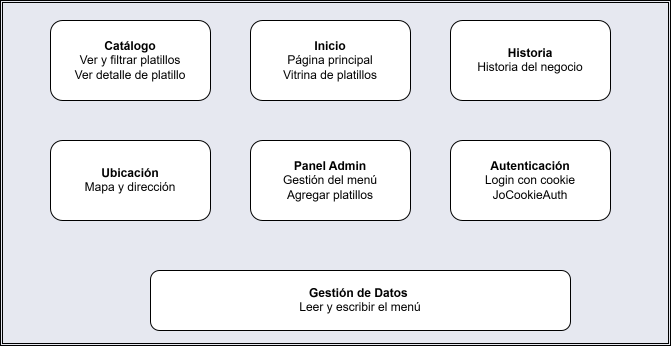
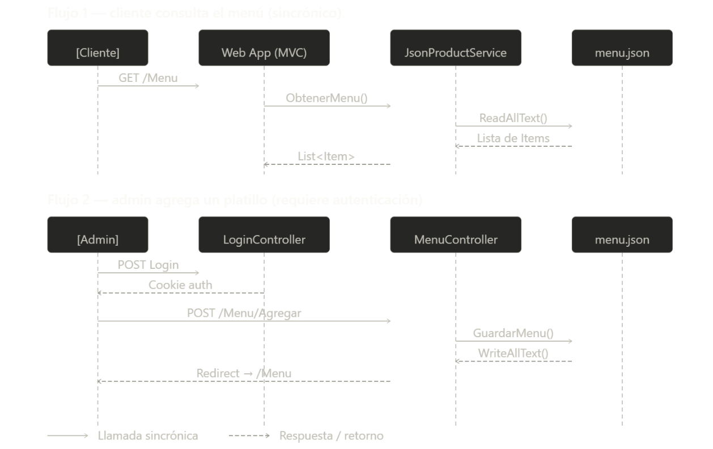
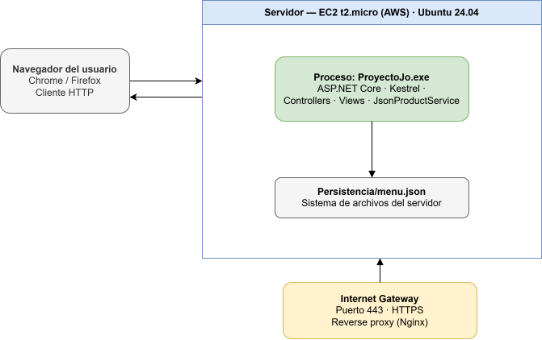
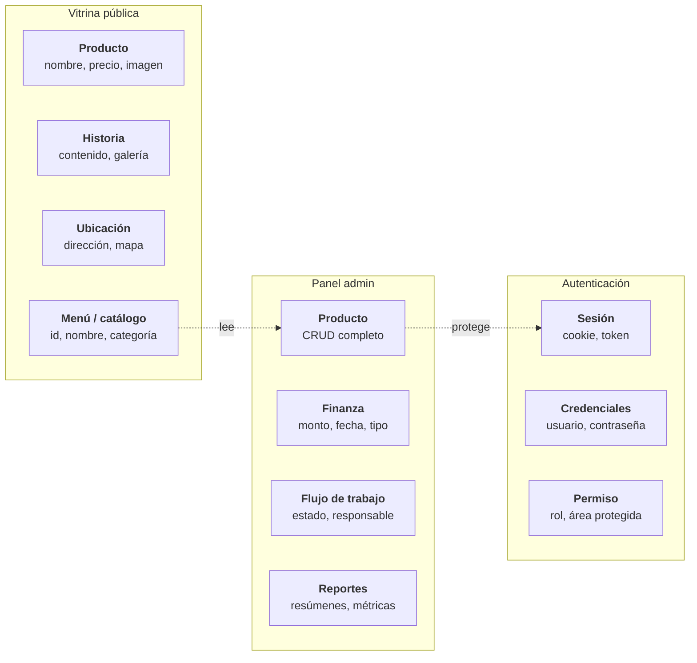

# ADR-01: Estructura base del sistema usando el patrón MVC
Campo	     Valor <br>
Autor	Joaquin Uriona <br>
Fecha	15/05/2026 <br>
Estado `Aceptado`  <br>
---
## Contexto

Quiero construir una aplicación web centralizada para la gestión financiera y administrativa, orientada específicamente a dueños y administradores de pequeños o medianos negocios en el cual el sistema debe permitir la visibilidad del flujo de trabajo, la gestión de catálogos de productos y la centralización de datos financieros y administrativos clave en una plataforma accesible en todo momento. <br>
Para el desarrollo de esta solución, se deben considerar las siguientes restricciones y objetivos:
- Restricción de Equipo: El proyecto es ejecutado por un único desarrollador, quien debe asumir la totalidad de las responsabilidades del ciclo de vida del software: desarrollo Frontend, arquitectura Backend, aseguramiento de compatibilidad tecnológica y despliegue
- Productividad y Mantenimiento: Debido a la limitación de recursos humanos, el sistema debe estructurarse de manera que el mantenimiento, la depuración y la escalabilidad inicial sean lo más sencillas y centralizadas posible, evitando la fragmentación de tecnologías.
- Reducir la Complejidad: Introducir frameworks de Frontend adicionales sin dominar alargaría el tiempo del desarrollo del proyecto por cuestiones de aprendizaje, diseñar el patrón MVC de forma pura permite concentrar el esfuerzo exclusivamente en la lógica de negocio, como se comunica y el apartado visual totalmente diseñado en C# adaptado para web.
---

## Decisión


Se decide implementar el patrón arquitectónico Model-View-Controller (MVC) utilizando el ecosistema de .NET ASP.NET Web como base para el desarrollo y despliegue de la aplicación.


### ¿Por qué?


Se eligió esta combinación tecnológica y arquitectónica por las siguientes razones de diseño y modularidad:


- Soporte Nativo para Despliegue: .NET ASP.NET provee una infraestructura robusta y optimizada que simplifica la compilación, empaquetado y puesta en producción de la aplicación web, reduciendo la carga operativa en un entorno de desarrollo unipersonal.
- Separación de Responsabilidades en Tres Capas: El patrón permite aislar el sistema en tres componentes independientes, garantizando que los cambios en uno no afecten negativamente a los demás:
- Vistas (Views): estas centralizan el apartado visual y la interfaz que consume el usuario, al estar desacopladas, permiten diseñar y modificar pantallas específicas de forma aislada, promoviendo la reutilización de componentes y evitando la duplicación de código HTML/CSS.
- Controladores (Controllers): Actúan como los intermediarios lógicos del sistema. Se encargan exclusivamente de interceptar las peticiones del usuario, procesar los flujos de información y comunicar de manera limpia las vistas con el núcleo del sistema.
- Modelos (Models): Encapsulan la lógica de negocio pura, permitiendo un desarrollo modular donde se define con total claridad qué hace el sistema, cómo procesa los datos y con qué estructuras trabaja, manteniendo el backend limpio y ordenado.


### Alternativas consideradas:


- Separar Frontend y Backend: React/Vue y una Web API 
- Microservicios: Separar la gestión de productos, finanzas y usuarios en mini-aplicaciones.
- Monolito: Meter toda la lógica y el HTML mezclado


### Alternativa	Por qué la descarté


Separar Frontend y Backend: considero que la complejidad y sobreesfuerzo seria mucha ya que no cuento con los suficientes conocimientos y estario obligario a gestionar dos proyectos totalmente independientes y por ende exige dominar JavaScript, el manejo de estados en el navegador, configuraciones de seguridad (CORS, tokens) y realizar dos despliegues distintos, para un desarrollador unipersonal, esto duplica el tiempo de desarrollo.


Arquitectura de Microservicios: requiere una infraestructura altamente compleja (orquestación de contenedores, redes internas, pasarelas de API) y una gestión DevOps avanzada, implementarlo para un MVP (Producto Mínimo Viable) diseñado por una sola persona ralentizaría el lanzamiento hasta por meses con mis conocimientos


Monolito Lineal sin Patrón: al tratarse de un sistema con datos financieros delicados, la falta de modularidad haría que un cambio estético en la pantalla pudiera romper accidentalmente un cálculo del negocio, haciendo que el mantenimiento sea peligroso y propenso a fallos críticos.


---
## Consecuencias
✅ Lo que gano:


Consecuencia Técnica: la separación en componentes (Modelos, Vistas y Controladores) agiliza drásticamente la construcción y despliegue de operaciones CRUD (Crear, Leer, Actualizar, Borrar), esenciales para la gestión de productos y finanzas. Además, permite delegar el ciclo de vida de las peticiones en la infraestructura nativa de ASP.NET, se evita la gestión manual y compleja de protocolos de red, cabeceras HTTP y estados de conexión, permitiendo un desarrollo más rápido y robusto.


Consecuencia sobre el Proceso o el Equipo: al ser el único desarrollador a cargo de la totalidad del proyecto (Frontend, Backend, DevOps, mantenimiento y gestión comercial del negocio), el orden de la arquitectura es vital, el MVC permite alternar de forma organizada entre diseñar pantallas y programar lógica de negocio, reduciendo la carga cognitiva y evitando que las múltiples responsabilidades del rol unipersonal colapsen el flujo de desarrollo.


⚠️ Lo que sacrifico o asumo:


Limitación técnica: al adoptar un enfoque MVC, la interfaz de usuario queda estrechamente acoplada al backend, por lo que si las reglas del negocio financiero crecen considerablemente en complejidad, este patrón básico corre el riesgo de saturarse y colapsar bajo el peso de controladores y modelos sobrecargados, lo cual generaría una rigidez técnica que impediría reutilizar la estructura actual si en el futuro el entorno exige escalar hacia aplicaciones móviles (iOS/Android) o de escritorio, obligándome a refactorizar todo el backend para transformarlo en una Web API independiente, además de que ante un crecimiento masivo de funciones, el sistema acumulará una deuda técnica crítica que forzaría a detener por completo el desarrollo de nuevas características con el fin de reestructurar el monolito hacia diseños más limpios y estrictamente modulares, como Clean Architecture o Arquitectura Hexagonal, que puedan soportar dicha escala de manera estable.


Deuda o riesgo: Al empaquetar todo el flujo financiero y administrativo dentro de un único bloque monolítico bajo el servidor de ASP.NET, se asume el riesgo de que si una característica específica del sistema experimenta una alta demanda de tráfico o procesamiento de datos por parte de los usuarios, se tendrá que escalar y pagar por la totalidad del servidor completo con el proveedor de hosting en lugar de poder distribuir o apagar componentes de forma aislada, lo cual incrementará los costos operativos y la complejidad del mantenimiento de la infraestructura a medida que el negocio crezca.


## Diagrama


---

## Vistas Arquitectonicas


### Vista logica



### Vista de desarrollo

```text
Proyecto Jo'
├───.github
│   └───workflows         # Configuración de CI/CD (ej. GitHub Actions) para despliegues y pruebas automatizadas.
├───.vs                   # Archivos temporales y configuraciones locales del entorno de Visual Studio (no se sube a Git).
└───Projecto Jo'          # Directorio principal de la aplicación SaaS.
    ├───ADRs              # Registros de Decisiones Arquitectónicas (Architecture Decision Records).
    │   └───Diagramas     # Diagramas de arquitectura e infraestructura del sistema.
    ├───Areas             # Módulos lógicamente separados para organizar componentes grandes.
    │   └───Admin         # Área de administración (el núcleo del panel de gestión interno).
    │       ├───Controllers # Lógica de los controladores exclusivos del panel de administración.
    │       ├───Models    # Modelos y ViewModels específicos para la gestión interna.
    │       ├───Views     # Vistas (Razor) del panel.
    │       │   ├───Gestion # Vistas para la operatividad del negocio.
    │       │   ├───Login # Vistas de autenticación y seguridad de acceso.
    │       │   └───Shared  # Layouts y componentes compartidos del dashboard de administración.
    │       └───wwwroot   # Archivos estáticos (imágenes, scripts) exclusivos del admin.
    │           └───css
    │               └───admin # Estilos aplicados únicamente al panel de control.
    ├───bin               # Archivos binarios compilados (generados automáticamente por .NET).
    │   ├───Debug         # Compilaciones para desarrollo local (soportando .NET 9.0 y 10.0).
    │   └───Release       # Compilaciones optimizadas listas para producción (.NET 10.0).
    ├───Controllers       # Controladores MVC para la interfaz pública o "vitrina" del negocio.
    │   ├───historia      # Lógica de la sección histórica del negocio.
    │   ├───home          # Lógica de la página principal (Landing).
    │   ├───menu          # Lógica del catálogo de servicios o menú.
    │   ├───nosotros      # Lógica de la página corporativa.
    │   └───ubicacion     # Lógica para mapas y contacto.
    ├───Data              # Contexto de la base de datos (Entity Framework Core) y configuraciones iniciales.
    ├───Models            # Modelos de dominio globales y ViewModels para la parte pública.
    ├───obj               # Archivos objeto temporales generados durante el proceso de compilación.
    ├───Persistencia      # Capa de acceso a datos (Patrón repositorio, interfaces, consultas a la DB).
    ├───Properties        # Propiedades de ejecución del proyecto (incluye launchSettings.json).
    ├───Views             # Páginas web en formato Razor para la cara pública de la aplicación.
    │   ├───historia
    │   ├───Home
    │   ├───menu
    │   ├───nosotros
    │   ├───Shared        # Plantilla principal (Layout), partial views y barra de navegación pública.
    │   └───Ubicacion
    └───wwwroot           # Directorio raíz para archivos estáticos accesibles directamente por el navegador.
        ├───css           # Hojas de estilo globales y específicas organizadas modularmente.
        │   ├───agregar
        │   ├───componentes
        │   ├───detalles
        │   ├───galeria
        │   ├───historia
        │   ├───home
        │   ├───index
        │   ├───layout
        │   ├───menu
        │   ├───modulos
        │   └───nosotros
        ├───img           # Recursos gráficos e imágenes públicas.
        ├───js            # Scripts de interactividad (JavaScript puro).
        └───lib           # Dependencias estáticas de terceros gestionadas localmente.
            ├───bootstrap # Framework CSS/JS para diseño responsivo.
            ├───jquery    # Librería base para manipulación del DOM.
            ├───jquery-validation # Validación de formularios en el cliente.
            └───jquery-validation-unobtrusive # Integración de validación de ASP.NET con jQuery.
```

### Vista de procesos




### Vista de despligue



---

## Trade-offs

| Decisión | Ganas | Sacrificas |
|---|---|---|
| MVC en lugar de API + Frontend separado (React/Vue) | Desarrollo centralizado en un solo proyecto, sin gestionar CORS, tokens ni dos despliegues distintos | Flexibilidad para una app móvil futura y si el negocio exige iOS/Android habrá que refactorizar el backend en una Web API independiente |
| Monolito MVC en lugar de microservicios | Cero overhead de orquestación, sin Docker Swarm, Kubernetes ni pasarelas de API, el MVP sale en semanas y no en meses | Escalado granular imposible y si el módulo financiero tiene alta demanda, se paga por escalar todo el servidor completo, no solo ese componente |
| Lógica de negocio en Modelos + Controladores en lugar de Clean Architecture | Curva de aprendizaje baja y desarrollo ágil para un equipo unipersonal | Deuda técnica acumulable y si las reglas financieras crecen, los controladores se saturan y forzarán una reestructuración hacia Clean Architecture o Arquitectura Hexagonal |
| Archivo `menu.json` en lugar de base de datos SQL | Sin servidor de base de datos que configurar y la app arranca en cualquier máquina con solo .NET instalado | Sin transacciones ni control de concurrencia y las escrituras simultáneas pueden corromper el archivo, ademas no escala a volúmenes grandes |
| `JoCookieAuth` con credenciales hardcodeadas en lugar de ASP.NET Identity | Sin base de datos de usuarios, sin migraciones ni configuración de roles y funcional en minutos | Las credenciales están en el código fuente y cambiar la contraseña requiere recompilar, deuda técnica que deberá resolverse antes de producción real |
| Un solo servidor EC2 en lugar de Load Balancer + Auto Scaling | Costo mensual mínimo (elegible para Free Tier) y configuración operativa simple | Sin redundancia y si el EC2 falla, la aplicación deja de estar disponible por completo, escalar exigirá migrar toda la infraestructura |


---

## Atributos de calidad

### Estaticos

| Atributo | Pregunta que responde | En Proyecto Jo' |
| :--- | :--- | :--- |
| **Mantenibilidad** | ¿Puedo cambiar el diseño de la vitrina sin tocar la lógica financiera? |  MVC separa Views de Controllers y Models |
| **Modularidad** | ¿Puedo agregar el módulo de finanzas sin romper la vitrina pública? |  Areas separada Admin de Controllers |
| **Testeabilidad** | ¿Puedo probar el cálculo financiero sin levantar el servidor web? |  Difícil hoy porque la lógica esta en Controllers, no en capa de dominio pura |

### Dinamicos

| Atributo | Pregunta que responde | En Proyecto Jo' |
| :--- | :--- | :--- |
| **Disponibilidad** | Si el EC2 cae, ¿el admin puede seguir gestionando finanzas? |  Un solo EC2 sin redundancia, caída total si el servidor falla |
| **Seguridad** | ¿Un visitante puede ver o modificar los datos financieros del admin? |  JoCookieAuth con credenciales hardcodeadas y deuda crítica conocida |
| **Escalabilidad** | Si el módulo financiero crece, ¿se puede escalar solo ese componente? |  Monolito y escalar implica escalar todo el servidor EC2 |

---

## Bounded Contexts 



---

## Uso de IA

Se utilizó IA únicamente para:

- Corregir redacción y ortografía del documento
- Generar la sintaxis Mermaid del diagrama de Bounded Contexts

No se utilizó para tomar decisiones arquitectónicas ni para diseñar la solución.
