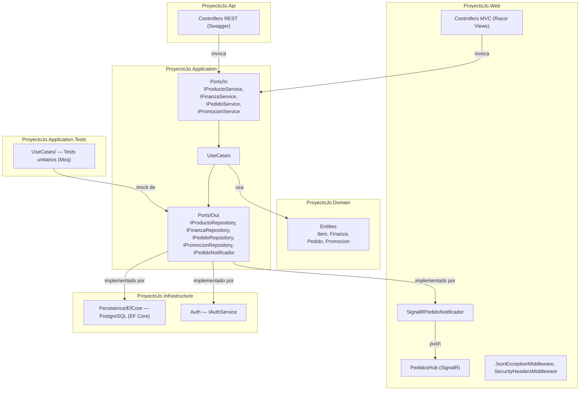
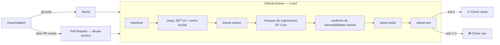

# Proyecto Jo'

> Sistema de gestión financiera y administrativa para dueños de pequeños y medianos
> negocios, construido con **ASP.NET Core** bajo **Arquitectura Hexagonal (Ports & Adapters)**.


[](https://github.com/Joako601/Protecto3/actions/workflows/ci.yml)

> El badge de CI refleja el estado de `pipeline-ci`, la rama de desarrollo activo; `main` va por detrás y se actualiza al mergear.

---

## Índice

- [Descripción](#descripción)
- [Arquitectura](#arquitectura)
- [Módulos implementados](#módulos-implementados)
- [Estructura del repositorio](#estructura-del-repositorio)
- [Documentación de Arquitectura (Modelo C4)](#documentación-de-arquitectura-modelo-c4)
- [Tecnologías](#tecnologías)
- [Requisitos previos](#requisitos-previos)
- [Cómo ejecutar el proyecto](#cómo-ejecutar-el-proyecto)
- [Documentación interactiva (Swagger)](#documentación-interactiva-swagger)
- [Endpoints disponibles](#endpoints-disponibles)
- [Integración Continua (CI/CD)](#integración-continua-cicd)
- [Decisiones de arquitectura (ADRs)](#decisiones-de-arquitectura-adrs)
- [Deuda técnica conocida](#deuda-técnica-conocida)
- [Uso de IA](#uso-de-ia)
- [Autor](#-autor)
- [Licencia y propiedad intelectual](#-licencia-y-propiedad-intelectual)

---

## Descripción

Proyecto Jo' nació como una aplicación MVC monolítica y migró progresivamente hacia
una **Arquitectura Hexagonal**, separando el dominio de negocio de los frameworks
y la infraestructura, el sistema se compone de cinco proyectos independientes con
fronteras explícitas y una dirección de dependencia única: los adaptadores dependen
del dominio, el dominio nunca depende de ellos.

El sistema expone dos adaptadores de entrada simultáneos:

- **`ProyectoJo.Web`** — panel administrativo y vitrina pública (ASP.NET Core MVC),
  con comunicación en tiempo real vía **SignalR** para las pantallas de Cocina y Recepción
- **`ProyectoJo.Api`** — API REST documentada con Swagger, actualmente desarrollada
  pero sin uso activo en el sistema, reservada para una futura integración con clientes
  externos (apps móviles, WhatsApp, Postman)

El historial completo de decisiones de diseño está documentado en
[`/ADRs`](./ADRs).

---

## Arquitectura



Más detalle en las vistas arquitectónicas de cada ADR.

## Módulos implementados

| Módulo | Descripción |
|---|---|
| Finanzas | CRUD de movimientos, dashboard con gráficas, filtros por mes y año |
| Menú | CRUD de platillos con búsqueda y filtros por categoría |
| Inventario | Toggle activo/agotado por platillo |
| Promociones | Banners y descuentos, vista pública en menú |
| Mapa de Calor | Ventas por semana y por mes con navegación por período |
| Cocina / Recepción | Flujo operacional de pedidos con autenticación por rol y PIN, sincronización en tiempo real vía SignalR |

>  En desarrollo activo — Arquitectura Hexagonal implementada, nuevos módulos en camino

---

## Estructura del repositorio

```text
ProyectoJo/
├── ProyectoJo.Domain/            # Núcleo del negocio — sin dependencias externas
│   └── Entities/                 # Item, Finanza, Pedido, ItemPedido, Promocion
│
├── ProyectoJo.Application/       # Casos de uso y puertos
│   ├── Ports/In/                 # IProductoService, IFinanzaService, IPedidoService, IPromocionService
│   ├── Ports/Out/                # IProductoRepository, IFinanzaRepository, IPedidoRepository,
│   │                             # IPromocionRepository, IPedidoNotificador
│   ├── UseCases/                 # Implementación de la lógica de negocio
│   └── DTOs/                     # ResumenFinanciero, ResumenDashboard, ResultadoCrearPedido
│
├── ProyectoJo.Infrastructure/    # Adaptadores de salida
│   ├── Persistence/EfCore/       # PostgreSQL vía EF Core: DbContext, Configurations/,
│   │                             # Repositories/ (Ef*Repository) y Migrations/
│   └── Auth/                     # EnvAuthService
│
├── ProyectoJo.Web/               # Adaptador de entrada — ASP.NET Core MVC
│   ├── Controllers/              # Home, Menu, Historia, Nosotros, Ubicación
│   ├── Areas/Admin/              # Panel administrativo (Finanzas, Productos, Promociones)
│   ├── Areas/Operaciones/        # Cocina, Recepción, Auth por PIN
│   ├── Hubs/                     # PedidosHub — canal SignalR en tiempo real
│   ├── Realtime/                 # SignalRPedidoNotificador
│   ├── Middleware/               # JsonExceptionMiddleware, SecurityHeadersMiddleware
│   └── Views/
│
├── ProyectoJo.Api/               # Adaptador de entrada — ASP.NET Core Web API
│   ├── Controllers/              # PedidosController
│   └── Program.cs                # Composición de dependencias + Swagger (sin persistencia
│                                  # registrada por ahora — ver Deuda técnica conocida)
│
├── ProyectoJo.Application.Tests/ # Proyecto de tests — xUnit + Moq
│   ├── Domain/                   # Tests de validaciones (DataAnnotations) por entidad
│   └── UseCases/                 # Tests unitarios con mocks, uno por caso de uso
│
├── ADRs/                         # Historial de decisiones arquitectónicas
│
└── .github/workflows/            # Integración Continua y validación de documentación
    ├── ci.yml                    # Restore, chequeo de migraciones, auditoría de vulnerabilidades, build y test
    └── docs.yml                  # Falla si hay links rotos en los archivos Markdown del repo
```
---

## Documentación de Arquitectura (Modelo C4)

La arquitectura del sistema está documentada en tres niveles de detalle bajo el
[Modelo C4](https://c4model.com/) — Contexto, Contenedores y Componentes -

**[Ver documentación completa → `/docs/Arquitectura-C4.md`](./docs/Arquitectura-C4.md)**

| Nivel | Contenido | Audiencia |
|---|---|---|
| 1 — Contexto | Qué es el sistema y quién interactúa con él | General |
| 2 — Contenedores | Procesos desplegables y cómo se comunican | Equipo técnico |
| 3 — Componentes | Clases e interfaces dentro de `ProyectoJo.Web` | Equipo de desarrollo |

> El historial de decisiones que sustenta esta arquitectura está documentado
> por separado en [`/ADRs`](./ADRs).

---

## Tecnologías

| Categoría | Tecnología |
|---|---|
| Framework | ASP.NET Core (.NET 10) |
| Patrón arquitectónico | Arquitectura Hexagonal (Ports & Adapters) |
| Web (adaptador de entrada) | ASP.NET Core MVC, Razor Views |
| API (adaptador de entrada) | ASP.NET Core Web API |
| Tiempo real | SignalR |
| Documentación de API | Swagger / OpenAPI (Swashbuckle.AspNetCore) |
| Persistencia actual | PostgreSQL vía Entity Framework Core (Npgsql), solo en `ProyectoJo.Web` — ver Deuda técnica conocida |
| Autenticación | Cookie auth  |
| Logging | Serilog (consola + archivo rotativo diario) |
| Tests | xUnit 2.9.2 + Moq 4.20.72 |
| Integración Continua | GitHub Actions — build, test, chequeo de migraciones EF Core pendientes y auditoría de vulnerabilidades NuGet en cada push y Pull Request; verificación de links rotos en la documentación |
| Despliegue objetivo | AWS EC2 |

---

## Requisitos previos

- [.NET SDK 10.0](https://dotnet.microsoft.com/download) o superior
- Un editor compatible (Visual Studio, VS Code con C# Dev Kit, Rider)

---

## Cómo ejecutar el proyecto

El sistema tiene **dos puntos de entrada independientes**: el sitio web (`ProyectoJo.Web`)
y la API (`ProyectoJo.Api`). Cada uno se ejecuta por separado.

```bash
# Restaurar dependencias de toda la solución
dotnet restore

# Aplicar las migraciones de EF Core contra tu PostgreSQL (ver sección siguiente)
dotnet ef database update --project ProyectoJo.Infrastructure --startup-project ProyectoJo.Web

# Levantar el sitio web (panel admin + vitrina pública + Cocina/Recepción)
dotnet run --project ProyectoJo.Web
# → https://localhost:7287  /  http://localhost:5207

# Levantar la API REST (actualmente sin persistencia registrada — ver Deuda técnica conocida)
dotnet run --project ProyectoJo.Api
# → https://localhost:63639  /  http://localhost:63640

# Correr los tests
dotnet test ProyectoJo.Application.Tests
```

### Base de datos (PostgreSQL)

`ProyectoJo.Web` requiere una instancia de PostgreSQL alcanzable y una cadena de
conexión configurada en `ConnectionStrings:Default`. En desarrollo, configúrala vía
*User Secrets* (nunca en `appsettings.json` ni en el repositorio):

```bash
dotnet user-secrets set "ConnectionStrings:Default" \
  "Host=localhost;Port=5432;Database=proyectojo;Username=postgres;Password=<tu-clave>" \
  --project ProyectoJo.Web
```

Con la base creada y la cadena de conexión configurada, aplicá las migraciones con el
comando `dotnet ef database update` de arriba. Las migraciones viven en
`ProyectoJo.Infrastructure/Persistence/EfCore/Migrations/`.

### Credenciales del panel administrativo

El panel admin requiere las variables de entorno `Auth__AdminUser` y
`Auth__AdminPasswordHash` (ver `Infrastructure/Auth/EnvAuthService`).
Configúralas en tu entorno local o en los *User Secrets* de .NET —
**nunca las dejes hardcodeadas ni las subas al repositorio** en `launchSettings.json`
con su valor real.

---

## Documentación interactiva (Swagger)

Con `ProyectoJo.Api` corriendo, Swagger UI queda disponible directamente en la raíz
del proyecto:

```
http://localhost:63640/
```

Desde ahí se pueden explorar y probar todos los endpoints sin necesidad de Postman.

---

## Endpoints disponibles

> Esta tabla se mantiene actualizada manualmente como referencia rápida. La fuente
> de verdad siempre es Swagger, generado directamente desde el código.

### Pedidos — `/api/Pedidos`

| Método | Ruta | Tag | Descripción |
|---|---|---|---|
| GET | `/api/Pedidos/recepcion` | Recepción | Lista pedidos para la vista de recepción |
| GET | `/api/Pedidos/{id}` | Recepción | Obtiene un pedido por id |
| POST | `/api/Pedidos` | Recepción | Crea un nuevo pedido |
| PATCH | `/api/Pedidos/{id}/pagar` | Recepción | Marca un pedido como pagado |
| GET | `/api/Pedidos/cocina` | Cocina | Lista pedidos pendientes/preparados para cocina |
| PATCH | `/api/Pedidos/{id}/estado` | Cocina | Cambia el estado de un pedido |

### Hub de tiempo real — SignalR

| Ruta | Descripción |
|---|---|
| `/hubs/pedidos` | Canal SignalR para Cocina y Recepción — push de cambios de estado en tiempo real |

### Próximos módulos a exponer vía API

Productos, Finanzas y Promociones ya tienen sus casos de uso y puertos listos en
`ProyectoJo.Application` (`IProductoService`, `IFinanzaService`, `IPromocionService`),
pero todavía solo se consumen desde `ProyectoJo.Web`. Quedan pendientes sus
respectivos controladores en `ProyectoJo.Api`.

---

## Integración Continua (CI/CD)

Cada `push` a cualquier rama y cada Pull Request contra `deuda-tecnica` dispara
el workflow de **GitHub Actions** `ci.yml`: restaura dependencias, verifica que
no haya migraciones de EF Core pendientes contra el modelo de dominio, audita
las dependencias NuGet en busca de vulnerabilidades conocidas, compila en modo
Release y corre toda la suite de `ProyectoJo.Application.Tests`. Si cualquier
paso falla, el check del Pull Request queda en rojo y bloquea el merge hasta
corregirlo. También puede dispararse manualmente desde la pestaña *Actions*.

Un segundo workflow, `docs.yml`, corre sobre los archivos Markdown del
repositorio (README, ADRs, `docs/`) y falla si detecta un link roto, interno
o externo.



La decisión original de usar GitHub Actions — alternativas consideradas y
consecuencias — está documentada en [ADR-09](./ADRs/ADR-09-Joaquin-Uriona.md).
El workflow evolucionó desde entonces con las verificaciones adicionales
descritas arriba; el trabajo vive en la rama [`pipeline-ci`](https://github.com/Joako601/Protecto3/tree/pipeline-ci).

---

## Decisiones de arquitectura (ADRs)

| ADR | Decisión |
|---|---|
| [ADR-01](./ADRs/ADR-01-Joaquin-Uriona.md) | Decisión inicial de stack/arquitectura del MVP |
| [ADR-02](./ADRs/ADR-02-Joaquin-Uriona.md) | MVC puro y sus limitaciones anticipadas |
| [ADR-03](./ADRs/ADR-03-Joaquin-Uriona.md) | Migración hacia Arquitectura Hexagonal |
| [ADR-04](./ADRs/ADR-04-Joaquin-Uriona.md) | Incorporación de una API REST con Swagger |
| [ADR-05](./ADRs/ADR-05-Joaquin-Uriona.md) | Integración de Patrones de Diseño GOF |
| [ADR-06](./ADRs/ADR-06-Joaquin-Uriona.md) | Reemplazo de Polling por SignalR en Cocina/Recepción |
| [ADR-07](./ADRs/ADR-07-Joaquin-Uriona.md) | Introducción de Proyecto de Tests y Estrategia de Cobertura |
| [ADR-08](./ADRs/ADR-08-Joaquin-Uriona.md) | Deuda técnica de `ProyectoJo.Api` |
| [ADR-09](./ADRs/ADR-09-Joaquin-Uriona.md) | Pipeline de Integración Continua con GitHub Actions |

---

## Deuda técnica conocida

El sistema documenta su deuda técnica de forma explícita en vez de dejarla implícita en el código. [ADR-08](./ADRs/ADR-08-Joaquin-Uriona.md) describe una versión anterior de esta deuda (de cuando `Web` y `Api` todavía leían los mismos archivos JSON); desde la migración de `Web` a PostgreSQL, el problema cambió de forma y está resumido acá hasta que se documente en un ADR nuevo.

| Deuda | Tipo | Estado |
|---|---|---|
| `ProyectoJo.Api/Program.cs` no registra ningún repositorio (`IPedidoRepository`, `IProductoRepository`, `IFinanzaRepository`, etc.) — cualquier endpoint que use persistencia falla en runtime al resolver sus dependencias | Accidental | Documentada — pendiente, `Api` fuera de alcance por ahora |
| `Web` y `Api` no comparten datos: `Web` persiste en PostgreSQL, `Api` no tiene ninguna fuente de datos propia | Infraestructura | Documentada — pendiente |

> Causa raíz: `Web` y `Api` componen su grafo de dependencias por separado y no hay una raíz de composición compartida. La prioridad actual es la migración de `Web`; retomar `Api` (ya sea dándole su propio acceso a PostgreSQL o centralizando el registro en un método compartido) queda pendiente.
---

## Uso de IA

Se utilizó IA para:

- Corregir redacción y ortografía de este documento
- Generar la sintaxis Mermaid de los diagramas de arquitectura y del pipeline de CI/CD
- Generar la estructura y el código de los tests unitarios y de integración a partir del código existente en
  `ProyectoJo.Application` y `ProyectoJo.Infrastructure`
- Generar la estructura inicial de los workflows de GitHub Actions (`ci.yml`, `docs.yml`)

No se utilizó para tomar decisiones arquitectónicas ni para diseñar la solución.

## 👨‍💻 Autor

**Joaquin Uriona**
* [LinkedIn](https://www.linkedin.com/in/Joaquin-Uriona)
* [GitHub](https://github.com/Joako601)

## 🔒 Licencia y propiedad intelectual

Copyright (c) 2026 Joaquin Uriona — Todos los derechos reservados.

Este software, su código fuente, arquitectura, diseño y documentación son
propiedad exclusiva de **Joaquin Uriona**. Queda terminantemente prohibido
el uso, copia, modificación, distribución o comercialización sin permiso
expreso y por escrito del autor.

El acceso a este repositorio se otorga únicamente para revisión técnica y
evaluación académica o profesional. Cualquier otro uso queda expresamente
prohibido.

> Este software se proporciona "tal cual", para fines de exhibición de
> portafolio profesional, sin garantías de ningún tipo.
