<div align="center">

# Proyecto Jo'

### Sistema de gestión financiera y administrativa para pequeños y medianos negocios

Construido con **ASP.NET Core** bajo **Arquitectura Hexagonal (Ports & Adapters)**


[](https://github.com/Joako601/Proyecto-Jo/actions/workflows/ci.yml)
[](https://github.com/Joako601/Proyecto-Jo/actions/workflows/docs.yml)

</div>

---

## Quick Start

Para levantarlo local hace falta [.NET SDK 10.0](https://dotnet.microsoft.com/download)
o superior y una instancia de PostgreSQL alcanzable:

```bash
git clone https://github.com/Joako601/Proyecto-Jo.git
cd Proyecto-Jo
dotnet restore

dotnet user-secrets set "ConnectionStrings:Default" \
  "Host=localhost;Port=5432;Database=proyectojo;Username=postgres;Password=<tu-clave>" \
  --project ProyectoJo.Web

dotnet ef database update --project ProyectoJo.Infrastructure --startup-project ProyectoJo.Web

dotnet run --project ProyectoJo.Web
# → https://localhost:7287  /  http://localhost:5207
```

El detalle completo (credenciales del panel admin, variables de configuración,
cómo levantar también `ProyectoJo.Api`, y cómo correr los tests) está en
[Cómo ejecutar el proyecto](#cómo-ejecutar-el-proyecto).

---

## Índice

**Inicio rápido**
- [Quick Start](#quick-start)

**Producto**
- [Descripción](#descripción)
- [Características principales](#características-principales)
- [Arquitectura](#arquitectura)
- [Principios y convenciones de diseño](#principios-y-convenciones-de-diseño)
- [Módulos y funcionalidades](#módulos-y-funcionalidades)
- [Capturas de pantalla](#capturas-de-pantalla)
- [Modelo de dominio](#modelo-de-dominio)

**Desarrollo**
- [Estructura del repositorio](#estructura-del-repositorio)
- [Documentación de Arquitectura (Modelo C4)](#documentación-de-arquitectura-modelo-c4)
- [Seguridad](#seguridad)
- [Tecnologías](#tecnologías)
- [Requisitos previos](#requisitos-previos)
- [Cómo ejecutar el proyecto](#cómo-ejecutar-el-proyecto)
- [Testing](#testing)

**Operación**
- [Documentación interactiva (Swagger)](#documentación-interactiva-swagger)
- [Endpoints disponibles](#endpoints-disponibles)
- [Despliegue](#despliegue)
- [Integración Continua (CI)](#integración-continua-ci)

**Referencia**
- [Decisiones de arquitectura (ADRs)](#decisiones-de-arquitectura-adrs)
- [Deuda técnica conocida](#deuda-técnica-conocida)
- [Roadmap y próximos pasos](#roadmap-y-próximos-pasos)
- [Uso de IA](#uso-de-ia)

**Proyecto**
- [Autor](#autor)
- [Licencia y propiedad intelectual](#licencia-y-propiedad-intelectual)

---

## Descripción

Proyecto Jo' nació como una aplicación MVC monolítica y migró progresivamente hacia
una **Arquitectura Hexagonal**, separando el dominio de negocio de los frameworks
y la infraestructura, y el sistema está pensado para dueños de pequeños y medianos
negocios gastronómicos que necesitan, en una sola herramienta, llevar el control
financiero del local (ingresos, gastos, cierre de caja), administrar el menú, el
inventario de insumos y las recetas, gestionar promociones y opiniones de clientes,
y coordinar en tiempo real el flujo operativo entre cocina y recepción, sin depender
de planillas sueltas ni de herramientas desconectadas entre sí.

El sistema se compone de cinco proyectos independientes con fronteras explícitas y
una dirección de dependencia única: los adaptadores dependen del dominio, el dominio
nunca depende de ellos, y esta separación no es un ejercicio académico: permite, por
ejemplo, tener cobertura de tests sobre la lógica de negocio sin levantar una base
de datos real, o cambiar de motor de persistencia sin tocar una sola línea de
`Application` ni de `Domain`.

El sistema expone dos adaptadores de entrada simultáneos: `ProyectoJo.Web`, el panel
administrativo y la vitrina pública (ASP.NET Core MVC), con comunicación en tiempo real
vía **SignalR** para las pantallas de Cocina y Recepción, y `ProyectoJo.Api`, una API
REST documentada con Swagger que todavía no tiene uso activo en el sistema y queda
reservada para una futura integración con clientes externos (apps móviles, WhatsApp,
Postman).

El historial completo de decisiones de diseño está documentado en
[`/ADRs`](./ADRs).

---

## Características principales

El sistema sostiene una Arquitectura Hexagonal real, no solo declarada, ya que
`ProyectoJo.Domain` no tiene ninguna dependencia externa, ni siquiera de Entity
Framework, y la dirección de dependencia hacia el dominio se mantiene en los cinco
proyectos, la autenticación se resuelve con tres esquemas de cookie independientes y
no superpuestos (Admin, Supervisor, Operaciones), cada uno con su propio cookie,
tiempo de vida y flujo de login, de modo que comprometer uno no otorga acceso a los
otros, y la comunicación entre Cocina y Recepción es en tiempo real vía SignalR,
reemplazando un esquema de *polling* anterior (ver [ADR-06](./ADRs/ADR-06-Joaquin-Uriona.md)).

La seguridad está reforzada de punta a punta, con cabeceras y una CSP explícita en
cada respuesta, cookies `HttpOnly` + `Secure` + `SameSite=Strict`, validación de la
firma real (*magic bytes*) de los archivos subidos, protección CSRF global y hashing
de contraseñas con PBKDF2 (ver [Seguridad](#seguridad)), mientras que la validación
de dominio combina `DataAnnotations` para reglas de un solo campo con
`IValidatableObject` para reglas cruzadas, alineada 1:1 con la precisión real de las
columnas en PostgreSQL.

El panel de administración cubre doce módulos operativos (Finanzas, Menú, Inventario,
Insumos, Recetario, Promociones, Mapa de Calor, Auditoría, Dispositivos, Usuarios y
Accesos, Opiniones y Cierre de Caja, ver [Módulos y funcionalidades](#módulos-y-funcionalidades)),
todo esto sostenido por un CI que corre en cada push (build, tests, chequeo de
migraciones de EF Core pendientes, auditoría de vulnerabilidades NuGet y verificación
de links rotos en la documentación), por un despliegue documentado de punta a punta en
cuatro guías paso a paso con un pipeline reproducible sobre EC2 + RDS y *rollback* por
symlink, y por un historial de nueve decisiones arquitectónicas registradas en ADRs,
no solo en la cabeza del autor.

---

## Arquitectura

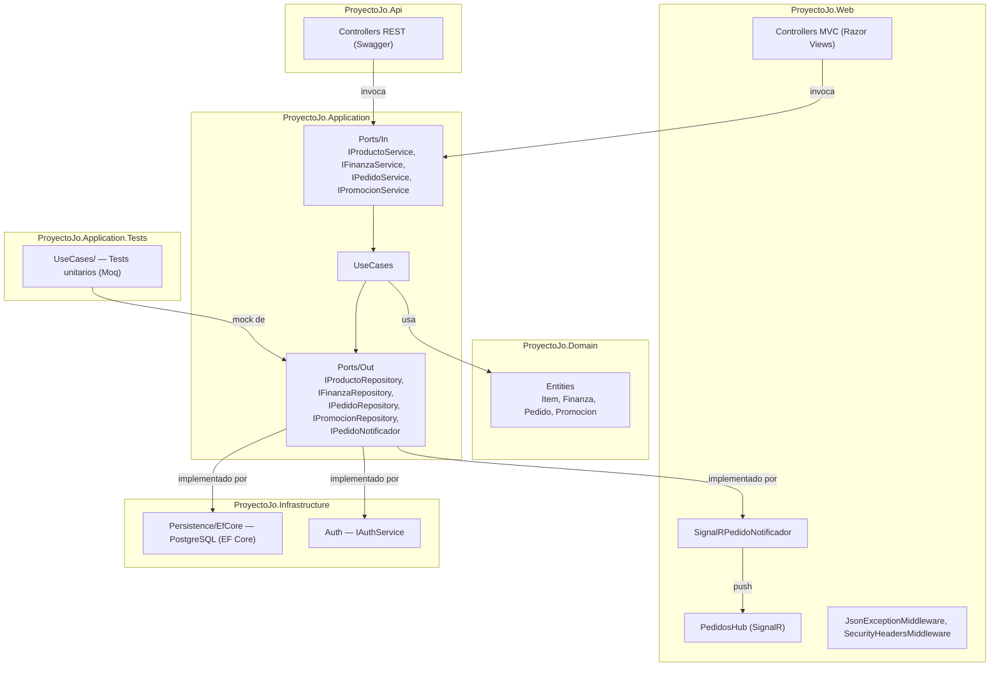

Cada bloque del diagrama tiene una responsabilidad y una frontera de dependencia
estrictas: `ProyectoJo.Domain` concentra las entidades del negocio (`Item`,
`Finanza`, `Pedido`, `Promocion`, entre otras, ver [Modelo de dominio](#modelo-de-dominio))
sin depender de ningún framework, así que puede evolucionar y probarse en aislamiento
total, mientras que `ProyectoJo.Application` define los puertos de entrada
(`Ports/In`, las interfaces que los adaptadores invocan) y los puertos de salida
(`Ports/Out`, las interfaces que la infraestructura implementa), y aloja en
`UseCases/` la lógica de negocio real construida sobre esos puertos, sin saber si
detrás hay PostgreSQL, SignalR o un mock de test. `ProyectoJo.Infrastructure`
implementa esos puertos de salida a través de `Persistence/EfCore`, que adapta cada
uno a PostgreSQL vía EF Core, y de `Auth`, que resuelve la autenticación basada en
variables de entorno, y `ProyectoJo.Web` junto con `ProyectoJo.Api` son los dos
adaptadores de entrada que invocan esos mismos puertos de `Application`, aunque
`Web` compone su propio grafo de dependencias completo, incluida la persistencia,
mientras que `Api` todavía no registra repositorios (ver [Deuda técnica conocida](#deuda-técnica-conocida)).
La regla que sostiene todo el diagrama es una sola dirección de dependencia: los
adaptadores dependen del dominio, el dominio nunca depende de los adaptadores.

Más detalle en las vistas arquitectónicas de cada ADR.

---

## Principios y convenciones de diseño

Además de la separación en capas, el proyecto sostiene un conjunto de reglas que se
aplican de forma consistente en todo el código, no solo en los módulos nuevos:
`Application` define los puertos y `Infrastructure`, `Web` y `Api` los implementan o
los consumen, nunca al revés, mientras que `Domain` no conoce la existencia de
ninguno de los otros cuatro proyectos, así que la dirección de dependencia hacia el
dominio se mantiene siempre única.

El código se escribe para ser autoexplicativo, con nombres claros y métodos pequeños,
en vez de apoyarse en comentarios que expliquen lo que la implementación ya debería
transmitir por sí sola, y la validación de dominio se resuelve en dos niveles: las
reglas de un solo campo (`Precio > 0`, `StringLength`, etc.) vía `DataAnnotations`,
verificadas a través de `ModelState.IsValid` en cada controlador antes de invocar un
caso de uso, y las reglas cruzadas entre campos, como el rango `FechaInicio`/`FechaFin`
de una `Promocion` o la consistencia entre `TipoDescuento` y `ValorDescuento`, vía
`IValidatableObject.Validate` sobre la propia entidad.

El nombre de carpeta y archivo de cada vista replica exactamente el nombre del
controlador y la acción en C#, porque la resolución de vistas de ASP.NET Core es
case-sensitive en el destino de despliegue (Linux), aunque en desarrollo sobre
Windows/NTFS un error de casing compila y corre sin avisar nada hasta que falla en
producción, y por la misma lógica de evitar sorpresas los repositorios que alimentan
tablas del panel de Admin ordenan siempre por `Id`, ya que PostgreSQL no garantiza el
orden de las filas sin un `ORDER BY` explícito, y los mensajes de commit siguen el
formato [Conventional Commits](https://www.conventionalcommits.org/en/v1.0.0/), para
que el historial de Git sea legible y, eventualmente, se pueda automatizar un
changelog a partir de él.

---

## Módulos y funcionalidades

El sistema tiene tres superficies de uso, cada una con su propio conjunto de
controladores: la vitrina pública, el panel de administración y el área de
Operaciones para Cocina y Recepción.

### Vitrina pública

| Página | Controlador | Contenido |
|---|---|---|
| Inicio | `HomeController` | Landing pública del negocio |
| Menú | `MenuController` (público) | Catálogo público de platillos, con vista de detalle por producto |
| Historia | `HistoriaController` | Historia y trayectoria del negocio |
| Nosotros | `NosotrosController` | Página institucional del equipo |
| Ubicación | `UbicacionController` | Dirección y mapa embebido de Google Maps |

### Panel de administración (`Areas/Admin`)

Todo el panel queda detrás de `JoCookieAuth` y de `RequiereAreaAttribute`, que exige
el rol `Administrador` y, según el módulo, el área `General` o el área específica
correspondiente (`SuperAdmin` no tiene esta restricción y accede a todo).

| Módulo | Controlador | Qué hace |
|---|---|---|
| Gestión (dashboard) | `GestionController` | Pantalla principal tras el login, con accesos a cada módulo del panel |
| Finanzas | `FinanzasController` | CRUD de movimientos financieros (ingresos/egresos), dashboard con gráficas, filtros por mes y año |
| Menú | `MenuController` (Admin) | CRUD de platillos (`Item`) con búsqueda y filtros por categoría |
| Inventario | `InventarioController` | Toggle activo/agotado por platillo del menú |
| Insumos | `InsumosController` | CRUD de insumos, reposición de stock (`Reponer`) y sincronización de insumos a partir del menú (`SincronizarDesdeMenu`) |
| Recetario | `RecetarioController` | CRUD de recetas por platillo, con ingredientes, costo total y costo por porción calculados automáticamente |
| Promociones | `PromocionesController` | CRUD de banners y descuentos, con validación de firma real (*magic bytes*) en la subida de imágenes |
| Mapa de Calor | `MapaCalorController` | Visualización de ventas por semana y por mes, con navegación por período |
| Auditoría | `HistorialAuditoriaController` | Consulta del historial de auditoría (creación/edición/eliminación), filtrable por módulo y rango de fechas |
| Dispositivos | `DispositivosController` | Listado de dispositivos de Operaciones emparejados, con bloqueo (`ToggleBloqueado`) y activación (`ToggleActivo`) |
| Usuarios y Accesos | `UsuariosController` | CRUD conjunto de administradores (áreas de acceso, PIN de supervisor) y operadores de Cocina/Recepción — la única pantalla de gestión de usuarios enlazada desde el dashboard |
| Opiniones | `OpinionesController` | CRUD de opiniones de clientes, con calificación y estado tipo semáforo (verde/amarillo/rojo) |
| Cierre de Caja | `CierreCajaController` | Apertura y cierre de caja diario, con fondo inicial, ventas y gastos del día |
| Login | `LoginController` | Autenticación del panel admin (`JoCookieAuth`) |

> **Controladores sin uso, no eliminados.** `AdministradoresController` y
> `OperadoresController` (con sus vistas en `Areas/Admin/Views/Administradores` y
> `Views/Operadores`) son una versión anterior de este mismo CRUD, hoy superada por
> `UsuariosController`, y aunque siguen compilando y comparten los mismos casos de
> uso, ninguna vista ni menú del panel enlaza hacia ellos: son código muerto, no una
> segunda fuente de verdad, y una corrección hecha en `UsuariosController` no se
> refleja automáticamente ahí.

### Área de Operaciones (`Areas/Operaciones`)

Gatea el acceso con PIN de supervisor antes de cada login de empleado, e independiza
la autenticación de Cocina/Recepción de la del panel admin.

| Pantalla | Controlador | Qué hace |
|---|---|---|
| Cocina | `CocinaController` | Lista los pedidos pendientes/preparados y permite cambiar su estado; recibe y envía actualizaciones en tiempo real vía SignalR |
| Recepción | `RecepcionController` | Muestra el menú disponible, crea pedidos nuevos y los marca como pagados |
| Autenticación | `AuthController` | Login de empleados por PIN, login de supervisor, emparejamiento de dispositivos (`Emparejar`) y logout de ambos |

---

## Capturas de pantalla

El proyecto sigue en desarrollo activo, y eso se nota también en lo visual: hay
apartados de la vitrina pública (los bloques "Próximamente" en Historia y
Nosotros) y ajustes de diseño en general todavía pendientes de pulir. Las
capturas de abajo son del sistema corriendo tal cual está hoy, no un mockup.

### Vitrina pública

<table>
<tr>
<td width="33%">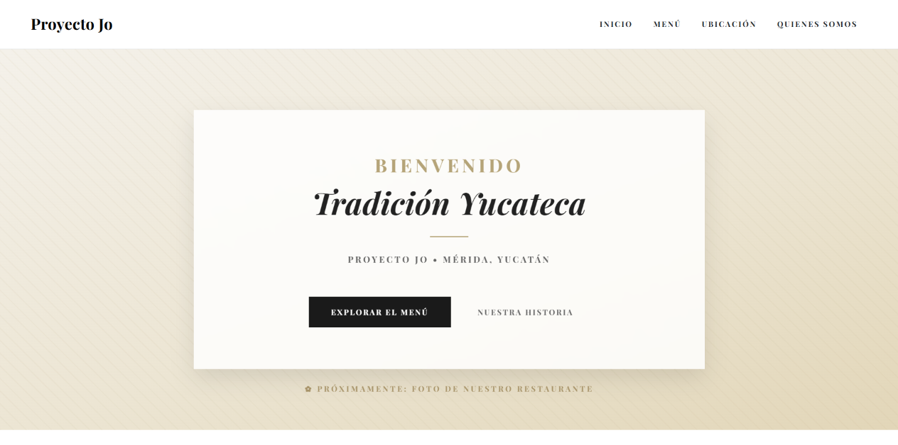<br><sub><b>Inicio</b></sub></td>
<td width="33%">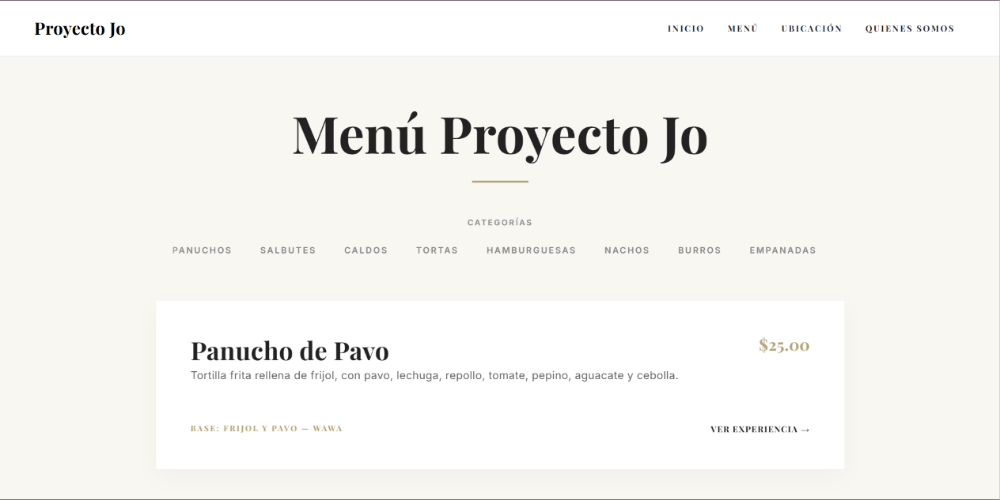<br><sub><b>Menú</b></sub></td>
<td width="33%">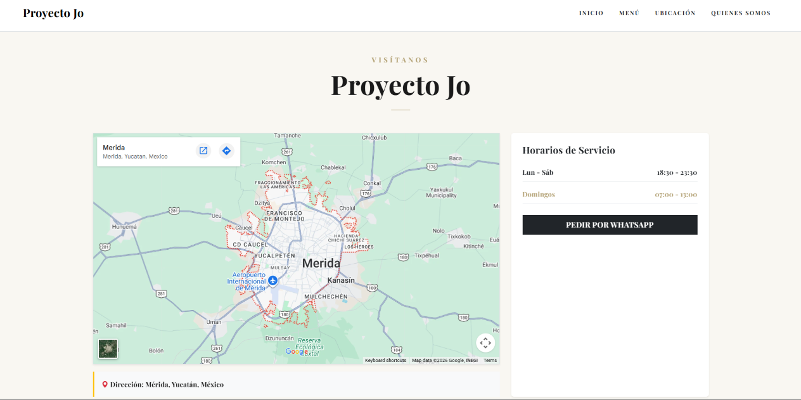<br><sub><b>Ubicación</b></sub></td>
</tr>
<tr>
<td>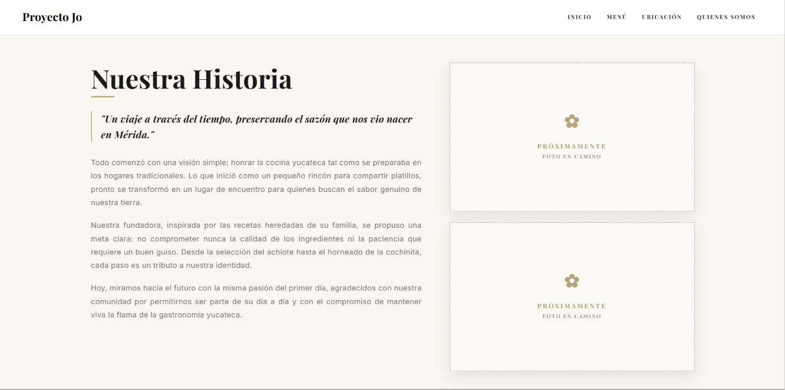<br><sub><b>Historia</b></sub></td>
<td>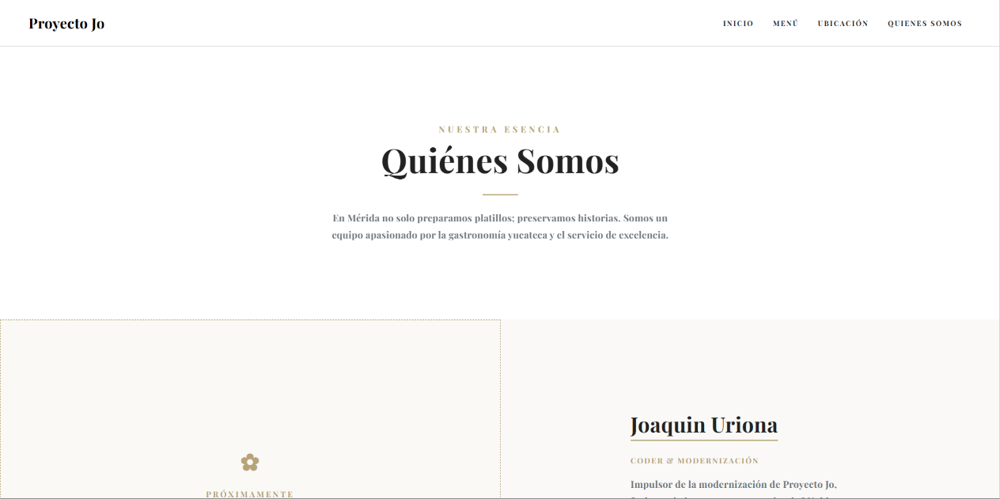<br><sub><b>Nosotros</b></sub></td>
<td></td>
</tr>
</table>

### Panel de administración

<table>
<tr>
<td width="33%">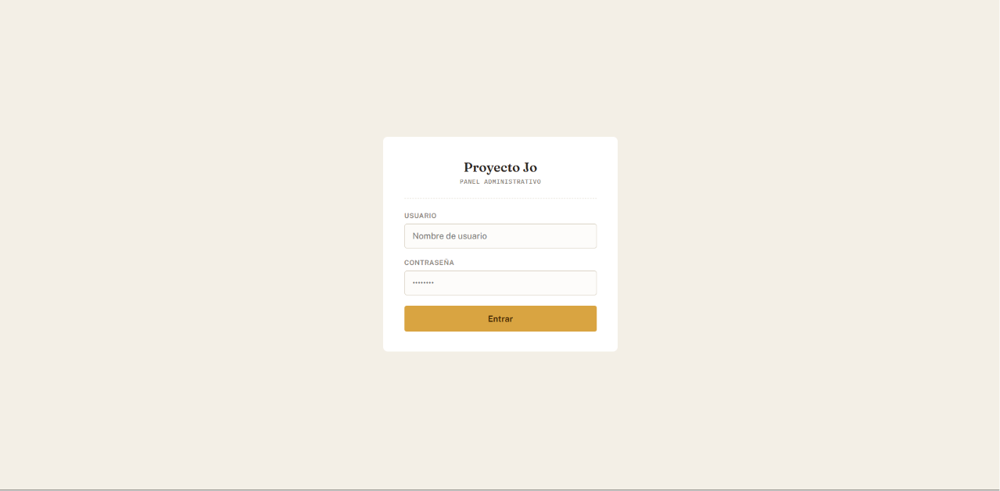<br><sub><b>Login</b></sub></td>
<td width="33%"><br><sub><b>Dashboard</b></sub></td>
<td width="33%">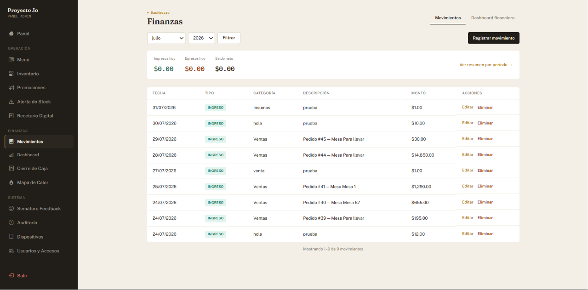<br><sub><b>Finanzas</b></sub></td>
</tr>
<tr>
<td><br><sub><b>Dashboard financiero</b></sub></td>
<td><br><sub><b>Menú</b></sub></td>
<td><br><sub><b>Mapa de Calor</b></sub></td>
</tr>
</table>

### Área de Operaciones

<table>
<tr>
<td width="50%"><br><sub><b>Login de supervisor por PIN</b></sub></td>
<td width="50%"><br><sub><b>Emparejamiento de dispositivo</b></sub></td>
</tr>
<tr>
<td>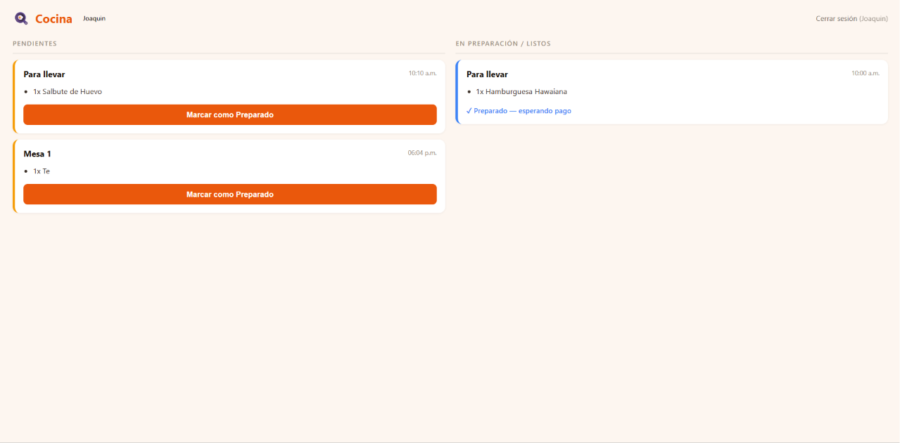<br><sub><b>Cocina</b></sub></td>
<td>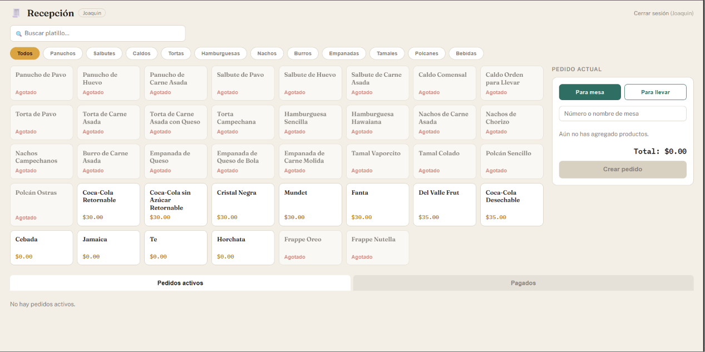<br><sub><b>Recepción</b></sub></td>
</tr>
</table>

---

## Modelo de dominio

`ProyectoJo.Domain/Entities` concentra las 19 clases y enums que representan las
reglas del negocio, sin ninguna dependencia externa:

| Entidad | Representa |
|---|---|
| `Item` | Un platillo del menú: nombre, categoría, precio, ingredientes, imagen y estado activo/agotado |
| `Finanza` | Un movimiento financiero: monto, tipo (`Ingreso`/`Egreso`), categoría, descripción y fecha |
| `Pedido` | Un pedido de Cocina/Recepción: mesa, lista de `ItemPedido`, estado y las transiciones de estado válidas (`PuedeTransicionarA`) |
| `ItemPedido` | Una línea dentro de un pedido: producto, cantidad, precio unitario y subtotal calculado |
| `Promocion` | Un banner o descuento: tipo y valor de descuento, rango de vigencia y los platillos a los que aplica, con validación cruzada de fechas y de consistencia del descuento |
| `Insumo` | Materia prima con stock actual, stock mínimo y los indicadores calculados `Agotado`/`StockBajo` |
| `IngredienteReceta` | Un ingrediente dentro de una receta: insumo, cantidad, unidad y costo unitario |
| `Receta` | La receta de un platillo: lista de ingredientes, rendimiento, y costo total/por porción calculados |
| `Administrador` | Un usuario del panel admin: credenciales, áreas de acceso y el hash de su PIN de supervisor |
| `Empleado` | Un operador de Cocina o Recepción: nombre, hash de PIN y rol (`RolEmpleado`) |
| `DispositivoOperaciones` | Un dispositivo emparejado para operar Cocina/Recepción: token, estación y estado de bloqueo/actividad |
| `CierreCaja` | La apertura/cierre de caja de un día: fondo inicial, ventas, gastos y el total calculado |
| `OpinionCliente` | Una opinión de un cliente sobre un platillo: calificación, comentario y estado tipo semáforo (`EstadoSemaforo`) |
| `RegistroAuditoria` | Un registro de auditoría: usuario, módulo, tipo de acción y los valores antes/después del cambio |
| `AreasAdmin` | El catálogo fijo de áreas de acceso del panel (`Menu`, `Finanzas`, `Promociones`, `Inventario`, `Insumos`, `Recetario`, `MapaCalor`, `Dispositivos`, `Opiniones`, `CierreCaja`, `Auditoria`, `Operadores`) |
| `EstadoPedido` *(enum)* | `Pendiente`, `Preparado`, `Pagado`, `Cancelado` |
| `EstadoCaja` *(enum)* | `Abierta`, `Cerrada` |
| `TipoDescuento` *(enum)* | `Ninguno`, `Porcentaje`, `MontoFijo` |
| `TipoMovimiento` *(enum)* | `Ingreso`, `Egreso` |

`IEntidadConId` es la interfaz común que exponen `Item`, `Finanza`, `Insumo`,
`Promocion` y `Receta` para permitir el descarte uniforme del `Id` provisto por el
cliente (`DescartarId()`, ver [Seguridad](#seguridad)).

---

## Estructura del repositorio

```text
ProyectoJo/
├── ProyectoJo.Domain/            # Núcleo del negocio — sin dependencias externas
│   └── Entities/                 # Item, Finanza, Pedido, ItemPedido, Promocion (ver Modelo de dominio)
│
├── ProyectoJo.Application/       # Casos de uso y puertos
│   ├── Ports/In/                 # IProductoService, IFinanzaService, IPedidoService, IPromocionService, ...
│   ├── Ports/Out/                # IProductoRepository, IFinanzaRepository, IPedidoRepository,
│   │                             # IPromocionRepository, IPedidoNotificador, ...
│   ├── UseCases/                 # Implementación de la lógica de negocio
│   └── DTOs/                     # ResumenFinanciero, ResumenDashboard, ResultadoCrearPedido
│
├── ProyectoJo.Infrastructure/    # Adaptadores de salida
│   ├── Persistence/EfCore/       # PostgreSQL vía EF Core: DbContext, Configurations/,
│   │                             # Repositories/ (Ef*Repository) y Migrations/
│   └── Auth/                     # EnvAuthService
│
├── ProyectoJo.Web/               # Adaptador de entrada — ASP.NET Core MVC
│   ├── Controllers/              # Home, Menu, Historia, Nosotros, Ubicación
│   ├── Areas/Admin/              # Panel administrativo — ver Módulos y funcionalidades
│   ├── Areas/Operaciones/        # Cocina, Recepción, Auth por PIN
│   ├── Hubs/                     # PedidosHub — canal SignalR en tiempo real
│   ├── Realtime/                 # SignalRPedidoNotificador
│   ├── Middleware/                # JsonExceptionMiddleware, SecurityHeadersMiddleware
│   └── Views/
│
├── ProyectoJo.Api/               # Adaptador de entrada — ASP.NET Core Web API
│   ├── Controllers/              # PedidosController, ProductosController
│   └── Program.cs                # Composición de dependencias + Swagger (sin persistencia
│                                  # registrada por ahora — ver Deuda técnica conocida)
│
├── ProyectoJo.Application.Tests/ # Proyecto de tests — xUnit + Moq
│   ├── Domain/                   # Tests de validaciones (DataAnnotations) por entidad
│   └── UseCases/                 # Tests unitarios con mocks, uno por caso de uso
│
├── ADRs/                         # Historial de decisiones arquitectónicas
│
└── .github/workflows/            # Integración Continua y validación de documentación
    ├── ci.yml                    # Restore, chequeo de migraciones, auditoría de vulnerabilidades, build y test
    └── docs.yml                  # Falla si hay links rotos en los archivos Markdown del repo
```
---

## Documentación de Arquitectura (Modelo C4)

La arquitectura del sistema está documentada en tres niveles de detalle bajo el
[Modelo C4](https://c4model.com/) — Contexto, Contenedores y Componentes -

**[Ver documentación completa → `/docs/Arquitectura-C4.md`](./docs/Arquitectura-C4.md)**

| Nivel | Contenido | Audiencia |
|---|---|---|
| 1 — Contexto | Qué es el sistema y quién interactúa con él | General |
| 2 — Contenedores | Procesos desplegables y cómo se comunican | Equipo técnico |
| 3 — Componentes | Clases e interfaces dentro de `ProyectoJo.Web` | Equipo de desarrollo |

> El historial de decisiones que sustenta esta arquitectura está documentado
> por separado en [`/ADRs`](./ADRs).

---

## Seguridad

### Esquemas de autenticación

Tres esquemas de cookie independientes y no superpuestos: comprometer uno no otorga
acceso a los otros.

| Esquema | Cookie | Login | Expiración |
|---|---|---|---|
| `JoCookieAuth` | `Jo.Admin` | `/Admin/Login` | 45 min, deslizante |
| `SupervisorAuth` | `Jo.Supervisor` | `/Operaciones/Auth/LoginSupervisor` | 15 min, fija |
| `OperacionesCookieAuth` | `Jo.Operaciones` | `/Operaciones/Auth/Login` | 12 h, deslizante |

### Resultados de la auditoría de seguridad

El sistema pasó por una auditoría de seguridad explícita cuyos resultados están
resumidos acá, en vez de quedar solo implícitos en el código, y las cuatro cookies del
sistema (las tres de arriba más `Jo.DispositivoToken`, la de emparejamiento de
dispositivos) son `HttpOnly` + `Secure` + `SameSite=Strict`, y cada respuesta recibe
además cabeceras de seguridad y una CSP explícita a través de
`SecurityHeadersMiddleware`, con `X-Content-Type-Options: nosniff`,
`X-Frame-Options: DENY` y una allowlist mínima (el CDN de Bootstrap/Chart.js, las
fuentes de Google Fonts, el `iframe` de Google Maps en la página pública de
Ubicación), sin `'unsafe-inline'` para scripts, ya que no hay `<script>` inline ni
atributos `onclick`/`onsubmit`/`onchange` en todo el proyecto.

La subida de imágenes de promociones valida la firma binaria (*magic bytes*) de
JPEG/PNG/GIF/WEBP antes de guardar el archivo, no solo la extensión declarada, y las
cinco acciones que bindean una entidad de Domain directamente desde el cuerpo del POST
(`MenuController.Agregar`, `FinanzasController.Registrar`, `InsumosController.Crear`,
`PromocionesController.Agregar`, `RecetarioController.Agregar`) descartan cualquier ID
enviado por el cliente antes de invocar el caso de uso, y la autenticación con PIN de
supervisor no depende de un secreto global, sino que cada `Administrador` tiene su
propio hash de clave de supervisor (PBKDF2), y el login de supervisor la valida contra
cualquier administrador activo, mientras que los endpoints de login de los tres
esquemas tienen rate limiting (de 5 a 8 solicitudes por minuto por IP), con
redirección a la pantalla de login correspondiente cuando se excede el límite.

La última auditoría verificó, además, protección CSRF global
(`AutoValidateAntiforgeryTokenAttribute` más token por cabecera para los endpoints
`[FromBody]`), ausencia de inyección SQL (el SQL crudo del proyecto es siempre
parametrizado o usa nombres de tabla fijos sin entrada de usuario), ausencia de XSS
(los usos de `Html.Raw` solo envuelven datos ya serializados con `System.Text.Json`),
hashing de contraseñas con PBKDF2 y comparación en tiempo constante
(`CryptographicOperations.FixedTimeEquals`), y autorización consistente en todos los
controladores de Admin.

---

## Tecnologías

**Backend**

| Categoría | Tecnología |
|---|---|
| Framework | ASP.NET Core (.NET 10) |
| Patrón arquitectónico | Arquitectura Hexagonal (Ports & Adapters) |
| Web (adaptador de entrada) | ASP.NET Core MVC, Razor Views |
| API (adaptador de entrada) | ASP.NET Core Web API |

**Tiempo real y documentación de API**

| Categoría | Tecnología |
|---|---|
| Tiempo real | SignalR |
| Documentación de API | Swagger / OpenAPI (Swashbuckle.AspNetCore) |

**Persistencia y autenticación**

| Categoría | Tecnología |
|---|---|
| Persistencia actual | PostgreSQL vía Entity Framework Core (Npgsql), solo en `ProyectoJo.Web` — ver Deuda técnica conocida |
| Convención de nombres | EFCore.NamingConventions (tablas y columnas en snake_case) |
| Autenticación | Cookie auth — tres esquemas independientes (ver Seguridad) |

**Calidad y automatización**

| Categoría | Tecnología |
|---|---|
| Logging | Serilog (consola + archivo rotativo diario) |
| Tests | xUnit 2.9.2 + Moq 4.20.72 |
| Integración Continua | GitHub Actions — build, test, chequeo de migraciones EF Core pendientes y auditoría de vulnerabilidades NuGet en cada push y Pull Request; verificación de links rotos en la documentación |
| Despliegue objetivo | AWS EC2 + RDS + nginx + systemd — ver [AWS-1-Cuenta.md](docs/AWS-1-Cuenta.md) (serie de 4 documentos) |

---

## Requisitos previos

Hace falta tener instalado el [.NET SDK 10.0](https://dotnet.microsoft.com/download)
o superior, y un editor compatible (Visual Studio, VS Code con C# Dev Kit, Rider).

---

## Cómo ejecutar el proyecto

El sistema tiene **dos puntos de entrada independientes**: el sitio web (`ProyectoJo.Web`)
y la API (`ProyectoJo.Api`), y cada uno se ejecuta por separado.

```bash
# Restaurar dependencias de toda la solución
dotnet restore

# Aplicar las migraciones de EF Core contra tu PostgreSQL (ver sección siguiente)
dotnet ef database update --project ProyectoJo.Infrastructure --startup-project ProyectoJo.Web

# Levantar el sitio web (panel admin + vitrina pública + Cocina/Recepción)
dotnet run --project ProyectoJo.Web
# → https://localhost:7287  /  http://localhost:5207

# Levantar la API REST (actualmente sin persistencia registrada — ver Deuda técnica conocida)
dotnet run --project ProyectoJo.Api
# → https://localhost:63639  /  http://localhost:63640

# Correr los tests
dotnet test ProyectoJo.Application.Tests
```

### Variables de configuración

| Clave | Dónde se lee | Obligatoria | Descripción |
|---|---|---|---|
| `ConnectionStrings:Default` | `ProyectoJo.Web/Program.cs` | Sí | Cadena de conexión a PostgreSQL |
| `Auth:AdminUser` | `EnvAuthService` (`ProyectoJo.Infrastructure/Auth`) | Sí | Usuario del panel administrativo |
| `Auth:AdminPasswordHash` | `EnvAuthService` (`ProyectoJo.Infrastructure/Auth`) | Sí | Hash PBKDF2 de la contraseña del panel administrativo |

Ninguna de las tres debe hardcodearse en `appsettings.json` ni en
`launchSettings.json`: en desarrollo se configuran vía *User Secrets*, como se
detalla en las dos subsecciones siguientes, y en producción, como variables de
entorno del proceso (`ConnectionStrings__Default`, `Auth__AdminUser`,
`Auth__AdminPasswordHash`, usando `__` como separador jerárquico, la convención
estándar de configuración de .NET).

### Base de datos (PostgreSQL)

`ProyectoJo.Web` requiere una instancia de PostgreSQL alcanzable y una cadena de
conexión configurada en `ConnectionStrings:Default`, así que en desarrollo
configúrala vía *User Secrets* (nunca en `appsettings.json` ni en el repositorio):

```bash
dotnet user-secrets set "ConnectionStrings:Default" \
  "Host=localhost;Port=5432;Database=proyectojo;Username=postgres;Password=<tu-clave>" \
  --project ProyectoJo.Web
```

Con la base creada y la cadena de conexión configurada, aplicá las migraciones con el
comando `dotnet ef database update` de arriba, y las migraciones viven en
`ProyectoJo.Infrastructure/Persistence/EfCore/Migrations/`.

### Credenciales del panel administrativo

El panel admin requiere las variables de entorno `Auth__AdminUser` y
`Auth__AdminPasswordHash` (ver `Infrastructure/Auth/EnvAuthService`), así que
configúralas en tu entorno local o en los *User Secrets* de .NET —
**nunca las dejes hardcodeadas ni las subas al repositorio** en `launchSettings.json`
con su valor real.

### Utilidades de línea de comandos

`ProyectoJo.Web` acepta dos flags al arrancar, además de la ejecución normal:

```bash
# Vacía todas las tablas de la aplicación (TRUNCATE ... RESTART IDENTITY CASCADE)
dotnet run --project ProyectoJo.Web -- --reset

# Importa los archivos JSON originales a Postgres — ya no aplica, ver nota abajo
dotnet run --project ProyectoJo.Web -- --seed
```

`--reset` es útil para dejar la base limpia antes de ensayar una demo, mientras que
`--seed` invoca `JsonToPostgresSeeder`, una herramienta pensada para la migración única de
los archivos JSON originales del sistema a Postgres; esos archivos ya no existen en
el repositorio, así que hoy `--seed` no hace nada (registra "no existe, se omite"
por cada archivo y termina).

---

## Testing

El proyecto `ProyectoJo.Application.Tests` (xUnit 2.9.2 + Moq 4.20.72) concentra toda
la cobertura automatizada actual, enfocada en `ProyectoJo.Application`, y la carpeta
`UseCases/` tiene un test unitario por caso de uso, mockeando siempre las interfaces
de `Ports/Out` en vez de una base de datos real, de forma que la lógica de negocio se
valida en aislamiento de la infraestructura, mientras que `Domain/EntityValidationTests.cs`
cubre las validaciones por `DataAnnotations` de cada entidad (`Item`, `Finanza`,
`Insumo`, `IngredienteReceta`, `Receta`, `Promocion`, `Pedido`) vía
`Validator.TryValidateObject`, con un caso válido y un caso por cada regla violada, y
`PromocionUseCaseTests` cubre puntualmente la validación cruzada de rango de fechas en
`ActualizarFecha` y el filtrado de `ItemIds` contra el menú real en `Agregar`/`Editar`.

```bash
# Correr toda la suite
dotnet test ProyectoJo.Application.Tests

# Correr una sola clase de test
dotnet test ProyectoJo.Application.Tests --filter "FullyQualifiedName~PedidoUseCaseTests"

# Correr un método específico
dotnet test ProyectoJo.Application.Tests --filter "FullyQualifiedName~PedidoUseCaseTests.MethodName"
```

> **Alcance actual:** todavía no existen tests de integración contra una base de
> datos PostgreSQL real, así que toda la cobertura de `Infrastructure` y de los
> adaptadores de entrada (`Web`, `Api`) queda fuera del proyecto de tests por ahora.

---

## Documentación interactiva (Swagger)

Con `ProyectoJo.Api` corriendo, Swagger UI queda disponible directamente en la raíz
del proyecto:

```
http://localhost:63640/
```

Desde ahí se pueden explorar y probar todos los endpoints sin necesidad de Postman.

---

## Endpoints disponibles

> Esta tabla se mantiene actualizada manualmente como referencia rápida. La fuente
> de verdad siempre es Swagger, generado directamente desde el código. También
> conviene tener presente que esta tabla describe solo `ProyectoJo.Api`: el flujo
> real de negocio hoy corre íntegramente sobre `ProyectoJo.Web` vía controladores
> MVC, no vía estos endpoints REST, y que ningún endpoint que toque persistencia
> funciona todavía en tiempo de ejecución (ver Deuda técnica conocida).

### Productos — `/api/Productos`

| Método | Ruta | Descripción |
|---|---|---|
| GET | `/api/Productos/menu` | Lista el menú de platillos |

### Pedidos — `/api/Pedidos`

| Método | Ruta | Tag | Descripción |
|---|---|---|---|
| GET | `/api/Pedidos/recepcion` | Recepción | Lista pedidos para la vista de recepción |
| GET | `/api/Pedidos/{id}` | Recepción | Obtiene un pedido por id |
| POST | `/api/Pedidos` | Recepción | Crea un nuevo pedido |
| PATCH | `/api/Pedidos/{id}/pagar` | Recepción | Marca un pedido como pagado |
| GET | `/api/Pedidos/cocina` | Cocina | Lista pedidos pendientes/preparados para cocina |
| PATCH | `/api/Pedidos/{id}/estado` | Cocina | Cambia el estado de un pedido |

### Hub de tiempo real — SignalR

| Ruta | Descripción |
|---|---|
| `/hubs/pedidos` | Canal SignalR para Cocina y Recepción — push de cambios de estado en tiempo real |

### Próximos módulos a exponer vía API

Finanzas y Promociones ya tienen sus casos de uso y puertos listos en
`ProyectoJo.Application` (`IFinanzaService`, `IPromocionService`), pero todavía solo
se consumen desde `ProyectoJo.Web`, y quedan pendientes sus respectivos controladores
en `ProyectoJo.Api`.

---

## Despliegue

El destino de despliegue es una única instancia EC2 (Ubuntu) detrás de nginx, que
hace terminación TLS y actúa de proxy reverso hacia Kestrel en loopback, con
PostgreSQL en RDS. El pipeline de despliegue (`deploy.yml`) es **manual**, disparado
solo por `workflow_dispatch` desde GitHub Actions — a diferencia del pipeline de CI,
que corre en cada push:

1. `dotnet publish` genera el artefacto de la aplicación.
2. Se genera el *bundle* de migraciones de EF Core.
3. El artefacto se copia por SCP a `/opt/proyectojo/releases/<run_id>` en el servidor.
4. Se aplican las migraciones contra RDS.
5. Se actualiza el symlink `/opt/proyectojo/current` para apuntar al nuevo release,
   lo que permite un *rollback* rápido volviendo a apuntar el symlink al release anterior.
6. Se reinicia el servicio `proyectojo-web` (systemd, `Type=simple`, definido en
   `deploy/proyectojo-web.service`, con `deploy/nginx-proyectojo.conf` como
   configuración del proxy reverso).

`ProyectoJo.Web/Program.cs` registra `UseForwardedHeaders` (`X-Forwarded-For` /
`X-Forwarded-Proto`) como el primer middleware del pipeline, algo necesario para
que el particionado por IP del rate limiter y cualquier chequeo de `Request.IsHttps`
funcionen correctamente detrás del proxy reverso de nginx, y el `.gitignore` tiene una
sección dedicada a infraestructura AWS (`*.pem`, `*.ppk`, `.aws/`, `*.env`, estado de
Terraform) para que ninguna credencial generada al seguir esta guía termine
commiteada por accidente.

La configuración completa está documentada como una serie de cuatro guías,
pensadas para seguirse en orden porque cada paso asume que el anterior ya se
completó:

1. [`docs/AWS-1-Cuenta.md`](./docs/AWS-1-Cuenta.md) — creación y activación de la cuenta de AWS.
2. [`docs/AWS-2-Usuarios.md`](./docs/AWS-2-Usuarios.md) — IAM: MFA en el root, grupo/usuario admin, usuario de solo lectura opcional, rol de EC2 sin permisos.
3. [`docs/AWS-3-Servicios.md`](./docs/AWS-3-Servicios.md) — security groups, RDS, EC2, Elastic IP, y cómo dar de baja todo después de una demo para dejar de facturar.
4. [`docs/Despliegue-AWS.md`](./docs/Despliegue-AWS.md) — instalación del runtime/nginx/certbot en el servidor, secretos de GitHub, ejecución del pipeline, rollback.

`docs/Despliegue-Resumen-Operativo.md` complementa la serie con una referencia
operativa corta para el día a día (reiniciar el servicio, ver logs, revisar el
estado del symlink) sin repetir el detalle paso a paso de las cuatro guías.

---

## Integración Continua (CI)

Cada `push` a cualquier rama y cada Pull Request contra `deuda-tecnica` dispara
el workflow de **GitHub Actions** `ci.yml`: restaura dependencias, verifica que
no haya migraciones de EF Core pendientes contra el modelo de dominio, audita
las dependencias NuGet en busca de vulnerabilidades conocidas, compila en modo
Release y corre toda la suite de `ProyectoJo.Application.Tests`, y si cualquier
paso falla, el check del Pull Request queda en rojo y bloquea el merge hasta
corregirlo; también puede dispararse manualmente desde la pestaña *Actions*.

Un segundo workflow, `docs.yml`, corre sobre los archivos Markdown del
repositorio (README, ADRs, `docs/`) y falla si detecta un link roto, interno
o externo.

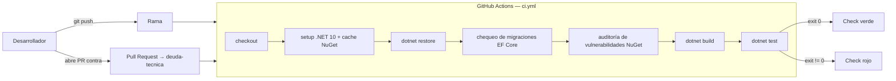

La decisión original de usar GitHub Actions — alternativas consideradas y
consecuencias — está documentada en [ADR-09](./ADRs/ADR-09-Joaquin-Uriona.md),
y el workflow evolucionó desde entonces con las verificaciones adicionales
descritas arriba; el trabajo vive en la rama [`pipeline-ci`](https://github.com/Joako601/Proyecto-Jo/tree/pipeline-ci).

> El pipeline de despliegue (CD), separado de este workflow de CI, está
> documentado en la sección [Despliegue](#despliegue).

---

## Decisiones de arquitectura (ADRs)

Cada ADR documenta el contexto, la decisión, las alternativas descartadas y las
consecuencias asumidas en el momento en que se tomó, así que preservan el registro
histórico de cómo evolucionó el sistema, incluidas etapas ya superadas por
decisiones posteriores (por ejemplo, los primeros ADRs describen persistencia en
archivos JSON, reemplazada más tarde por PostgreSQL, como se detalla en
[Persistencia](#tecnologías) y en la [Deuda técnica conocida](#deuda-técnica-conocida)).

| ADR | Decisión |
|---|---|
| [ADR-01](./ADRs/ADR-01-Joaquin-Uriona.md) | Decisión inicial de stack/arquitectura del MVP: patrón MVC sobre ASP.NET Core |
| [ADR-02](./ADRs/ADR-02-Joaquin-Uriona.md) | MVC puro documentado a fondo (vistas arquitectónicas, trade-offs, atributos de calidad) y sus limitaciones anticipadas |
| [ADR-03](./ADRs/ADR-03-Joaquin-Uriona.md) | Migración hacia Arquitectura Hexagonal, reemplaza ADR-02 |
| [ADR-04](./ADRs/ADR-04-Joaquin-Uriona.md) | Incorporación de una API REST con Swagger como segundo adaptador de entrada |
| [ADR-05](./ADRs/ADR-05-Joaquin-Uriona.md) | Integración formal de los patrones de diseño GoF Adapter y Strategy |
| [ADR-06](./ADRs/ADR-06-Joaquin-Uriona.md) | Reemplazo de Polling por SignalR en Cocina/Recepción, introduce el puerto `IPedidoNotificador` |
| [ADR-07](./ADRs/ADR-07-Joaquin-Uriona.md) | Introducción de `ProyectoJo.Application.Tests` y la estrategia de dos niveles (unitarios + integración) |
| [ADR-08](./ADRs/ADR-08-Joaquin-Uriona.md) | Deuda técnica de `ProyectoJo.Api`: registro de DI incompleto y rutas/candados no compartidos entre procesos |
| [ADR-09](./ADRs/ADR-09-Joaquin-Uriona.md) | Pipeline de Integración Continua con GitHub Actions |

---

## Deuda técnica conocida

El sistema documenta su deuda técnica de forma explícita en vez de dejarla implícita en el código, y [ADR-08](./ADRs/ADR-08-Joaquin-Uriona.md) describe una versión anterior de esta deuda (de cuando `Web` y `Api` todavía leían los mismos archivos JSON); desde la migración de `Web` a PostgreSQL, el problema cambió de forma y está resumido acá hasta que se documente en un ADR nuevo.

| Deuda | Tipo | Estado |
|---|---|---|
| `ProyectoJo.Api/Program.cs` no registra ningún repositorio (`IPedidoRepository`, `IProductoRepository`, `IFinanzaRepository`, etc.) — cualquier endpoint que use persistencia falla en runtime al resolver sus dependencias | Accidental | Documentada — pendiente, `Api` fuera de alcance por ahora |
| `Web` y `Api` no comparten datos: `Web` persiste en PostgreSQL, `Api` no tiene ninguna fuente de datos propia | Infraestructura | Documentada — pendiente |
| `AdministradoresController`/`OperadoresController` (`Areas/Admin`) son una versión de CRUD superada por `UsuariosController`, sin ninguna vista que enlace hacia ellos | Código muerto | Documentada — sin prioridad de limpieza asignada |
| `Menu/Index.cshtml`'s `menu.css` tiene varias clases (`.item-module`, `.item-title`, `.menu-title`, `.btn-add-platillo`, `.btn-ver-experiencia`, etc.) sin ninguna coincidencia en el markup actual de la vista | CSS muerto | Documentada — fuera de alcance |

> Causa raíz de las dos primeras: `Web` y `Api` componen su grafo de dependencias por separado y no hay una raíz de composición compartida. La prioridad actual es la migración de `Web`; retomar `Api` (ya sea dándole su propio acceso a PostgreSQL o centralizando el registro en un método compartido) queda pendiente.

---

## Roadmap y próximos pasos

Lo siguiente es trabajo identificado y reconocido, todavía no implementado, y se
documenta acá aparte para no mezclarlo con lo que ya está aplicado: falta registrar
los repositorios `Ef*Repository` en el `Program.cs` de `ProyectoJo.Api`, o
centralizar la composición de dependencias entre `Web` y `Api` para no duplicar el
registro, según se resuelva en el próximo ADR, y falta también un ADR nuevo sobre el
estado actual de `Api`/`Web`, ya que [ADR-08](./ADRs/ADR-08-Joaquin-Uriona.md)
describe una versión superada del problema (JSON compartido) y no el estado
post-migración a PostgreSQL, y por último queda pendiente continuar la limpieza de
estilos y scripts inline en las vistas restantes de `Areas/Admin` y
`Areas/Operaciones` (`Insumos`, `Menu`, `Recetario`, `Promociones`, `Opiniones`,
`Operadores`, `CierreCaja`, `Finanzas/Registrar`, las vistas de autenticación de
`Operaciones`), y en las dos páginas públicas que todavía quedan
(`Home/Index.cshtml`, `Views/Shared/_Layout.cshtml`), siguiendo el mismo patrón ya
aplicado en el resto de las páginas públicas.

---

## Uso de IA

Se utilizó IA para corregir la redacción y ortografía de este documento, generar la
sintaxis Mermaid de los diagramas de arquitectura y del pipeline de CI/CD, generar la
estructura y el código de los tests unitarios y de integración a partir del código
existente en `ProyectoJo.Application` y `ProyectoJo.Infrastructure`, y generar la
estructura inicial de los workflows de GitHub Actions (`ci.yml`, `docs.yml`), pero no
se utilizó para tomar decisiones arquitectónicas ni para diseñar la solución.

## Autor

<div align="center">
  

  ### Joaquin Uriona
  Diseñador Backend & Cloud — arquitectura, backend, infraestructura y despliegue de este sistema

  [](https://www.linkedin.com/in/Joaquin-Uriona)
  [](https://github.com/Joako601)
</div>

## Licencia y propiedad intelectual

<div align="center">

**© 2026 Joaquin Uriona — Todos los derechos reservados**

</div>

| | |
|---|---|
| Titular | Joaquin Uriona |
| Alcance de acceso | Revisión técnica y evaluación académica o profesional |
| Uso, copia, modificación, distribución o comercialización | Prohibido sin permiso expreso y por escrito del autor |

Este software, su código fuente, arquitectura, diseño y documentación son
propiedad exclusiva de **Joaquin Uriona**, y el acceso a este repositorio se
otorga únicamente para los fines de la tabla anterior; cualquier otro uso
queda expresamente prohibido.

> Este software se proporciona "tal cual", para fines de exhibición de
> portafolio profesional, sin garantías de ningún tipo.
