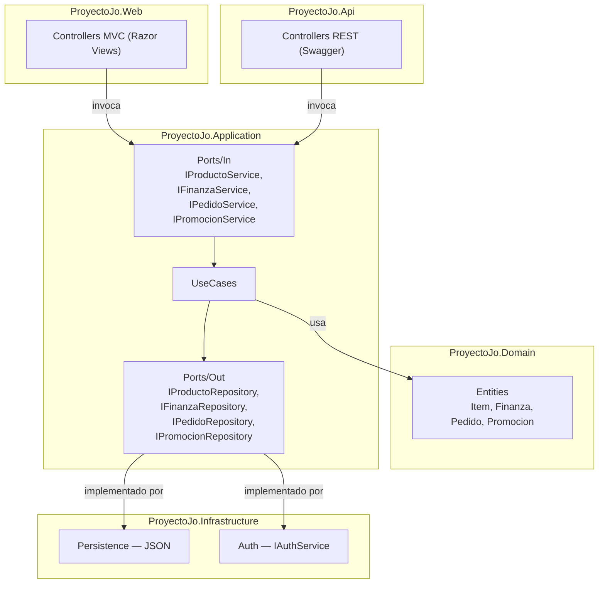

# Proyecto Jo'

> Sistema de gestión financiera y administrativa para dueños de pequeños y medianos
> negocios, construido con **ASP.NET Core** bajo **Arquitectura Hexagonal (Ports & Adapters)**.


---

## Descripción

Proyecto Jo' nació como una aplicación MVC monolítica y migró progresivamente hacia
una **Arquitectura Hexagonal**, separando el dominio de negocio de los frameworks
y la infraestructura, el sistema se compone de cinco proyectos independientes con
fronteras explícitas y una dirección de dependencia única: los adaptadores dependen
del dominio, el dominio nunca depende de ellos.

El sistema expone dos adaptadores de entrada simultáneos:

- **`ProyectoJo.Web`** — panel administrativo y vitrina pública (ASP.NET Core MVC)
- **`ProyectoJo.Api`** — API REST documentada con Swagger, para clientes externos
  (Postman, apps móviles, integraciones futuras)

El historial completo de decisiones de diseño está documentado en
[`/ADRs`](./ADRs).

---

## Arquitectura



Más detalle en las vistas arquitectónicas de cada ADR.

## Módulos implementados

| Módulo | Descripción |
|---|---|
| Finanzas | CRUD de movimientos, dashboard con gráficas, filtros por mes y año |
| Menú | CRUD de platillos con búsqueda y filtros por categoría |
| Inventario | Toggle activo/agotado por platillo |
| Promociones | Banners y descuentos, vista pública en menú |
| Mapa de Calor | Ventas por semana y por mes con navegación por período |
| Cocina / Recepción | Flujo operacional de pedidos con autenticación por rol y PIN |

>  En desarrollo activo — Arquitectura Hexagonal implementada, nuevos módulos en camino

---

## Estructura del repositorio

```text
ProyectoJo/
├── ProyectoJo.Domain/            # Núcleo del negocio — sin dependencias externas
│   └── Entities/                 # Item, Finanza, Pedido, ItemPedido, Promocion
│
├── ProyectoJo.Application/       # Casos de uso y puertos
│   ├── Ports/In/                 # IProductoService, IFinanzaService, IPedidoService, IPromocionService
│   ├── Ports/Out/                # IProductoRepository, IFinanzaRepository, IPedidoRepository, IPromocionRepository
│   ├── UseCases/                 # Implementación de la lógica de negocio
│   └── DTOs/                     # ResumenFinanciero, ResumenDashboard
│
├── ProyectoJo.Infrastructure/     # Adaptadores de salida
│   ├── Persistence/               # Repositorios JSON
│   └── Auth/                      # EnvAuthService
│
├── ProyectoJo.Web/                # Adaptador de entrada — ASP.NET Core MVC
│   ├── Controllers/                # Home, Menu, Historia, Nosotros, Ubicación
│   ├── Areas/Admin/                 # Panel administrativo (Finanzas, Productos, Promociones)
│   ├── Views/
│   ├── Persistencia/                 # menu.json, finanzas.json, promociones.json, pedidos.json
│   └── ADRs/                          # Historial de decisiones arquitectónicas
│
└── ProyectoJo.Api/                 # Adaptador de entrada — ASP.NET Core Web API
    ├── Controllers/                  # PedidosController
    └── Program.cs                    # Composición de dependencias + Swagger
```

---

## Tecnologías

| Categoría | Tecnología |
|---|---|
| Framework | ASP.NET Core (.NET 10) |
| Patrón arquitectónico | Arquitectura Hexagonal (Ports & Adapters) |
| Web (adaptador de entrada) | ASP.NET Core MVC, Razor Views |
| API (adaptador de entrada) | ASP.NET Core Web API |
| Documentación de API | Swagger / OpenAPI (Swashbuckle.AspNetCore) |
| Persistencia actual | Archivos JSON (planeado: SQL + Entity Framework) |
| Autenticación | Cookie auth (`JoCookieAuth`) + `IAuthService` desacoplado |
| Despliegue objetivo | AWS EC2 |

---

## Requisitos previos

- [.NET SDK 10.0](https://dotnet.microsoft.com/download) o superior
- Un editor compatible (Visual Studio, VS Code con C# Dev Kit, Rider)

---

## Cómo ejecutar el proyecto

El sistema tiene **dos puntos de entrada independientes**: el sitio web (`ProyectoJo.Web`)
y la API (`ProyectoJo.Api`). Cada uno se ejecuta por separado.

```bash
# Restaurar dependencias de toda la solución
dotnet restore

# Levantar el sitio web (panel admin + vitrina pública)
dotnet run --project ProyectoJo.Web
# → https://localhost:7287  /  http://localhost:5207

# Levantar la API REST
dotnet run --project ProyectoJo.Api
# → https://localhost:63639  /  http://localhost:63640
```

### Credenciales del panel administrativo

El panel admin requiere las variables de entorno `JO_ADMIN_USER` y `JO_ADMIN_PASSWORD`
(ver `Infrastructure/Auth/EnvAuthService`). Configúralas en tu entorno local o en los
*User Secrets* de .NET — **nunca las dejes hardcodeadas ni las subas al repositorio**
en `launchSettings.json` con su valor real.

---

## Documentación interactiva (Swagger)

Con `ProyectoJo.Api` corriendo, Swagger UI queda disponible directamente en la raíz
del proyecto:

```
http://localhost:63640/
```

Desde ahí se pueden explorar y probar todos los endpoints sin necesidad de Postman.

---

## Endpoints disponibles

> Esta tabla se mantiene actualizada manualmente como referencia rápida. La fuente
> de verdad siempre es Swagger, generado directamente desde el código.

### Pedidos — `/api/Pedidos`

| Método | Ruta | Tag | Descripción |
|---|---|---|---|
| GET | `/api/Pedidos/recepcion` | Recepción | Lista pedidos para la vista de recepción |
| GET | `/api/Pedidos/{id}` | Recepción | Obtiene un pedido por id |
| POST | `/api/Pedidos` | Recepción | Crea un nuevo pedido |
| PATCH | `/api/Pedidos/{id}/pagar` | Recepción | Marca un pedido como pagado |
| GET | `/api/Pedidos/cocina` | Cocina | Lista pedidos pendientes/preparados para cocina |
| PATCH | `/api/Pedidos/{id}/estado` | Cocina | Cambia el estado de un pedido |

### Próximos módulos a exponer vía API

Productos, Finanzas y Promociones ya tienen sus casos de uso y puertos listos en
`ProyectoJo.Application` (`IProductoService`, `IFinanzaService`, `IPromocionService`),
pero todavía solo se consumen desde `ProyectoJo.Web`. Quedan pendientes sus
respectivos controladores en `ProyectoJo.Api`.

---

## Decisiones de arquitectura (ADRs)

| ADR | Decisión |
|---|---|
| [ADR-01](./ADRs/ARD-01-Joaquin-Uriona.md) | Decisión inicial de stack/arquitectura del MVP |
| [ADR-02](./ADRs/ARD-02-Joaquin-Uriona.md) | MVC puro y sus limitaciones anticipadas |
| [ADR-03](./ADRs/ARD-03-Joaquin-Uriona.md) | Migración hacia Arquitectura Hexagonal |
| [ADR-04](./ADRs/ARD-04-Joaquin-Uriona.md) | Incorporación de una API REST con Swagger |
| [ADR-05](./ADRs/ARD-05-Joaquin-Uriona.md) | Integración de Patrones de Diseño GOF |

---

## Uso de IA

Se utilizó IA para:

- Corregir redacción y ortografía de este documento
- Generar la sintaxis Mermaid del diagrama de arquitectura
- Redactar la estructura del README a partir del código real del repositorio

No se utilizó para tomar decisiones arquitectónicas ni para diseñar la solución.

## 👨‍💻 Autor

**Joaquin Uriona**
* [LinkedIn](https://www.linkedin.com/in/Joaquin-Uriona)
* [GitHub](https://github.com/Joako601)

## 🔒 Cláusula de Propiedad y Uso Privado

Este software, incluyendo su código fuente, arquitectura, diseño y documentación, es de **uso estrictamente privado y exclusivo**. Queda terminantemente prohibida la reproducción, distribución, comunicación pública,
transformación o cualquier otra actividad
que se pueda realizar con los contenidos de este repositorio por cualquier persona distinta al autor original,
**Joaquin Uriona**, sin autorización expresa y por escrito.

El acceso a este proyecto se otorga bajo fines de revisión técnica personal y profesional,
manteniendo todos los derechos de propiedad intelectual reservados exclusivamente a su creador.


