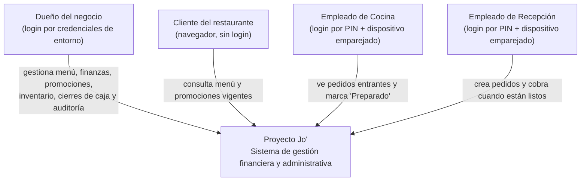
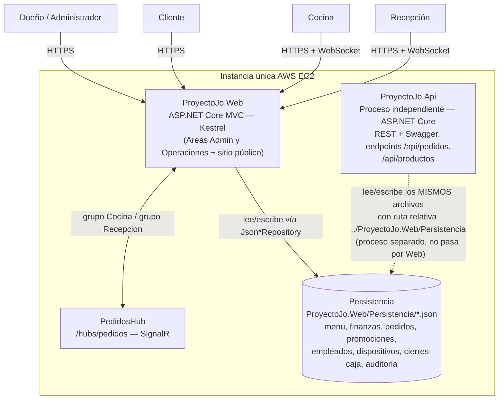

# Arquitectura de Proyecto Jo' — Modelo C4

## Nivel 1 — Contexto

**Para quién es:** cualquier persona ajena al código.  
**Qué responde:** ¿qué es Proyecto Jo' y quién lo usa?

---
 
## Nivel 2 — Contenedores
 
**Para quién es:** el equipo técnico.  
**Qué responde:** ¿qué piezas desplegables tiene el sistema y cómo se comunican?
 

---
 
## Nivel 3 — Componentes 
 
**Para quién es:** quien va a modificar el código.  
**Qué responde:** ¿qué hay dentro de la pieza principal y cómo fluye una
petición desde el controlador hasta el archivo `.json`?

```mermaid
flowchart TD
    subgraph ADMIN_C ["Areas/Admin/Controllers"]
        C_LOGIN["LoginController"]
        C_GESTION["GestionController"]
        C_MENU["MenuController"]
        C_INV["InventarioController"]
        C_PROMO["PromocionesController"]
        C_FIN["FinanzasController"]
        C_MAPA["MapaCalorController"]
        C_CIERRE["CierreCajaController"]
        C_AUDIT["HistorialAuditoriaController"]
    end
 
    subgraph OPS_C ["Areas/Operaciones/Controllers"]
        C_AUTH["AuthController"]
        C_COCINA["CocinaController"]
        C_RECEP["RecepcionController"]
    end
 
    subgraph PUB_C ["Controllers públicos"]
        C_HOME["HomeController"]
        C_MENUPUB["MenuController (público)"]
    end
 
    HUB["PedidosHub : Hub"]
    MW["JsonExceptionMiddleware, SecurityHeadersMiddleware\n(envuelven todas las peticiones)"]
 
    subgraph PIN ["Application/Ports/In"]
        I_AUTH["IAuthService"]
        I_PROD["IProductoService"]
        I_FIN["IFinanzaService"]
        I_PED["IPedidoService"]
        I_PROMO["IPromocionService"]
        I_EMPAUTH["IEmpleadoAuthService"]
        I_DISP["IDispositivoService"]
        I_CIERRE["ICierreCajaService"]
        I_AUDIT["IAuditoriaService"]
    end
 
    subgraph UC ["Application/UseCases"]
        UC_PROD["ProductoUseCase"]
        UC_FIN["FinanzaUseCase"]
        UC_PED["PedidoUseCase"]
        UC_PROMO["PromocionUseCase"]
        UC_EMPAUTH["EmpleadoAuthUseCase"]
        UC_DISP["DispositivoUseCase"]
        UC_CIERRE["CierreCajaUseCase"]
        UC_AUDIT["AuditoriaUseCase"]
    end
 
    subgraph POUT ["Application/Ports/Out"]
        O_PED["IPedidoRepository"]
        O_PROD["IProductoRepository"]
        O_FIN["IFinanzaRepository"]
        O_PROMO["IPromocionRepository"]
        O_EMP["IEmpleadoRepository"]
        O_DISP["IDispositivoRepository"]
        O_CIERRE["ICierreCajaRepository"]
        O_AUDIT["IAuditoriaRepository"]
        O_NOTIF["IPedidoNotificador"]
    end
 
    subgraph INFRA ["ProyectoJo.Infrastructure"]
        R_PED["JsonPedidoRepository"]
        R_PROD["JsonProductRepository"]
        R_FIN["JsonFinanzaRepository"]
        R_PROMO["JsonPromocionRepository"]
        R_EMP["JsonEmpleadoRepository"]
        R_DISP["JsonDispositivoRepository"]
        R_CIERRE["JsonCierreCajaRepository"]
        R_AUDIT["JsonAuditoriaRepository"]
        AUTHSVC["EnvAuthService"]
    end
 
    NOTIF["SignalRPedidoNotificador\nProyectoJo.Web/Realtime\n(usa IHubContext&lt;PedidosHub&gt;)"]
 
    MW -.-> ADMIN_C
    MW -.-> OPS_C
    MW -.-> PUB_C
 
    C_LOGIN --> I_AUTH
    C_GESTION --> I_PROD & I_FIN
    C_MENU --> I_PROD
    C_INV --> I_PROD
    C_PROMO --> I_PROMO & I_PROD
    C_FIN --> I_FIN
    C_MAPA --> I_PED
    C_CIERRE --> I_CIERRE
    C_AUDIT --> I_AUDIT
    C_AUTH --> I_EMPAUTH & I_DISP
    C_COCINA --> I_PED
    C_RECEP --> I_PED & I_PROD
    C_HOME --> I_PROD
    C_MENUPUB --> I_PROD & I_PROMO
 
    I_PROD -.->|implementado por| UC_PROD
    I_FIN -.->|implementado por| UC_FIN
    I_PED -.->|implementado por| UC_PED
    I_PROMO -.->|implementado por| UC_PROMO
    I_EMPAUTH -.->|implementado por| UC_EMPAUTH
    I_DISP -.->|implementado por| UC_DISP
    I_CIERRE -.->|implementado por| UC_CIERRE
    I_AUDIT -.->|implementado por| UC_AUDIT
    I_AUTH -.->|implementado por| AUTHSVC
 
    UC_PROD -->|usa| I_AUDIT
    UC_FIN -->|usa| I_AUDIT
    UC_PROMO -->|usa| I_AUDIT
    UC_CIERRE -->|usa| I_AUDIT
    UC_PED -->|"orquesta"| I_FIN
    UC_PED -->|"orquesta"| I_PROD
    UC_PED -->|"orquesta"| I_PROMO
    UC_PED -->|"notifica cambio"| O_NOTIF
 
    UC_PROD --> O_PROD
    UC_FIN --> O_FIN
    UC_PED --> O_PED
    UC_PROMO --> O_PROMO
    UC_EMPAUTH --> O_EMP
    UC_DISP --> O_DISP
    UC_CIERRE --> O_CIERRE & O_FIN
    UC_AUDIT --> O_AUDIT
 
    O_PED -.->|implementado por| R_PED
    O_PROD -.->|implementado por| R_PROD
    O_FIN -.->|implementado por| R_FIN
    O_PROMO -.->|implementado por| R_PROMO
    O_EMP -.->|implementado por| R_EMP
    O_DISP -.->|implementado por| R_DISP
    O_CIERRE -.->|implementado por| R_CIERRE
    O_AUDIT -.->|implementado por| R_AUDIT
    O_NOTIF -.->|implementado por| NOTIF
 
    NOTIF -->|"Clients.Group('Cocina'|'Recepcion').SendAsync"| HUB
    C_COCINA -. "se suscribe" .-> HUB
    C_RECEP -. "se suscribe" .-> HUB
```
 
