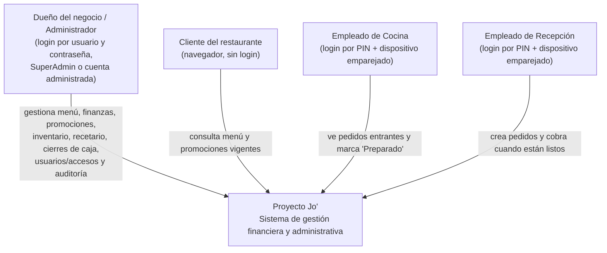
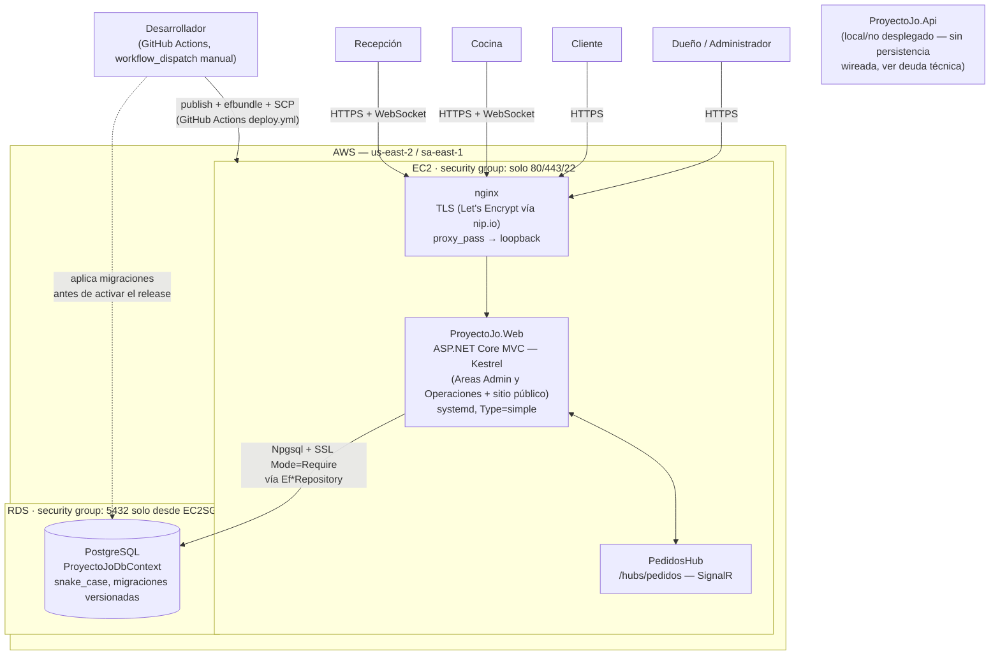

# Arquitectura de Proyecto Jo' — Modelo C4

> Actualizado post-migración a PostgreSQL (ADR-10), hardening de seguridad (ADR-11),
> optimización de performance (ADR-12) y despliegue en AWS (ADR-13).

## Nivel 1 — Contexto

**Para quién es:** cualquier persona ajena al código.  
**Qué responde:** ¿qué es Proyecto Jo' y quién lo usa?

---

## Nivel 2 — Contenedores

**Para quién es:** el equipo técnico.  
**Qué responde:** ¿qué piezas desplegables tiene el sistema, dónde corren, y cómo se comunican?

**Nota:** `ProyectoJo.Api` existe en el repositorio pero **no forma parte del despliegue actual** — su `Program.cs` registra los casos de uso pero ningún repositorio, por lo que cualquier endpoint que toque persistencia falla en tiempo de ejecución (ver "Deuda técnica conocida" en `CLAUDE.md`).

---

## Nivel 3 — Componentes

**Para quién es:** quien va a modificar el código.  
**Qué responde:** ¿qué hay dentro de `ProyectoJo.Web` y cómo fluye una
petición desde el controlador hasta PostgreSQL?

```mermaid
flowchart TD
    subgraph ADMIN_C ["Areas/Admin/Controllers"]
        C_LOGIN["LoginController"]
        C_GESTION["GestionController"]
        C_USUARIOS["UsuariosController\n(admins + operadores, activo)"]
        C_MENU["MenuController"]
        C_INV["InventarioController"]
        C_INSUMOS["InsumosController"]
        C_RECETA["RecetarioController"]
        C_PROMO["PromocionesController"]
        C_FIN["FinanzasController"]
        C_MAPA["MapaCalorController"]
        C_CIERRE["CierreCajaController"]
        C_AUDIT["HistorialAuditoriaController"]
        C_OPIN["OpinionesController"]
        C_DISP["DispositivosController"]
        C_LEGACY["AdministradoresController / OperadoresController\n(código muerto, superseded por Usuarios)"]
    end

    subgraph OPS_C ["Areas/Operaciones/Controllers"]
        C_AUTH["AuthController\n(login PIN supervisor + empleado)"]
        C_COCINA["CocinaController"]
        C_RECEP["RecepcionController"]
    end

    subgraph PUB_C ["Controllers públicos"]
        C_HOME["HomeController"]
        C_MENUPUB["MenuController (público)"]
        C_UBIC["UbicacionController"]
        C_NOS["NosotrosController"]
        C_HIST["HistoriaController"]
    end

    HUB["PedidosHub : Hub"]
    MW["JsonExceptionMiddleware, SecurityHeadersMiddleware\nUseForwardedHeaders, RateLimiter, UseResponseCompression\n(envuelven todas las peticiones)"]
    AUTHZ["RequiereAreaAttribute\n(autorización por área/rol)"]

    subgraph PIN ["Application/Ports/In (selección)"]
        I_AUTH["IAuthService"]
        I_ADMIN["IAdministradorService"]
        I_SUPER["ISupervisorAuthService"]
        I_PROD["IProductoService"]
        I_FIN["IFinanzaService"]
        I_PED["IPedidoService"]
        I_PROMO["IPromocionService"]
        I_INSUMO["IInsumoService"]
        I_RECETA["IRecetaService"]
        I_OPIN["IOpinionService"]
        I_EMPAUTH["IEmpleadoAuthService"]
        I_DISP["IDispositivoService"]
        I_CIERRE["ICierreCajaService"]
        I_AUDIT["IAuditoriaService"]
    end

    subgraph UC ["Application/UseCases"]
        UC_ALL["*UseCase\n(un caso de uso por Port/In,\nmisma forma que en Ports/In)"]
    end

    subgraph POUT ["Application/Ports/Out"]
        O_ALL["I*Repository\n(uno por entidad)"]
        O_NOTIF["IPedidoNotificador"]
    end

    subgraph INFRA ["ProyectoJo.Infrastructure"]
        CTX["ProyectoJoDbContext\n+ ProyectoJoDbContextFactory\n(IDesignTimeDbContextFactory)"]
        EFREPOS["Ef*Repository\n(uno por I*Repository,\nAsNoTracking en lecturas,\nFOR UPDATE en operaciones atómicas)"]
        AUTHSVC["EnvAuthService\n(SuperAdmin vía env vars\n+ fallback a Administrador en DB)"]
    end

    NOTIF["SignalRPedidoNotificador\nProyectoJo.Web/Realtime\n(usa IHubContext&lt;PedidosHub&gt;)"]
    PG[("PostgreSQL — RDS")]

    MW -.-> ADMIN_C
    MW -.-> OPS_C
    MW -.-> PUB_C
    AUTHZ -.->|"gatea"| ADMIN_C

    C_LOGIN --> I_AUTH
    C_USUARIOS --> I_ADMIN & I_EMPAUTH
    C_GESTION --> I_PROD & I_FIN
    C_MENU --> I_PROD
    C_INV --> I_PROD
    C_INSUMOS --> I_INSUMO
    C_RECETA --> I_RECETA
    C_PROMO --> I_PROMO & I_PROD
    C_FIN --> I_FIN
    C_MAPA --> I_PED
    C_CIERRE --> I_CIERRE
    C_AUDIT --> I_AUDIT
    C_OPIN --> I_OPIN
    C_DISP --> I_DISP
    C_AUTH --> I_SUPER & I_EMPAUTH & I_DISP
    C_COCINA --> I_PED
    C_RECEP --> I_PED & I_PROD
    C_HOME --> I_PROD
    C_MENUPUB --> I_PROD & I_PROMO

    PIN -.->|implementado por| UC
    UC --> POUT
    UC -->|"orquesta (ej. UC_PED)"| I_FIN
    UC -->|"notifica cambio"| O_NOTIF
    UC -->|"registra"| I_AUDIT

    O_ALL -.->|implementado por| EFREPOS
    O_NOTIF -.->|implementado por| NOTIF
    I_AUTH -.->|implementado por| AUTHSVC

    EFREPOS --> CTX
    CTX -->|"Npgsql, SSL Mode=Require"| PG

    NOTIF -->|"Clients.Group('Cocina'|'Recepcion').SendAsync"| HUB
    C_COCINA -. "se suscribe" .-> HUB
    C_RECEP -. "se suscribe" .-> HUB
```

**Cambios de fondo respecto a la versión anterior de este diagrama** (ver ADR-10, ADR-11, ADR-12):

- Toda la familia `Json*Repository` fue reemplazada por `Ef*Repository` — el contrato de `Ports/Out` no cambió, solo la implementación.
- `AdministradoresController`/`OperadoresController` quedan marcados explícitamente como código muerto — `UsuariosController` es la única vía real de gestión de administradores/operadores desde el dashboard.
- `SecurityHeadersMiddleware`, `UseForwardedHeaders` y el rate limiter se agregan al pipeline de middleware (ADR-11), necesarios además para funcionar correctamente detrás del proxy nginx (ADR-13).
- `ProyectoJoDbContextFactory` aparece como componente propio porque las herramientas de diseño de EF Core (usadas en el pipeline de despliegue) no pueden construir el contexto a través del service provider de la aplicación cuando está registrado con `AddDbContextPool` (ver ADR-12 y ADR-13).
