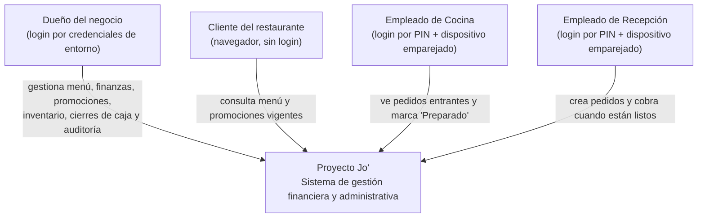

# Arquitectura de Proyecto Jo' — Modelo C4

## Nivel 1 — Contexto

**Para quién es:** cualquier persona ajena al código.  
**Qué responde:** ¿qué es Proyecto Jo' y quién lo usa?

```mermaid
flowchart TD
    ADMIN["Dueño del negocio\n(login por credenciales de entorno)"]
    CLIENTE["Cliente del restaurante\n(navegador, sin login)"]
    COCINERO["Empleado de Cocina\n(login por PIN + dispositivo emparejado)"]
    RECEP["Empleado de Recepción\n(login por PIN + dispositivo emparejado)"]

    SISTEMA["Proyecto Jo'\nSistema de gestión financiera y administrativa"]

    ADMIN -->|"gestiona menú, finanzas, promociones,\ninventario, cierres de caja y auditoría"| SISTEMA
    CLIENTE -->|"consulta menú y promociones vigentes"| SISTEMA
    COCINERO -->|"ve pedidos entrantes y marca 'Preparado'"| SISTEMA
    RECEP -->|"crea pedidos y cobra cuando están listos"| SISTEMA
```

